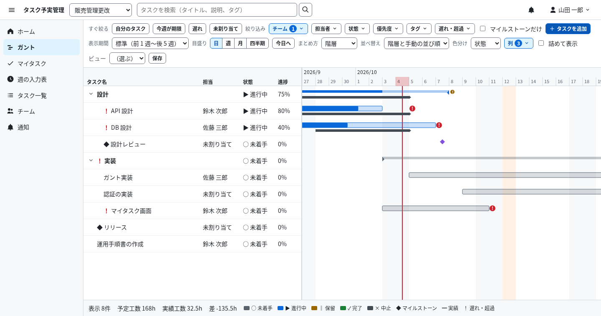
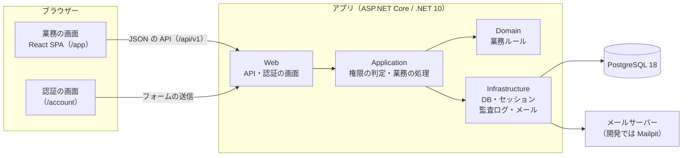
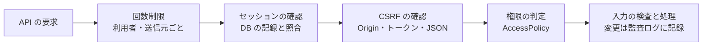

# BudgetControlSite（タスク予実管理システム）

チームのタスクの予定と実績（日程・工数・進捗）をガントチャートで管理する、社内向けの Web アプリです。
中身の保証はできません。仕様は [要件定義書](docs/requirements_v2.md)、[基本設計書](docs/basic_design_v2.md)、[詳細設計書](docs/detail_design_v2.md) にあります。



## システムの構成



- **フロントエンド**: 業務の画面は React と TypeScript で作り、Vite でビルドします。ビルドしたファイルはアプリと同じサーバーから同じ URL の下（`/app`）で配信するので、画面用のサーバーは別に要りません。データは JSON の API で読み書きし、集計や遅れの判定はサーバーだけで行います。
- **認証の画面**: ログイン、パスワードの再設定、多要素認証の設定などは、サーバーで HTML を作る Blazor の静的 SSR です。
- **バックエンド**: 上の図の 4 つの層に分けています。共通の確認（セッション、CSRF、回数制限、セキュリティのヘッダー）は Web 層のミドルウェアで、権限の判定は Application 層の AccessPolicy の 1 か所だけで行います。
- **本番**: ブラウザーとアプリの間に nginx（HTTPS）を置き、Docker で動かします（[deploy/](deploy/)）。

| フォルダー | 内容 |
| --- | --- |
| `src/` | サーバー（`TaskYojitsu.Domain`、`.Application`、`.Infrastructure`、`.Web`）と運用コマンド（`.Tool`） |
| `web/` | 業務の画面（React）。ビルドすると `src/TaskYojitsu.Web/wwwroot/app` に出力する |
| `tests/` | 単体テスト、API と権限の結合テスト、通しのテスト（Playwright） |
| `deploy/` | 本番の構成（Dockerfile、compose、nginx、PostgreSQL）と配備スクリプト |
| `scripts/` | 開発用のスクリプト（DB の作り直し） |
| `.devcontainer/`、`.github/` | 開発コンテナ、CI（GitHub Actions） |

## セキュリティ

API への 1 回の要求は、次の順に確かめてから処理します。



| 観点 | 対策 |
| --- | --- |
| ログイン | パスワードは 15 文字以上で、よく使われるものは使えない。PBKDF2（30 万回）で保存する。5 回続けて失敗すると 15 分ロックし、本人にメールで知らせる。多要素認証（認証アプリ・パスキー）に対応 |
| セッション | Cookie にはランダムな ID だけを入れ、中身は DB に保存する（`__Host-`、HttpOnly、Secure、SameSite）。30 分操作がないか 12 時間たつと切れる。ログアウトやアカウントの無効化はすぐに反映される |
| CSRF | 状態を変える要求では、Origin、トークン（`X-XSRF-TOKEN`）、JSON であることの 3 つを確かめる |
| 権限 | 判定は詳細設計書 4.5 の表のとおり。所属していないチームのデータは 404 にして、あること自体を見せない。管理の操作には直近 10 分以内の再認証が要る |
| 画面 | CSP で、自サイト以外のスクリプトと HTML の中のスクリプトを禁止する。HSTS や X-Frame-Options などのヘッダーを付け、ログイン後の応答はキャッシュさせない |
| 監査ログ | ログイン、データの変更、権限による拒否を記録する。ハッシュの鎖で改ざんを見つけられ、アプリの DB アカウントは追記しかできない |
| DB と秘密情報 | アプリは権限を絞った DB アカウント（`tyj_app`）で接続する。秘密情報は設定ファイルに書かず、本番では Docker の secrets で渡す |
| 依存パッケージ | 版を固定し、公開から 7 日以上たった版だけを使う。CI で CodeQL、脆弱性の検査、イメージの検査を行う |

## 初回の準備と起動

必要なもの: Docker（Docker Desktop など）と、VS Code の拡張機能「Dev Containers」

1. リポジトリを VS Code で開き、「コンテナーで再度開く」を選びます。
   開発用のコンテナ、PostgreSQL 18、Mailpit が起動します。DB のアカウントと DB は初回に自動で作られ、依存パッケージも自動で入ります。
2. DB のテーブルを作り、デモデータを入れます。パスワードは 15 文字以上で決めてください（デモの利用者の全員に同じものを設定します）。

   ```bash
   bash scripts/dev-reset-db.sh --seed blue-river-under-cloudy-sky
   ```

3. 画面をビルドし、アプリを起動します。

   ```bash
   (cd web && pnpm build)
   dotnet run --project src/TaskYojitsu.Web
   ```

4. <http://localhost:5080> を開き、手順 2 のパスワードでログインします。

| メールアドレス | 立場 |
| --- | --- |
| `admin@example.com` | 管理者（チームには所属していないので、チームのデータは閲覧だけ） |
| `yamada@example.com` | 「販売管理更改」「社内ポータル改善」のリーダー |
| `suzuki@example.com`、`sato@example.com` | 「販売管理更改」のメンバー |
| `tanaka@example.com` | 「社内ポータル改善」のメンバー |

- 招待やロックのお知らせなど、送ったメールは Mailpit（<http://localhost:8025>）で確かめます。
- データを最初の状態に戻すときは、手順 2 をもう一度実行します。
- 画面を直しながら確かめるときは、アプリを起動したまま `cd web && pnpm dev` を実行し、<http://localhost:5173/app/> を開きます。
- `dotnet` が SDK のエラーを出すときは、コンテナーをリビルドしてください（.NET 10 の正式版の SDK が必要です）。

## テスト

```bash
# 単体テストと結合テスト（結合テストは実際の PostgreSQL を使う）
dotnet test --solution TaskYojitsu.slnx

# 画面の静的検査と単体テスト
(cd web && pnpm lint && pnpm typecheck && pnpm test)

# 通しのテスト（Playwright）。全員が同じ送信元から操作するため、送信元ごとの回数制限を広げてアプリを起動しておく
RateLimits__LoginByIp__Permits=100 RateLimits__ApiByIp__Permits=100000 dotnet run --project src/TaskYojitsu.Web
(cd tests/e2e && pnpm exec playwright install --with-deps chromium && E2E_PASSWORD=<手順 2 のパスワード> pnpm test)
```

プルリクエストを作ったときと、そのブランチに変更をプッシュしたときは、GitHub Actions がすべてのテストを動かします。

## 本番と運用

- イメージを `docker build -f deploy/Dockerfile .` で作り、`deploy/deploy.sh <イメージ@sha256:...>` で配備します（署名の検証、マイグレーション、失敗したときの切り戻しを含む）。
- 運用コマンドの一覧は `dotnet run --project src/TaskYojitsu.Tool -- help` で表示します（最初の管理者の作成、祝日の取り込み、監査ログの検証など）。
- 設定値と秘密情報は詳細設計書の 11 章、配備は 12 章を参照してください。
