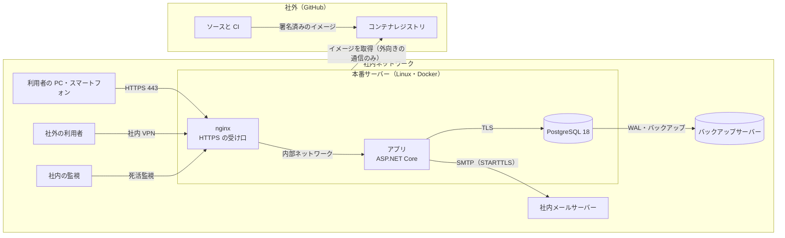
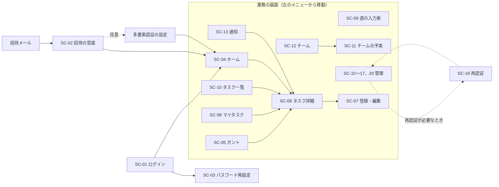
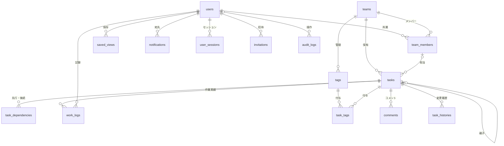
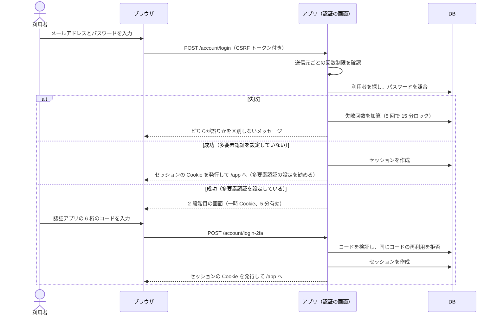
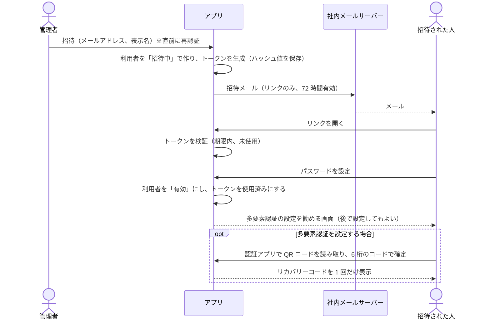
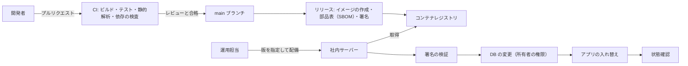

# タスク予実管理システム（仮称） 基本設計書

| 項目 | 内容 |
| --- | --- |
| 版 | 1.2 案（2026-10-03 更新） |
| 状態 | レビュー待ち |
| 入力となる文書 | [要件定義書 1.4 案](requirements_v2.md)、[現行システム調査書](current_system_analysis.md) |
| 次の文書 | [詳細設計書](detail_design_v2.md) |
| 置き換える文書 | 旧 [basic_design.md](basic_design.md)（試作品の基本設計書。本書の確定後は参照しない） |

改訂履歴

| 版 | 日付 | 内容 |
| --- | --- | --- |
| 1.0 案 | 2026-10-03 | 初版 |
| 1.1 案 | 2026-10-03 | 要件定義書 1.3 案（Q2〜Q6 の回答）を反映した。多要素認証を任意にし（7.1、7.2）、管理者がすべてのチームを閲覧できるようにした（3.2、7.4） |
| 1.2 案 | 2026-10-03 | 開発コンテナを作り（2.3）、pnpm を 12 系にした（2.3、8.6） |

---

## 1. はじめに

### 1.1 目的と範囲

本書は、要件定義書の要件をどのような方式で実現するかを定める。対象は、システムの構成、機能の分け方、画面、データ、外部とのやりとり、セキュリティ、性能・運用、テストの方針である。テーブルの列、API の入出力、設定値などの細部は詳細設計書で定める。

### 1.2 設計の前提

| 項目 | 前提 |
| --- | --- |
| 要件定義書の確認事項 | すべて回答済み（要件定義書 12.3）。技術の構成は開発側に任され、セキュリティを重視して C#（.NET 10）と TypeScript に決めた。多要素認証は任意。管理者はすべてのチームのタスクを閲覧できる（変更はできない）。メンバーはリーダーが作ったタスクの予定を変えられない。他チームの情報は見られない |
| 稼働環境 | 社内の Linux サーバー。インターネットには公開せず、社外からは社内の VPN を経由する |
| 規模 | 利用者 100 人以下、同時に進むチーム（プロジェクト）20 以下、同時利用 50 人程度 |
| 名称 | システムの仮称は「タスク予実管理システム」。プログラム上の名前は TaskYojitsu（仮） |

### 1.3 表記

- FR-、NF-、SC- で始まる ID は要件定義書のもの。本書で追加した画面は SC-19 以降とする。
- 「チーム」はプロジェクトの単位を兼ねる（要件定義書 1.3）。

---

## 2. システム構成

### 2.1 全体の構成

- 利用者は、社内 DNS に登録した名前（例: `tasks.corp.example`）で HTTPS 接続する。インターネットからは接続できない（NF-INF-01）。
- nginx だけが 443 番を受け付け、アプリと DB は外から直接つながらない内部ネットワークに置く。
- ソースコードと CI は GitHub に置き、CI で作って署名したコンテナイメージを、社内サーバーの側から取得して配備する。社外から社内サーバーへの接続は開けない。

### 2.2 機器の構成（目安）

| 機器 | 用途 | 目安 |
| --- | --- | --- |
| 本番サーバー | nginx、アプリ、PostgreSQL のコンテナ | 4 コア、メモリ 16GB、SSD 200GB（ディスク全体を暗号化） |
| 予備サーバー | 本番が故障したときの復元先（社内の仮想基盤でも可） | 本番と同等 |
| 検証サーバー | 検証環境 | 2 コア、メモリ 8GB |
| バックアップサーバー | バックアップの保管先（本番とは別の機器） | 1TB 程度。本番から削除できない保管も併用する |

### 2.3 ソフトウェアの構成

| 区分 | 採用するもの | 備考 |
| --- | --- | --- |
| OS | 社内標準の Linux（サポート期間内の版） | セキュリティ更新を定期的に適用する |
| コンテナ | Docker Engine、Docker Compose | |
| HTTPS の受け口 | nginx | TLS 1.2／1.3。社内の認証局が発行した証明書 |
| アプリの実行環境 | .NET 10 LTS（ASP.NET Core） | 公式イメージ aspnet:10.0-noble-chiseled（シェルがなく、root 以外で動く） |
| 認証 | ASP.NET Core Identity | 多要素認証（TOTP）、パスキー、アカウントのロック |
| 認証の画面 | Blazor Web App テンプレートの Identity 画面（静的 SSR） | テンプレートを本システム用に改修する（2.5） |
| 業務の画面 | React と TypeScript で作る SPA。Vite でビルドし、アプリから配信する | 外部 CDN は使わない |
| DB | PostgreSQL 18 | 2030-11 までサポート |
| DB アクセス | Entity Framework Core 10 | |
| メール送信 | MailKit から社内メールサーバーへ送る | 本文はテキストのみ |
| バックアップ | pgBackRest | 暗号化、差分バックアップ、WAL の継続保管 |
| 開発環境 | Dev Container（.NET 10 SDK、Node.js 24、pnpm 12、PostgreSQL 18、Mailpit） | .devcontainer/ に作成済み |
| CI | GitHub Actions | ビルド、テスト、静的解析、署名 |
| パッケージ管理 | NuGet（ロックファイルあり）、pnpm（12 系） | 8.6 |

### 2.4 アプリケーションの層

| プロジェクト | 役割 | 参照してよい先 |
| --- | --- | --- |
| TaskYojitsu.Domain | エンティティ、業務ルール（まとめタスクの集計、遅れの判定、状態の変化、稼働日の計算） | なし |
| TaskYojitsu.Application | 利用場面ごとの処理、権限の判定、入出力の型 | Domain |
| TaskYojitsu.Infrastructure | DB アクセス、メール送信、セッションの保存、監査ログの書き込み | Application、Domain |
| TaskYojitsu.Web | 起動処理、認証の画面、API、ミドルウェア、SPA の配信、定期処理 | Application、Infrastructure |
| TaskYojitsu.Tool | 運用コマンド（最初の管理者の作成、祝日の取り込み、監査ログの検証など） | Application、Infrastructure |
| web/ | 業務の画面（React と TypeScript） | API だけを使う |

- 業務ルールは Domain に集め、画面や API には書かない（NF-QUA-03）。
- 権限の判定は Application の 1 つの部品にまとめる（3.2、NF-ACC-05）。

### 2.5 画面の作り方

| 画面の種類 | 方式 | 理由 |
| --- | --- | --- |
| 認証まわり（ログイン、多要素認証、招待の受諾、パスワード再設定、再認証、アカウントのセキュリティ設定） | サーバー側で HTML を作る。.NET 10 の Blazor Web App テンプレートに含まれる Identity 画面を、静的 SSR のまま改修して使う | 認証は実績のある部品を使う方が安全。パスキーの画面もそろっている。改修内容: 自分での登録をなくす、招待を加える、多要素認証の設定を勧める表示を加える、HTML 内のスタイルをなくす |
| 業務の画面（ホーム、ガント、マイタスク、チーム、管理など） | 1 つの SPA（React と TypeScript） | ガントと詳細パネル、マイタスク、週の入力表など、画面を移らずに操作する場面が多い |

- SPA と API は同じオリジンに置き、サーバー側のセッション（Cookie）で認証する。認証用のトークンをブラウザの保存領域に置かない（NF-SES-01）。
- 画面の URL は、認証が `/account/...`、業務が `/app/...`、API が `/api/v1/...` とする。

### 2.6 ガントチャート部品の方針

- React と SVG で自作する。理由は次の 3 つ。
  - 予定と実績の 2 本表示、担当者別・チーム別のまとめ表示など、本システム固有の表示が多い。
  - CSP で HTML 内のスタイルを禁止する（NF-BRW-02）ため、部品がこれに従っている必要がある。
  - ライセンスと外部への依存を増やさない。
- 開発の最初に 3 日程度の検証を行い、1,000 行の描画、ドラッグ、スクロールの滑らかさを確かめる（NF-PRF-02）。満たせない場合は既製部品の採用を再検討する。
- 部品は画面の他の部分から切り離す。入力は「行の一覧と表示条件」、出力は「操作の通知（日程の変更、クリックなど）」とし、あとで既製部品に置き換えられる形にする。

---

## 3. 機能の構成

### 3.1 機能一覧

| 機能群 | 主な機能 | 要件 | 実現する場所 |
| --- | --- | --- | --- |
| 認証・アカウント | ログイン、多要素認証、パスキー、招待の受諾、パスワード再設定、再認証、ログイン中の端末 | FR-AUT-01〜09 | 認証の画面 |
| 管理 | 利用者の招待・無効化・管理者権限、チームの作成とリーダーの指定、監査ログ、祝日 | FR-ADM-01〜08 | 業務の画面（管理）と管理 API |
| チーム運営 | チームの作成（リーダー）、名前の変更・アーカイブ、メンバーと役割、タグ | FR-TEM-01〜07 | 業務の画面（チーム）と API |
| タスク管理 | 登録・変更・削除・復元・移動、コメント、依存関係、変更履歴 | FR-TSK-01〜16 | ガント、詳細パネルと API |
| 実績の入力 | 作業実績、進捗・状態、完了、週の入力表 | FR-ACT-01〜07 | 詳細パネル、マイタスク、週の入力表と API |
| ガントチャート | 表示、操作、検索・絞り込み・まとめ方、ビュー | FR-GNT-01〜29 | ガントの画面と API |
| 一覧・ホーム | マイタスク、タスク一覧、ホーム、チームの予実 | FR-LST-01〜03、FR-DSH-01〜03 | 業務の画面と API |
| 通知 | 画面内の通知、セキュリティに関するメール | FR-NTF-01〜04 | 業務の画面、API、メール |
| 定期処理 | 期限の通知、削除データの整理、監査ログの検証など | FR-NTF-01、NF-LOG-04〜05 | アプリ内の定期処理、運用コマンド |

### 3.2 権限の判定方式

- 判定は Application 層の権限判定サービスに集める。API は「操作」と「対象」を渡して可否を受け取るだけにする（NF-ACC-05）。
- 判定に使う情報は次のとおり。
  - 利用者が管理者か
  - 対象チームでの役割（リーダー、メンバー、所属なし）
  - タスクの作成者・担当者か
  - 作業実績があるか
  - チームがアーカイブされているか
  - いずれかのチームでリーダーを務めているか（チームの作成に使う）
- 判定の材料は毎回 DB から読む（キャッシュしない）。役割の変更は次の操作からすぐに反映される（NF-SES-05）。
- チームに所属していない利用者が、そのチームのデータを ID で指定した場合は 404 を返す（NF-ACC-03）。ただし管理者には閲覧だけを許可する（FR-ADM-09）。所属しているが権限がない場合は 403 を返す。
- 判定がエラーになった場合は拒否する（NF-ACC-02）。
- 操作ごとの判定条件は、詳細設計書 4.5 の判定表に定める。

---

## 4. 画面設計

### 4.1 画面一覧

| ID | 画面 | URL | 方式 | 主な要件 |
| --- | --- | --- | --- | --- |
| SC-01 | ログイン | /account/login（2 段階目は /account/login-2fa、/account/login-recovery） | サーバー | FR-AUT-01〜02 |
| SC-02 | 招待の受諾 | /account/accept-invitation（続けて、任意で /account/setup-mfa） | サーバー | FR-AUT-03 |
| SC-03 | パスワード再設定 | /account/forgot-password、/account/reset-password | サーバー | FR-AUT-04 |
| SC-04 | ホーム | /app | SPA | FR-DSH-01 |
| SC-05 | ガントチャート | /app/gantt | SPA | FR-GNT-01〜29 |
| SC-06 | タスク詳細（パネル） | /app/gantt?task={タスクID} など、各画面の上に開く | SPA | FR-GNT-13、FR-ACT-06 |
| SC-07 | タスクの登録・編集 | 各画面の上に開くダイアログ | SPA | FR-TSK-01〜02 |
| SC-08 | マイタスク | /app/my-tasks | SPA | FR-LST-01 |
| SC-09 | 週の実績入力表 | /app/timesheet | SPA | FR-ACT-07 |
| SC-10 | タスク一覧 | /app/tasks | SPA | FR-LST-02 |
| SC-11 | チームの予実 | /app/teams/{チームID}/report | SPA | FR-DSH-02 |
| SC-12 | チーム | /app/teams、/app/teams/{チームID} | SPA | FR-TEM-01〜07 |
| SC-13 | 通知 | /app/notifications | SPA | FR-NTF-01〜02 |
| SC-14 | アカウント設定 | /app/settings（表示名）、/account/manage（パスワード、多要素認証、パスキー、リカバリーコード、ログイン中の端末、ログイン履歴） | SPA とサーバー | FR-AUT-05〜07、09 |
| SC-15 | 利用者管理 | /app/admin/users | SPA | FR-ADM-01〜03 |
| SC-16 | チーム管理 | /app/admin/teams | SPA | FR-ADM-04〜05 |
| SC-17 | 監査ログ | /app/admin/audit-logs | SPA | FR-ADM-06 |
| SC-18 | エラー | /error、/account/access-denied、/account/lockout、SPA 内のエラー表示 | サーバーと SPA | NF-LOG-07 |
| SC-19 | 再認証（本書で追加） | /account/reauthenticate | サーバー | NF-AUT-06、FR-ADM-08 |
| SC-20 | 祝日の管理（本書で追加） | /app/admin/holidays | SPA | FR-ADM-07 |

### 4.2 画面の遷移

### 4.3 共通のレイアウト

| 領域 | 内容 |
| --- | --- |
| 上部のバー（高さ 48px） | チーム（プロジェクト）の切り替え、キーワード検索、通知（未読の数）、利用者メニュー（アカウント設定、ログアウト） |
| 左のメニュー（幅 200px、折りたためる） | ホーム、ガント、マイタスク、週の入力表、タスク一覧、チーム、管理（管理者だけに表示） |
| 本文 | 各画面の内容 |
| 右のパネル（幅 480px） | タスク詳細。どの画面からでも開ける |
| 画面上部のお知らせ | 保存の結果などを数秒表示する。エラーは閉じるまで表示する |

- PC（幅 1366px 以上）ですべての機能を使える。幅 768px 未満では、左のメニューを上部のボタンで開く形にし、ガントは閲覧だけにする（要件定義書 6.4）。
- セッションの時間切れ 5 分前に、画面の中央で予告する（「続ける」を押すと延長する）。
- 多要素認証を設定していない利用者には、上部のバーの下に設定を勧める表示を出す（7.1）。

### 4.4 デザインのルール

色・余白・文字の大きさは 1 つの CSS ファイルに変数として定義し、すべての画面で使う（要件定義書 6.2）。

色（コントラスト比は計算で確認した値）:

| 用途 | 色 | 白の背景に対する比 | 灰色の面（#F6F8FA）に対する比 |
| --- | --- | --- | --- |
| 文字 | #1F2328 | 15.80:1 | 14.84:1 |
| 補助の文字、状態「未着手」 | #59636E | 6.11:1 | 5.74:1 |
| 主色（リンク、主なボタン）、状態「進行中」、予定バー | #0969DA | 5.19:1 | 4.88:1 |
| 状態「保留」 | #9A6700 | 4.87:1 | 4.57:1 |
| 状態「完了」 | #1A7F37 | 5.08:1 | 4.77:1 |
| 状態「中止」（取り消し線も付ける） | #424A53 | 8.99:1 | 8.44:1 |
| 遅れ・エラー | #CF222E | 5.36:1 | 5.03:1 |
| マイルストーン | #8250DF | 5.05:1 | 4.74:1 |

- 主色・遅れ・完了の色を背景にして白い文字を載せた場合も、比は 5.08〜5.36:1 で基準（4.5:1）を満たす。
- 入力欄の枠は #6E7781（白の背景に対して 4.55:1）とし、部品の境界の基準（3:1）を満たす。区切り線（#D1D9E0）は装飾だけに使う。
- 状態は色だけで示さず、アイコンを添える（未着手 ○、進行中 ▶、保留 ‖、完了 ✓、中止 ✕、遅れ ！）。

文字と余白:

- 文字は OS の標準フォントを使う（外部フォントは読み込まない、NF-BRW-03）。本文 14px、行の高さ 1.6。
- 余白は 4px の倍数（4、8、12、16、24、32px）。

部品:

- ボタン（主、副、危険）、入力欄、選択（単一・複数）、日付入力、工数入力、表、タブ、ダイアログ、お知らせ、状態・優先度の印、アイコンをそろえる。
- ダイアログは HTML 標準の dialog 要素、日付入力は標準の date 入力を使い、外部の部品を増やさない。アイコンは SVG で自前に持つ。

### 4.5 主な画面の概要

| 画面 | 概要 |
| --- | --- |
| ホーム（SC-04） | 左に自分の担当タスクの要約（遅れ、今日まで、今週まで）、右に所属チームごとの状況（完了率、遅れの件数、予定工数と実績工数）。件数を押すと、その条件でマイタスクかガントを開く |
| ガント（SC-05） | 構成は要件定義書 6.3 のとおり。表示条件は URL に持たせる（FR-GNT-25）。データはチームと期間を単位に取得し、絞り込み・まとめ方・並べ替えは画面側で行う（8.1）。管理者は所属していないチームも選べ、その場合は画面上部に「閲覧のみ」と表示して、変更の操作を出さない |
| タスク詳細（SC-06） | 右のパネルに、概要（計画・実績）、作業実績、コメント、履歴のタブを並べる。権限のない項目は表示だけにする。構成は詳細設計書 7.4 |
| マイタスク（SC-08） | 自分の担当タスクを「遅れ」「今日まで」「今週まで」「それ以降」「日程未定」に分けて表示する。各行から作業実績の記録と完了の操作ができる |
| 週の入力表（SC-09） | 行に担当タスク、列に月〜日を並べ、マスに作業時間を入れて一括保存する。日と行の合計を表示する |
| チーム（SC-12） | 所属チームの一覧と、チームごとのメンバー・役割・タグ。リーダーには、チームの作成、名前の変更、アーカイブ、メンバーの追加・削除、リーダーの任命のボタンを表示する |
| 管理（SC-15〜17、20） | 利用者の一覧（多要素認証の設定状況を含む）と招待、チームの一覧とリーダーの指定、監査ログの検索、祝日の一覧。操作の前に再認証を求める（FR-ADM-08） |

---

## 5. データ設計

### 5.1 データの関係

- 担当者は、利用者ではなく「チームの所属」を参照する。チームに所属していない人を担当者にできないことを DB で保証するため（5.4）。
- 列の定義は詳細設計書 3.2 に定める。

### 5.2 テーブル一覧

| 区分 | テーブル | 内容 |
| --- | --- | --- |
| 利用者・認証 | users | 利用者。Identity のユーザー情報を含む |
| | user_tokens、user_passkeys、user_claims、user_logins | 認証基盤の標準テーブル。認証アプリの鍵（暗号化）、リカバリーコード（HMAC の値）、パスキーを保存する。user_claims と user_logins は使わない |
| | user_sessions | サーバー側のセッション |
| | user_known_devices | ログインしたことのある端末（新しい端末の検知に使う） |
| | invitations | 招待 |
| | password_reset_tokens | パスワード再設定のトークン |
| チーム | teams | チーム（プロジェクト） |
| | team_members | チームの所属と役割。外れた後も行を残す |
| | tags | チームのタグ |
| タスク | tasks | タスク |
| | task_dependencies | 依存関係 |
| | task_tags | タスクとタグの対応 |
| | task_histories | 変更履歴（チームの利用者が見る） |
| | comments | コメント |
| 実績 | work_logs | 作業実績 |
| 画面 | saved_views | ビュー |
| | notifications | 通知 |
| 設定 | holidays | 祝日 |
| 監査 | audit_logs | 監査ログ（追記のみ） |
| | audit_chain_head | 監査ログのハッシュ連鎖の先頭 |
| 基盤 | data_protection_keys | Cookie などの暗号化に使う鍵（証明書で暗号化して保存） |

### 5.3 区分値

| 区分 | コード | 画面の表示 |
| --- | --- | --- |
| タスクの状態 | not_started、in_progress、on_hold、done、cancelled | 未着手、進行中、保留、完了、中止 |
| 優先度 | high、medium、low | 高、中、低 |
| チームでの役割 | leader、member | リーダー、メンバー |
| 利用者の状態 | invited、active、disabled | 招待中、有効、無効 |
| 認証の方式 | password、password_totp、password_recovery、passkey | パスワードのみ、パスワードと認証アプリ、パスワードとリカバリーコード、パスキー |
| 通知の種類 | task_assigned、task_unassigned、comment_added、due_tomorrow、overdue、team_added | 割り当て、割り当ての解除、コメント、期限の前日、期限超過、チームへの追加 |
| タグの色 | gray、blue、green、yellow、orange、red、purple、teal | 決めた 8 色（背景とのコントラスト比を確認したもの） |

区分値と表示名の対応は、サーバー（C#）と画面（TypeScript）でそれぞれ 1 か所にまとめる（DEV-04）。

### 5.4 整合性を守る仕組み

| ルール | DB で守る | アプリで守る |
| --- | --- | --- |
| メールアドレス・チーム名の重複を防ぐ | 一意の索引 | 画面に分かりやすいメッセージを出す |
| 親タスクは同じチームのもの | 複合外部キー（team_id と parent_id） | — |
| 担当者はチームの所属者 | 複合外部キー（team_id と assignee_id → team_members） | 「現在の」メンバーかを確認する |
| 予定日は両方入れるか両方空、終了日は開始日以降 | CHECK 制約 | 入力の検査 |
| 工数は 15 分単位で範囲内、進捗率は 0〜100 | CHECK 制約 | 入力の検査 |
| 区分値は決めたもののみ | CHECK 制約 | 入力の検査 |
| 親子の循環を防ぎ、深さは 4 まで | depth 列の CHECK（1〜4） | 移動のときに循環を検査する |
| 1 人 1 日の作業時間は 24 時間まで | — | 同じ利用者・同じ日の記録をロックして合計を確認する |
| 同時の編集で上書きしない | version 列 | 更新のときに version を照合する |
| 監査ログを書き換えない | UPDATE・DELETE の権限を与えない。トリガーでハッシュ値をつなぐ | 定期的に連鎖を検証する |

### 5.5 日付・時刻・時間の扱い

- 予定と実績の日付は date 型で持つ。業務上の「今日」は日本時間で決める。
- 作成日時などの日時は UTC の timestamptz で保存し、画面では日本時間で表示する。
- 工数と作業時間は分単位の整数で持つ（15 分刻み）。
- API では、日付を "YYYY-MM-DD"、日時を ISO 8601 の UTC（末尾が Z）で表す。

---

## 6. 外部とのやりとり

### 6.1 API の方式

| 項目 | 方式 |
| --- | --- |
| 形式 | HTTPS 上の JSON。URL は `/api/v1/...`。項目名は camelCase |
| 認証 | セッションの Cookie。すべての API で認証を必須とする（NF-ACC-01） |
| CSRF 対策 | 状態を変える要求（POST、PUT、PATCH、DELETE）では、トークンのヘッダー、Origin、Content-Type（application/json）を確認する（NF-INP-02） |
| エラー | RFC 9457 の Problem Details 形式。画面に出すメッセージの ID を含める |
| 入出力の型 | ビルドのときに OpenAPI の定義を作り、画面側の TypeScript の型を自動で作る。本番では定義を公開しない（NF-INF-05） |
| 同時編集 | 更新の要求に version を含め、食い違えば 409 を返す |
| 回数制限 | 利用者ごと・送信元ごとに上限を設け、超えたら 429 を返す（NF-ACC-06） |

### 6.2 API の一覧（概要）

| 区分 | 主な API |
| --- | --- |
| 自分 | 自分の情報、表示名、最初に開くビュー、セッションの状態と延長 |
| チーム | 一覧、作成、変更、アーカイブ、メンバーの追加・削除・役割の変更、利用者の検索、タグ |
| ガント | 表示用データの取得、キーワード検索 |
| タスク | 詳細、登録、変更、移動、削除、復元、変更履歴、コメント、依存関係、一覧 |
| 作業実績 | 一覧、記録、修正、削除、週の入力表 |
| ホーム・予実 | ホームの要約、マイタスク、チームの予実 |
| ビュー・通知 | ビューの保存・変更・削除、通知の一覧・既読 |
| 管理 | 利用者の一覧・招待・無効化・管理者権限・多要素認証のリセット、チームの一覧、監査ログ、祝日 |

全件の一覧と入出力は詳細設計書 5章に定める。

### 6.3 メール

| 種類 | 送る契機 | 宛先 |
| --- | --- | --- |
| 招待 | 管理者が招待したとき | 招待された人 |
| パスワード再設定 | 本人が申請したとき | 本人 |
| セキュリティの通知 | 新しい端末からのログイン、パスワードの変更・再設定、多要素認証・パスキーの変更、アカウントのロック | 本人 |
| セキュリティの警告 | ログイン失敗の急増などを検知したとき | 管理者 |
| 業務の通知（C） | 利用者が受け取ると設定した場合 | 本人 |

- 本文はテキストだけとし、HTML のメールは送らない。業務の内容は書かず、システムへのリンクだけを載せる（FR-NTF-03）。
- 社内メールサーバーへは STARTTLS で接続する。

### 6.4 運用コマンド

| コマンド | 用途 | 要件 |
| --- | --- | --- |
| create-admin | 最初の管理者を「招待中」で作り、招待リンクを表示する | NF-AUT-10 |
| import-holidays | 内閣府が公表する祝日の CSV を取り込む | FR-ADM-07 |
| verify-audit-log | 監査ログのハッシュ連鎖を検証する | NF-LOG-04 |
| purge-audit-log | 保存期間を過ぎた監査ログを削除する（DB の所有者の権限で実行） | NF-LOG-05 |
| revoke-sessions | 指定した利用者、または全員のセッションを失効させる（緊急時） | NF-AUT-07 |

祝日の取り込みは、Web 画面からのファイルのアップロードではなく、このコマンドで行う。初版ではファイルをアップロードする機能を設けないため（NF-INP-05）。

---

## 7. セキュリティ設計

### 7.1 ログイン

- パスキーでのログイン（FR-AUT-02）は、本人確認（指紋・PIN など）を必須にし、パスキーだけで多要素認証を満たすものとして扱う。
- 多要素認証は任意とする。設定していない利用者には、業務画面の上部で設定を勧める表示を出す（閉じても、次にログインしたときに再び表示する）。設定値 Security:Mfa:RequiredForAdmins を有効にすると管理者だけ必須にできるが、初期値は無効とする。
- 多要素認証を設定していない利用者がいることは、15 文字以上のパスワード、漏えいパスワードの拒否、ロック、新しい端末からのログインの通知、ログイン失敗の急増の検知で補う（NF-AUT-11）。
- 認証の方式（パスワードと認証アプリ、パスキーなど）と認証した時刻をセッションに記録する。

### 7.2 招待

### 7.3 セッション

| 項目 | 方式 |
| --- | --- |
| 保存場所 | サーバー側（user_sessions テーブル）。Cookie にはランダムな鍵だけを入れ、DB には鍵のハッシュ値を保存する |
| Cookie | `__Host-` 接頭辞、Secure、HttpOnly、SameSite=Lax。ブラウザを閉じると消える Cookie にする |
| 時間切れ | 操作がない状態が 30 分続いたら切る。ログインから 12 時間で必ず切る。通知の件数の確認など、画面が自動で送る要求では延長しない |
| 失効 | ログアウト、パスワードの変更・再設定、多要素認証の変更、アカウントの無効化、利用者自身による端末の失効、運用コマンド |
| 再認証 | 管理者の操作とアカウントのセキュリティ設定の変更は、直近 10 分以内の認証を求める（SC-19） |

### 7.4 アクセス制御

- すべての画面と API を「認証が必要」にし、ログインなどの必要なものだけを例外にする（NF-ACC-01）。
- チームのデータは、権限判定サービスで役割を確かめてから返す（3.2）。
- 更新の API は、変更してよい項目だけを持つ入力の型を使い、DB のエンティティを直接受け取らない（NF-ACC-04）。
- 管理 API は、管理者であること、直近の再認証、許可したネットワークからのアクセス（設定した場合）をすべて満たすときだけ受け付ける（NF-ACC-07）。
- 管理者は、所属していないチームのデータを閲覧だけできる。変更の API は拒否する。所属していないチームを閲覧したことは監査ログに残す（同じセッション・同じチームでは 1 回）。

### 7.5 入力・出力とブラウザ側の防御

- すべての入力をサーバーで検査する。画面側の検査は使いやすさのための補助とする。
- 画面には、React と Razor の自動エスケープを通した文字列だけを出す。利用者の入力を HTML として描画する機能（dangerouslySetInnerHTML など）は使わない。
- HTTP の応答に、CSP、HSTS などのセキュリティヘッダーを付ける。値は詳細設計書 8.1 に定める。
- 外部の CDN、フォント、アクセス解析は使わない。必要なファイルは自サイトから配信する。

### 7.6 暗号と秘密情報

| 対象 | 方式 |
| --- | --- |
| 通信 | 利用者と nginx の間は TLS 1.2／1.3。アプリと DB の間も TLS で、証明書を検証する |
| パスワード | PBKDF2-HMAC-SHA512 で保存する。反復回数は OWASP の推奨値（210,000 回）を上回る 300,000 回とする。.NET 標準の部品を使い、暗号ライブラリを増やさない |
| 認証アプリの鍵 | ASP.NET Core のデータ保護の仕組みで暗号化して保存する |
| リカバリーコード | 秘密の値（pepper）を使った HMAC-SHA256 の値だけを保存する |
| 招待・再設定・セッションの鍵 | 256 ビットの乱数。DB には SHA-256 の値だけを保存する |
| 秘密情報 | Docker の secrets でファイルとして渡す。リポジトリと設定ファイルには書かない |
| データ保護の鍵 | DB に保存し、証明書で暗号化する。90 日ごとに自動で更新される |
| 保存データ | サーバーのディスク全体を暗号化する。バックアップも暗号化する |

### 7.7 監査ログ

- 記録する出来事は、要件定義書 NF-LOG-01 のとおり。種類の一覧は詳細設計書 8.4 に定める。
- 業務データの変更と監査ログの記録は、同じトランザクションで行う。どちらか片方だけが残ることはない。
- 各記録には、直前の記録のハッシュ値を含める（DB のトリガーで付ける）。アプリの DB アカウントには追記だけを許可する。
- 毎日、連鎖が途切れていないかを検証し、異常があれば管理者に知らせる。
- 管理者が監査ログや、所属していないチームを閲覧したことも記録する。

### 7.8 インフラ

- サーバーで受け付けるのは 443 番（と、443 番への転送用の 80 番）と、管理用の端末からの SSH だけとする。
- コンテナは root 以外のユーザーで動かし、ファイルシステムを読み取り専用にし、不要な権限をすべて外す。
- アプリが外へ通信してよい先は、社内メールサーバー、社内 DNS、社内の時刻サーバーに限る（サーバーのファイアウォールで制限する）。
- DB は PostgreSQL のアカウントを用途ごとに分ける（所有者、アプリ、バックアップ）。アプリのアカウントにテーブル定義を変える権限を与えない。

### 7.9 セキュリティ要件との対応

| 要件 | 本書の対応箇所 |
| --- | --- |
| NF-AUT-01〜11（認証） | 7.1、7.2、7.6、6.4 |
| NF-SES-01〜05（セッション） | 7.3、3.2 |
| NF-ACC-01〜07（アクセス制御） | 3.2、7.4 |
| NF-INP-01〜08（入力と出力） | 6.1、7.5、6.4 |
| NF-BRW-01〜05（ブラウザ側の防御） | 7.5 |
| NF-CRY-01〜04（暗号と秘密情報） | 7.6 |
| NF-INF-01〜10（インフラ） | 2.1、7.8、8.4 |
| NF-LOG-01〜07（ログと監査） | 7.7、8.3 |
| NF-SDL-01〜10（開発と運用の安全管理） | 8.4、8.6、9 |

---

## 8. 非機能の設計

### 8.1 性能

| 対象 | 方式 |
| --- | --- |
| ガントのデータ | 選んだチームのタスクを 1 回の要求でまとめて取得する（説明文などの長い項目は除く）。まとめタスクの集計と遅れの判定はサーバーで行う |
| 絞り込み・まとめ方・並べ替え | 取得済みのデータに対して画面側で行い、1 秒以内に反映する（NF-PRF-03）。キーワード検索だけはサーバーで行い、一致したタスクの ID を受け取る |
| 描画 | 画面に見えている行だけを描く（前後に余分を持つ）。1,000 行でも描く行は数十に抑える（NF-PRF-02） |
| DB | 絞り込みに使う列に索引を付ける。作業時間の合計はタスクごとにまとめて 1 回の問い合わせで求める |
| 配信 | 画面のファイルは名前に内容のハッシュを付けて長期間キャッシュさせ、圧縮して配信する |

### 8.2 可用性・バックアップ・復旧

| 項目 | 方式 | 要件 |
| --- | --- | --- |
| バックアップ | pgBackRest で、週 1 回の完全バックアップ、毎日の差分バックアップ、WAL の継続保管（5 分ごとに区切る）を行う。暗号化して、バックアップサーバーに保存する | NF-AVL-02、NF-AVL-04 |
| 消されない保管 | バックアップサーバーから本番の DB へ取りに行く形にし、本番にはバックアップを消す権限を持たせない。週 1 回、書き換えできない保管先にも複製する | NF-AVL-04 |
| 保存期間 | 30 日 | NF-AVL-04 |
| 復旧の目標 | 障害の 1 時間前（実際は 5 分前）までのデータに戻す。4 時間以内に予備サーバーで再開する | NF-AVL-02〜03 |
| 復元の訓練 | 四半期に 1 回、検証環境に復元して動作を確認する | NF-AVL-04 |
| 計画停止 | 3 日前までに、画面上部のお知らせで予告する | NF-AVL-01 |

### 8.3 運用・監視・定期処理

- 監視: 社内の監視の仕組みから、アプリの状態確認（`/health/ready`）、ディスクの空き容量、証明書の期限を監視する（NF-OPS-01）。状態確認の URL は監視サーバーからだけ受け付ける。
- ログ: アプリは JSON 形式でログを出し、サーバーで 90 日保存する。社内にログを集める仕組みがあれば転送する（NF-OPS-02）。
- 定期処理: アプリ内で次の処理を動かす。時刻は日本時間。

| 処理 | 頻度 | 要件 |
| --- | --- | --- |
| 期限の前日と期限超過の通知 | 毎日 7:00 | FR-NTF-01 |
| 論理削除から 1 年たったタスクの完全削除 | 毎日 2:00 | 要件定義書 7.6 |
| 期限切れの招待・再設定トークン・セッションの削除 | 1 時間ごと | NF-AUT-05、NF-SES-03 |
| 監査ログの連鎖の検証 | 毎日 3:00 | NF-LOG-04 |
| ログイン失敗の急増などの検知 | 5 分ごと | NF-LOG-06 |
| 古い通知の削除（180 日） | 毎日 | — |

### 8.4 配備

- 配備するイメージは、版ではなく内容のハッシュ（digest）で指定する。
- 署名の検証に失敗したら配備を止める（NF-SDL-09）。
- DB の変更は、1 つ前の版のアプリでも動く形（列の追加を先にし、削除は次の版で行う）にして、アプリだけを前の版に戻せるようにする。
- 配備の直前に、直近のバックアップがあることを確かめる。

### 8.5 環境

| 環境 | 置き場所 | 用途 |
| --- | --- | --- |
| 開発 | 各開発者の Dev Container | 開発。メールは Mailpit で受け取る |
| CI | GitHub Actions | ビルド、自動テスト（PostgreSQL はテストのたびにコンテナで起動） |
| 検証 | 検証サーバー | リリース前の確認、動的検査、復元の訓練。本番のデータは使わない |
| 本番 | 本番サーバー | 運用 |

### 8.6 依存パッケージの管理

- NuGet: ロックファイルを使い、取得元を nuget.org だけに限る。脆弱性の警告はエラーとして扱う。
- pnpm: ロックファイルを使う。依存パッケージのインストール時スクリプトは既定で動かさず、必要と確認したものだけを許可する（allowBuilds）。公開から 7 日たっていない版は入れない（minimumReleaseAge。pnpm の既定の 1 日より長くする）。
- 開発環境で使うツールやコンテナイメージ（pnpm、Mailpit など）も、公開から 7 日以上たった版に固定する。
- GitHub Actions: 外部のアクションはコミットのハッシュで固定する。
- 依存の更新は自動の提案（Dependabot など）で受け、レビューしてから取り込む（NF-SDL-01）。

---

## 9. テストの方針

| 種類 | 内容 | 要件 |
| --- | --- | --- |
| 業務ルールの単体テスト | 集計、遅れの判定、稼働日、状態の変化、階層の検査、工数の入力の解釈。該当コードの 80% 以上を通す | NF-QUA-01 |
| 権限のテスト | 要件定義書 3章の権限表の全組み合わせを、実際の DB を使った API のテストで確かめる | NF-SDL-06 |
| API の結合テスト | 入力の検査、同時編集、CSRF の拒否、回数制限 | NF-INP-01〜02 |
| 画面の単体テスト | ガントの行の組み立て、絞り込み、URL の条件、工数の入力 | NF-QUA-01 |
| 通しのテスト（E2E） | 要件定義書 4.2 の S1〜S6 と、ロック・時間切れなどのセキュリティの場面 | NF-QUA-02 |
| 性能テスト | 1,000 件のガントの表示、同時 50 人の操作 | NF-PRF-01〜04 |
| セキュリティの確認 | ASVS レベル 2 のチェックリスト、動作中のシステムへの検査（OWASP ZAP）、第三者の診断 | NF-SDL-07、NF-SDL-10 |

---

## 10. 導入の手順（概要）

1. サーバーの準備: OS の設定、ディスクの暗号化、ファイアウォール、社内 DNS への登録、証明書の取得
2. DB の準備: PostgreSQL のアカウントと権限の作成、バックアップの設定と最初のバックアップ
3. アプリの配備: 8.4 の手順で最初の版を配備する
4. 初期データ: 祝日の取り込み（import-holidays）、最初の管理者の作成（create-admin）
5. 最初の管理者が招待リンクから初期設定をし、ほかの管理者・リーダーを招待する
6. リリース前の確認: 権限のテスト、ASVS のチェックリスト、動的検査、第三者の診断、復元の訓練

---

## 11. 未決事項とリスク

| No | 内容 | 対応 |
| --- | --- | --- |
| 1 | 多要素認証が任意のため、パスワードだけで使う利用者が残る（ASVS 6.3.3 の例外） | 設定を勧める表示と NF-AUT-11 の対策で補う。とくに管理者はすべてのチームを閲覧できるため、運用で多要素認証の設定を求め、必要なら管理者だけ必須にする設定（7.1）を有効にする |
| 2 | ガントの自作に手間がかかる | 開発の最初の検証で性能と操作性を確かめる（2.6）。満たせなければ既製部品を再検討する |
| 3 | 漏えいパスワードの照合に使う一覧 | 社内サーバーからインターネットに出られない前提で、配布できるライセンスの頻出パスワード一覧を同梱する。外部の照合サービスは、プロキシ経由で使える場合だけ有効にする |
| 4 | 社内の認証局、VPN、メールサーバーの利用条件 | 情報システム部門と確認する（スマートフォンから VPN を使えるかを含む） |
| 5 | 社内サーバーからコンテナレジストリへの外向きの通信 | 許可されない場合は、イメージをファイルで持ち込む手順に切り替える |
| 6 | サーバーの性能 | 2.2 は目安。性能テストの結果で見直す |
