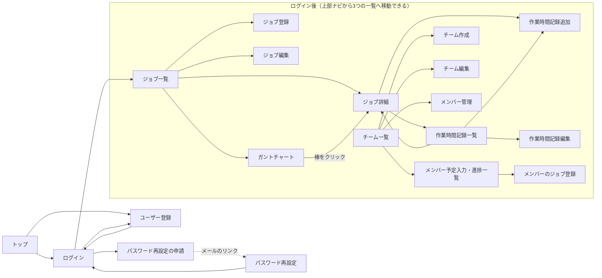
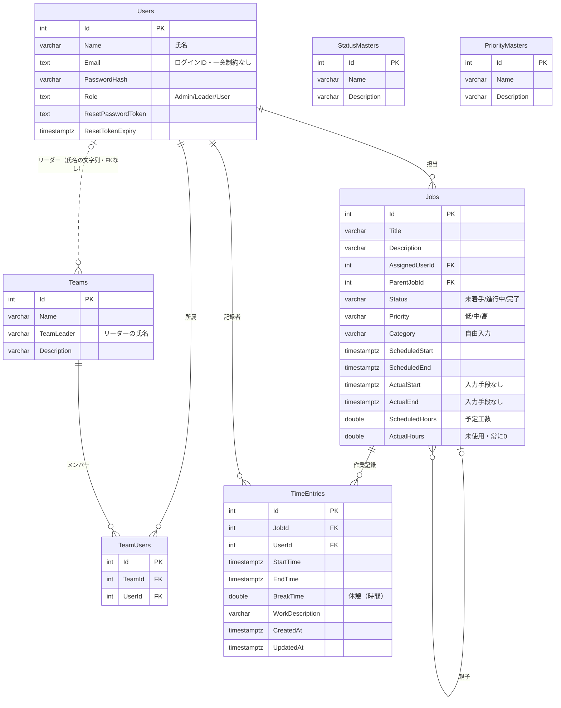

# 現行システム調査書（要件定義の参考資料）

| 項目 | 内容 |
| --- | --- |
| 対象 | リポジトリ BudgetControlSite（main ブランチ、コミット 3431f74 時点） |
| 版 | 1.0（2026-10-03 初版） |
| 目的 | 現行アプリの機能・画面・データ構造・課題を整理し、新しい要件定義書を作るための参考資料とする |
| 調査方法 | ソースコード、設定ファイル、既存ドキュメント（docs/）、画面キャプチャ（pics/）の読解 |
| 削除について | 調査した試作品（TaskManagementApp/）、画面キャプチャ（pics/）、旧設計書は、新システムの開発に合わせてリポジトリから削除した。本書のリンクは、GitHub 上のコミット 3431f74 を指す |
| 注意 | 現在の開発環境には .NET SDK が無いため、アプリは実行していない。挙動はコードから判断したもので、「要実機確認」と書いた項目は特に確認が必要 |

既存の [requirements.md](https://github.com/RyotaKawakami2i2/BudgetControlSite/blob/3431f74/docs/requirements.md)、[basic_design.md](https://github.com/RyotaKawakami2i2/BudgetControlSite/blob/3431f74/docs/basic_design.md)、[detail_design.md](https://github.com/RyotaKawakami2i2/BudgetControlSite/blob/3431f74/docs/detail_design.md) は計画段階の文書で、実装と食い違う箇所が多い（10章）。本書は「実際に何が作られ、どう動くか」を記録する。

本書でいう「予実」は、予定（または予算）と実績の比較を指す。

---

## 1. 調査結果のまとめ

### 1.1 現行アプリの正体

- ジョブ（タスク）ごとに予定（期間・工数）と実績（作業時間の記録）を登録し、その差を確認する Web アプリ。
- C# / ASP.NET Core MVC（.NET 8）と PostgreSQL で作られている。2025年6月19〜20日に AI エディタの Cursor で試作したもので、README にも「あくまでCursorのテスト」とある。
- 予実の対象は**工数（時間）と日程だけ**で、**金額（予算・原価・売上）は扱っていない**。リポジトリ名（BudgetControl＝予算管理）から想像される機能とは異なる。

### 1.2 実装状況

| 区分 | 内容 |
| --- | --- |
| 実装済み | アカウント登録・ログイン・パスワード再設定／ジョブの登録・編集・削除（親子関係・ステータス・優先度）／作業時間の記録と簡易集計／ジョブ単位の予実差異の表示／ガントチャート（予定のみ）／チームとメンバーの管理／リーダーによるメンバーへのジョブ登録 |
| 未実装 | ダッシュボード／期間・担当者・チーム別の予実集計／実績日程の入力／レポート出力／データの一括取込／通知／プロジェクト・カテゴリのマスタ／ユーザー（ロール）管理画面／監査ログ |

既存の要件定義書が挙げた機能要件 37 項目のうち、実装済みは 13、一部のみが 10、未実装が 14（10.1）。

### 1.3 主な問題（詳細は 11章）

1. セキュリティ: ログインしていなくてもジョブを削除できるなど、権限チェックに漏れがある。CSRF 対策も効いていない。ユーザーを氏名で識別しているため、同じ氏名で登録すると他人になりすませる。
2. データ構造: 実績工数を二か所で持っていて、一覧と詳細で値が食い違う。ジョブがチームにもプロジェクトにも紐付かないため、チーム別・案件別・月別の予実を集計できない。
3. UI: 予実の全体を見渡す画面がなく、一覧には検索や絞り込みもない。画面ごとにデザインの作り方がばらばら。
4. 技術基盤: .NET 8 は 2026-11-10 にサポートが終了する（本書作成時点で残り約 1 か月）。開発コンテナは別プロジェクトの設定のままで、このままではビルドできない。

### 1.4 所見

問題が認証方式・データモデル・画面構成という土台に及ぶため、部分的な修正より、要件とデータモデルを定義し直して作り直す方が合理的と考える。現行コードは「動く試作品」として、画面のイメージと業務ルールの参考に使う。新しい要件定義で決めるべき点は 12章にまとめた。

### 1.5 引き継ぐ価値のある点

- ジョブに予定工数を置き、作業記録の積み上げを実績として、差異と比率を出すという基本の考え方
- 作業記録の入力項目（開始・終了・休憩・作業内容）と、「開始＜終了」「休憩≦作業時間」の検査
- ガントチャートのステータス・期間による絞り込みと、棒をクリックして詳細へ移る操作
- チーム・メンバー・リーダーという組織の考え方と、リーダーがメンバーの予定を登録する運用
- メールによるパスワード再設定と、登録時のパスワード強度表示

---

## 2. システム概要

### 2.1 名称と用語

| 場所 | 名称 |
| --- | --- |
| リポジトリ | BudgetControlSite |
| README | 予実管理サイト |
| .NET プロジェクト | TaskManagementApp |
| 画面上のアプリ名 | タスク・作業時間管理システム（トップページ）、TaskManagementApp（ナビ・タブのタイトル） |
| 既存の設計書 | タスク・作業時間管理Webサイト |
| 管理対象の呼び方 | 画面と DB では「ジョブ」、トップページでは「タスク」、設計書の DB 名は tasks |

名称と用語（ジョブかタスクか、「予実」が何を指すか）は、新しい要件定義で統一する必要がある。

### 2.2 利用者（ロール）

| ロール | 値 | 既存設計書での想定 | 実際にできること |
| --- | --- | --- | --- |
| 管理者 | Admin | 全機能 | 全ユーザーのジョブ・作業記録と全チームの閲覧・操作。チームの作成・編集・削除 |
| チームリーダー | Leader | 自チームの管理、メンバーの予定入力、アカウント登録 | 全ユーザーのジョブの一覧表示（詳細は開けない）。チームの操作権限はロールではなく、チームの「リーダー」欄の氏名が自分と一致するかで決まる |
| 一般ユーザー | User | 自分のジョブと作業時間の管理 | 自分のジョブと作業記録の管理、所属チームの閲覧 |

新規登録すると常に User になる。ロールを付与・変更する画面はなく、Admin と Leader は DB を直接更新して作る（詳細は 5章）。

### 2.3 技術構成

| 区分 | 現行 | 備考 |
| --- | --- | --- |
| 言語・フレームワーク | C# / ASP.NET Core MVC（.NET 8） | .NET 8 は 2026-11-10 にサポート終了。後継の長期サポート版（LTS）は .NET 10（2028-11-10 まで） |
| データアクセス | Entity Framework Core 9（Npgsql 9.0.4）。コードからテーブルを作るマイグレーションが 9 本 | EF Core 9 も 2026-11-10 にサポート終了 |
| データベース | PostgreSQL 16（Docker、ポート 5433、DB 名 task_management） | |
| 画面 | Razor ビュー（サーバー側で HTML を生成）、Bootstrap 5.1.0、jQuery 3.6.0、jQuery Validation 1.19.5 | いずれも 2021〜2022 年の版 |
| 外部 CDN | Google Charts（ガントチャート）、Font Awesome 6.0.0（アイコン） | |
| 認証 | 独自実装。ログイン時にセッションへ氏名とロールを保存する | ASP.NET Core Identity はパスワードのハッシュ化部品だけを利用 |
| メール | .NET 標準の SmtpClient → MailHog（開発用のメール受信サーバー。Docker、SMTP 1025／画面 8025） | MailHog は開発が止まっている。後継は Mailpit |
| 開発支援 | Cursor（.cursor/rules に開発ルール） | C# 用のほか PHP/Laravel 用のルールも混在 |

### 2.4 構成図

```text
[ブラウザ]
   │ http://localhost:5106（https は 7252）
   ▼
[ASP.NET Core MVC アプリ: TaskManagementApp]
   ├─ Controller（5 個）── EF Core ──▶ [PostgreSQL 16]（Docker）
   ├─ Razor ビュー（25 ファイル）＋ site.css / gantt.js / register.js
   └─ SmtpClient ──────────────────▶ [MailHog]（Docker。パスワード再設定メールのみ）

外部 CDN: Google Charts（ガントチャート）、Font Awesome（アイコン）
```

Controller から DB を直接操作しており、業務ロジック用のサービス層やリポジトリ層はない。

### 2.5 ソース構成

```text
BudgetControlSite/
├─ docker-compose.yml   … PostgreSQL 16 と MailHog
├─ docs/                … 既存の要件定義書・基本設計書・詳細設計書・開発メモ、本書
├─ pics/                … 画面キャプチャ 3 枚
└─ TaskManagementApp/
   ├─ Program.cs        … 起動設定（セッション、DB 接続）
   ├─ Controllers/      … Account / Home / Job / Team / TimeEntry（計 1,086 行）
   ├─ Models/           … エンティティ 7 種、DbContext、エラー画面用モデル
   ├─ Migrations/       … マイグレーション 9 本（すべて 2025-06-19 作成）
   ├─ Views/            … Razor ビュー 25 ファイル
   └─ wwwroot/          … site.css（2,425 行）、gantt.js（527 行）、register.js（158 行）、lib/（Bootstrap など）
```

### 2.6 起動手順（README より）

1. リポジトリ直下で `docker compose up -d`（PostgreSQL と MailHog を起動）
2. `TaskManagementApp` で `dotnet ef database update`（テーブルを作成）
3. 管理者ユーザーを SQL で直接追加する。README にはパスワードのハッシュ値だけが載っており、元のパスワードはリポジトリ内に書かれていない
4. `dotnet run` で起動し、`http://localhost:5106` を開く

---

## 3. 機能一覧

凡例: ○ 実装済み　△ 一部のみ　× 未実装

### 3.1 認証・アカウント

| 機能 | 現行の挙動 | 状態 |
| --- | --- | --- |
| ユーザー登録 | 氏名・メールアドレス・パスワードで誰でも登録できる。権限は常に User。メールアドレスの重複はアプリ側で検査 | ○ |
| ログイン・ログアウト | メールアドレスとパスワードで認証し、セッションに氏名とロールを保存してジョブ一覧へ移動。セッションはサーバーのメモリ上にあり、再起動で消える | ○ |
| パスワード再設定 | メールアドレスを入力すると、再設定用 URL（有効期限 1 時間）をメールで送る。URL から新しいパスワードを設定 | ○ |
| パスワードポリシー | 登録画面に「12 文字以上・英大文字・英小文字・数字・記号」の達成状況を表示するだけで、強制はしていない | × |
| ロール管理 | Admin／Leader／User の 3 種類。付与・変更する画面はない | △ |
| ユーザー管理（一覧・編集・無効化） | なし | × |

### 3.2 ジョブ管理

| 機能 | 現行の挙動 | 状態 |
| --- | --- | --- |
| 一覧 | カード形式で表示。User は自分が担当のジョブ、Leader と Admin は全ユーザーのジョブ。カード上のプルダウンでステータスと優先度をその場で変更できる | ○ |
| 登録 | タイトル、説明、カテゴリ、予定開始日、予定終了日、予定工数（時間）、親ジョブ、ステータス、優先度を入力。担当者は登録した本人に固定 | ○ |
| 編集・削除 | 上記の項目を編集できる（担当者は変更不可）。削除は確認ダイアログの後に実行し、そのジョブの作業記録も消える | ○ |
| 詳細 | 基本情報、予定工数・実績工数・差異・進捗率、サブジョブ一覧、作業記録一覧を表示 | ○ |
| 親子関係 | 親ジョブを 1 つ指定できる（候補は自分のジョブ）。詳細画面にサブジョブを表示。工数を親へ積み上げる集計はない | △ |
| ステータス | 未着手／進行中／完了の 3 段階で固定 | ○ |
| 優先度 | 低／中／高の 3 段階で固定 | ○ |
| カテゴリ | 自由入力の文字列。マスタはない | △ |
| 担当者の割当て | 自分で登録したジョブは自分が担当。リーダーはメンバー担当のジョブを登録できる（3.5）。後から担当者を変える手段はない | △ |
| 検索・絞り込み・並べ替え・ページ送り | なし | × |

### 3.3 作業時間（実績）の記録

| 機能 | 現行の挙動 | 状態 |
| --- | --- | --- |
| 記録の登録 | ジョブ（自分が担当のものから選択）、開始日時、終了日時、休憩時間（時間）、作業内容を入力。開始が終了より前か、休憩が作業時間を超えないかを検査 | ○ |
| 一覧と集計 | 自分の記録（Admin は全員分）を新しい順に表示し、総作業時間・総休憩時間・件数・平均作業時間を表示。ジョブ詳細から開くとそのジョブに絞り込む | ○ |
| 編集・削除 | 記録した本人と Admin だけができる | ○ |
| 一括取込（CSV／Excel） | なし | × |

### 3.4 予実の比較・可視化

| 機能 | 現行の挙動 | 状態 |
| --- | --- | --- |
| ジョブ単位の予実 | 詳細画面に予定工数、実績工数（作業記録の合計）、差異、進捗率（実績 ÷ 予定）を表示 | ○ |
| 一覧での実績工数 | カードに「実績工数」を表示するが、どこからも更新されない列を表示しているため常に 0 時間 | ×（不具合） |
| 日程の予実 | 実績開始日・実績終了日は DB の列だけあり、入力手段がない | × |
| ガントチャート | 予定期間を棒で表示。行はステータス別。ステータスと表示期間で絞り込み、棒をクリックすると詳細へ移動。実績は表示しない | △ |
| 期間・担当者・チーム別の集計、ダッシュボード、グラフ | なし | × |
| レポート出力（PDF／Excel） | なし | × |

### 3.5 チーム管理

| 機能 | 現行の挙動 | 状態 |
| --- | --- | --- |
| チーム一覧 | Admin は全チーム、それ以外は自分がメンバーのチームを表示。リーダー名、人数、メンバー（先頭 3 名）と、総チーム数などの統計を表示 | ○ |
| 作成・編集・削除 | 画面上は Admin だけ。項目はチーム名、リーダー、説明 | ○ |
| リーダーの設定 | 作成時は Leader／Admin ロールのユーザーから選択、編集時は氏名を自由入力。保存されるのは氏名の文字列 | △ |
| メンバーの追加・削除 | Admin とそのチームのリーダーが、登録済みユーザーから追加・削除 | ○ |
| メンバーのジョブ一覧（進捗） | メンバーを 1 人選ぶと、そのメンバーの全ジョブを表で表示（閲覧のみ）。総メンバー数・ジョブ数・完了数を表示 | △ |
| メンバーへのジョブ登録（予定入力） | リーダーがメンバー担当のジョブを新規登録できる。既存ジョブの編集・削除はできない | △ |
| チーム全体の予実・スケジュール | なし | × |

### 3.6 その他

| 機能 | 現行の挙動 | 状態 |
| --- | --- | --- |
| トップページ | 未ログイン時の紹介ページ。ログイン済みならジョブ一覧へ移動 | ○ |
| 通知（期限・超過・メール・画面内） | なし。メール送信はパスワード再設定のみ | × |
| カレンダー、マイルストーン、ジョブ間の依存関係 | なし | × |
| 監査ログ（操作履歴） | なし | × |

---

## 4. 画面一覧と画面遷移

### 4.1 画面一覧（21 画面）

| No | 画面 | URL | 利用できる人（画面上） | 主な内容 |
| --- | --- | --- | --- | --- |
| 1 | トップ | / | 未ログイン | 機能紹介、ログイン・新規登録への導線 |
| 2 | ログイン | /Account/Login | 未ログイン | メールアドレス、パスワード（表示切替あり） |
| 3 | ユーザー登録 | /Account/Register | 誰でも | 氏名、メールアドレス、パスワード（強度表示） |
| 4 | パスワード再設定の申請 | /Account/ForgotPassword | 誰でも | メールアドレスを入力し、再設定メールを送る |
| 5 | パスワード再設定 | /Account/ResetPassword?token=… | メールのリンクから | 新しいパスワード |
| 6 | ジョブ一覧 | /Job/Index | ログイン済み | ジョブのカード、ステータス・優先度の即時変更、詳細・編集・削除 |
| 7 | ジョブ詳細 | /Job/Details/{id} | 担当者、Admin | 基本情報、予実（予定・実績・差異・進捗率）、サブジョブ、作業記録 |
| 8 | ジョブ登録 | /Job/Create | ログイン済み | 3.2 の入力項目 |
| 9 | ジョブ編集 | /Job/Edit/{id} | ログイン済み | 同上 |
| 10 | ガントチャート | /Job/Gantt | ログイン済み | 予定期間の棒グラフ、ステータス・期間の絞り込み、件数、凡例 |
| 11 | 作業時間記録一覧 | /TimeEntry/Index | ログイン済み | 集計カード、記録の表、編集・削除 |
| 12 | 作業時間記録追加 | /TimeEntry/Create | ログイン済み | ジョブ、開始・終了日時、休憩、作業内容 |
| 13 | 作業時間記録編集 | /TimeEntry/Edit/{id} | 記録者、Admin | 同上 |
| 14 | チーム一覧 | /Team/Index | ログイン済み | チームのカード、統計 |
| 15 | チーム作成 | /Team/Create | Admin | チーム名、リーダー（選択）、説明 |
| 16 | チーム編集 | /Team/Edit/{id} | Admin | チーム名、リーダー（自由入力）、説明 |
| 17 | メンバー管理 | /Team/Members/{id} | Admin、そのチームのリーダー | メンバー一覧、追加、削除 |
| 18 | メンバー予定入力・進捗一覧 | /Team/MemberJobs?teamId=…&userId=… | Admin、そのチームのリーダー | メンバーを選んでジョブ一覧を表示 |
| 19 | メンバーのジョブ登録 | /Team/CreateMemberJob?teamId=…&userId=… | Admin、そのチームのリーダー | ジョブ登録とほぼ同じ項目（カテゴリ・親ジョブなし） |
| 20 | プライバシー | /Home/Privacy | 誰でも | テンプレートのまま（英語の仮文） |
| 21 | エラー | /Home/Error | — | テンプレートのまま（英語） |

### 4.2 画面遷移



### 4.3 共通レイアウト

- 上部のナビゲーション: ジョブ管理／作業時間記録／チーム管理／アカウント登録（Admin・Leader にのみ表示。リンク先は誰でも使えるユーザー登録画面）／ログイン中の氏名／ログアウト。
- ログイン後に最初に表示されるのはジョブ一覧で、ダッシュボードはない。
- 画面の文言は日本語だが、HTML の言語指定は英語（`lang="en"`）のまま。

---

## 5. 権限（実際の挙動）

| 操作 | 未ログイン | User | Leader | Admin |
| --- | --- | --- | --- | --- |
| ジョブ一覧・ガントチャートの表示範囲 | 不可 | 自分の担当分 | 全ユーザー分 | 全ユーザー分 |
| ジョブ詳細 | 不可 | 自分の担当分 | 自分の担当分 | すべて |
| ジョブ登録 | 不可 | 可（担当は自分） | 可（担当は自分） | 可（担当は自分） |
| ジョブ編集 | 不可 | 可（他人の分も ※1） | 可（他人の分も ※1） | すべて |
| ジョブ削除、ステータス・優先度の変更 | 可（※2） | 可（他人の分も ※1） | 可（他人の分も ※1） | すべて |
| 作業記録の一覧 | 不可 | 自分の記録 | 自分の記録 | すべて |
| 作業記録の登録 | 不可 | 可（他人のジョブにも ※1） | 同左 | 同左 |
| 作業記録の編集・削除 | 不可 | 自分の記録 | 自分の記録 | すべて |
| チーム一覧 | 不可 | 所属チーム | 所属チーム | すべて |
| チームの作成・編集 | 可（※3） | 可（※3） | 可（※3） | 可 |
| チームの削除 | 不可 | 不可 | 不可 | 可 |
| メンバーの追加・削除、メンバーのジョブ一覧・登録 | 不可 | リーダー欄が自分の氏名のチームのみ（※4） | 同左（※4） | すべて |
| アカウント登録 | 可 | 可 | 可 | 可（常に User で作成） |
| ロールの付与・変更 | 不可 | 不可 | 不可 | 画面なし（SQL で直接更新） |

※1 画面にボタンは出ないが、URL や送信内容を指定すれば実行できる（権限の確認がない）。
※2 ログインの確認がなく、未ログインでも送信すれば実行できる。
※3 画面は Admin しか開けないが、送信処理に権限の確認がないため誰でも実行できる。
※4 Leader ロールかどうかではなく、チームの「リーダー」欄の氏名が自分の氏名と一致するかで判定する。User ロールでもリーダー欄に名前があれば操作でき、Leader ロールでもリーダー欄に名前がなければ操作できない。

既存設計書は「リーダーは自チームのメンバーだけを管理する」想定だが、実装では Leader ロールが全ユーザーのジョブを一覧で見られる。一方、チームの操作はロールと無関係に氏名で判定している。

---

## 6. データモデル

### 6.1 ER 図



ステータスと優先度にはマスタテーブル（StatusMasters／PriorityMasters）があるが、Jobs には名称の文字列を保存しており、外部キーで結ばれていない。チームのリーダーも氏名の文字列で、Users とは外部キーで結ばれていない（図の点線）。

### 6.2 テーブル定義

テーブル名・列名は EF Core の既定どおり PascalCase（PostgreSQL では `"Users"` のように引用符付き）。型の timestamptz は timestamp with time zone の略。

#### Users（ユーザー）

| 列 | 型 | NULL | 説明 |
| --- | --- | --- | --- |
| Id | integer（自動採番） | 不可 | 主キー |
| Name | varchar(100) | 不可 | 氏名。ログイン後のユーザー識別にも使われている（一意制約なし） |
| Email | text | 不可 | ログイン ID。一意制約なし（重複はアプリ側で検査） |
| PasswordHash | varchar(255) | 不可 | ASP.NET Core Identity 方式のハッシュ |
| Role | text | 不可 | 'Admin'／'Leader'／'User'（値の制約なし） |
| ResetPasswordToken | text | 可 | パスワード再設定用トークン（GUID、平文） |
| ResetTokenExpiry | timestamptz | 可 | トークンの有効期限（発行から 1 時間） |

#### Teams（チーム）

| 列 | 型 | NULL | 説明 |
| --- | --- | --- | --- |
| Id | integer | 不可 | 主キー |
| Name | varchar(100) | 不可 | チーム名 |
| TeamLeader | varchar(100) | 可 | リーダーの氏名（Users.Name と同じ文字列。外部キーなし） |
| Description | varchar(500) | 可 | 説明 |

#### TeamUsers（チーム所属）

| 列 | 型 | NULL | 説明 |
| --- | --- | --- | --- |
| Id | integer | 不可 | 主キー |
| TeamId | integer | 不可 | Teams への外部キー（チーム削除時に連動して削除） |
| UserId | integer | 不可 | Users への外部キー（ユーザー削除時に連動して削除） |

TeamId と UserId の組合せに一意制約はない（重複追加はアプリ側で防いでいる）。

#### Jobs（ジョブ）

| 列 | 型 | NULL | 説明 |
| --- | --- | --- | --- |
| Id | integer | 不可 | 主キー |
| Title | varchar(200) | 不可 | タイトル |
| Description | varchar(1000) | 不可 | 説明 |
| AssignedUserId | integer | 不可 | 担当者。Users への外部キー（ユーザー削除時に連動して削除） |
| ParentJobId | integer | 可 | 親ジョブ。Jobs への外部キー（削除時の動作指定なし） |
| Status | varchar(50) | 不可 | '未着手'／'進行中'／'完了'（文字列。マスタとの外部キーなし） |
| Priority | varchar(20) | 不可 | '低'／'中'／'高'（同上） |
| Category | varchar(50) | 可 | カテゴリ（自由入力） |
| ScheduledStart | timestamptz | 不可 | 予定開始（画面は日付のみ） |
| ScheduledEnd | timestamptz | 不可 | 予定終了（同上） |
| ActualStart | timestamptz | 可 | 実績開始（入力手段なし） |
| ActualEnd | timestamptz | 可 | 実績終了（入力手段なし） |
| ScheduledHours | double precision | 不可 | 予定工数（時間） |
| ActualHours | double precision | 不可 | 実績工数。どこからも更新されず常に 0 |

#### TimeEntries（作業記録）

| 列 | 型 | NULL | 説明 |
| --- | --- | --- | --- |
| Id | integer | 不可 | 主キー |
| JobId | integer | 不可 | Jobs への外部キー（ジョブ削除時に連動して削除） |
| UserId | integer | 不可 | 記録者。Users への外部キー（ユーザー削除時に連動して削除） |
| StartTime | timestamptz | 不可 | 作業開始日時 |
| EndTime | timestamptz | 不可 | 作業終了日時 |
| BreakTime | double precision | 不可 | 休憩時間（時間） |
| WorkDescription | varchar(500) | 不可 | 作業内容 |
| CreatedAt | timestamptz | 不可 | 作成日時 |
| UpdatedAt | timestamptz | 可 | 更新日時 |

#### StatusMasters／PriorityMasters（区分マスタ）

| テーブル | Id | Name | Description |
| --- | --- | --- | --- |
| StatusMasters | 1 | 未着手 | まだ作業を開始していない |
| StatusMasters | 2 | 進行中 | 作業中 |
| StatusMasters | 3 | 完了 | 作業完了 |
| PriorityMasters | 1 | 低 | 優先度低 |
| PriorityMasters | 2 | 中 | 優先度中 |
| PriorityMasters | 3 | 高 | 優先度高 |

列は Id（integer）、Name（varchar(50)／varchar(20)）、Description（varchar(100)、NULL 可）。このマスタを読むのはジョブ一覧とジョブ登録のプルダウンだけで、ジョブ編集・メンバーのジョブ登録・ガントチャートは同じ値を固定で書いている。

#### インデックス

主キーと、外部キー列（Jobs.AssignedUserId、Jobs.ParentJobId、TeamUsers.TeamId、TeamUsers.UserId、TimeEntries.JobId、TimeEntries.UserId）のみ。主キー以外の一意制約はない。

### 6.3 削除時の連鎖

| 削除するもの | 連鎖して起きること |
| --- | --- |
| ユーザー | 担当ジョブ、作業記録、チーム所属がすべて削除される（ユーザーを削除する画面はない） |
| チーム | チーム所属が削除される（ジョブには影響しない） |
| ジョブ | そのジョブの作業記録が削除される。子ジョブがある場合は外部キー違反でエラーになる（推定・要実機確認） |

### 6.4 計画されていたが作られていないテーブル

既存の要件定義書が挙げた 11 テーブルのうち、作られたのは users・teams・team_user・tasks（Jobs）・time_entries に相当する 5 つ。scheduled_times（予定）、actual_times（実績）、categories（カテゴリ）、projects（プロジェクト）、notifications（通知）、audit_logs（監査ログ）はない。一方、計画になかった StatusMasters と PriorityMasters が追加されている。

### 6.5 データ構造の所見

- 予実を集計するための軸（チーム、プロジェクト、期間、費目）がジョブに無い。
- 実績が Jobs.ActualHours（未使用）と TimeEntries の合計の二か所に存在する。
- 区分値やリーダーを名称の文字列で持ち、外部キーで整合性を保証していない。
- メールアドレスやチーム所属の重複を DB で防げない。
- 作成日時・更新日時は TimeEntries にしかなく、変更履歴も論理削除もない。
- 時間は時間単位の小数（double）で保存しており、丸め誤差が出やすい。

---

## 7. 業務ルールと計算ロジック

### 7.1 現行の「予実」の考え方

```text
予定: ジョブ ── 予定開始日・予定終了日（日付）、予定工数（時間）
実績: ジョブ ── 作業記録（開始日時・終了日時・休憩）× n 件 → 実績工数
比較: ジョブ詳細画面で、予定工数と実績工数の差と比率を表示
```

金額、単価、予算枠の概念はない。比較できるのはジョブ単位だけで、期間・人・チームでまとめる機能はない。

### 7.2 計算式

| 指標 | 計算方法 | 表示場所 |
| --- | --- | --- |
| 実作業時間（作業記録 1 件） | 終了日時 − 開始日時 − 休憩時間（単位は時間、小数） | 作業記録一覧、ジョブ詳細 |
| 実績工数（ジョブ） | そのジョブの作業記録の実作業時間の合計。保存せず、表示のたびに計算 | ジョブ詳細のみ |
| 差異 | 実績工数 − 予定工数（プラスなら予定超過） | ジョブ詳細 |
| 進捗率 | 実績工数 ÷ 予定工数 × 100。100% を超えることがあり、実際は工数の消化率 | ジョブ詳細 |
| 進捗（ステータス連動） | 未着手 0%、進行中 50%、完了 100% の固定値 | ジョブ一覧、ジョブ詳細の上部 |
| 作業記録の集計 | 表示中の記録の総実作業時間、総休憩時間、件数、平均（総実作業時間 ÷ 件数） | 作業記録一覧 |
| ガントの件数 | 表示中のジョブの件数（全体・未着手・進行中・完了） | ガントチャート |
| チームの件数 | メンバー数、選択したメンバーのジョブ数と完了数 | メンバー予定入力・進捗一覧 |

### 7.3 入力チェック

| 対象 | 定義されているルール | 実際の効き方 |
| --- | --- | --- |
| ユーザー登録 | 氏名・メールアドレス・パスワードは必須。メールアドレスの重複は不可 | 必須は画面（HTML）でのみ確認。重複はサーバーで確認。パスワード要件は強制されない |
| ジョブ | タイトル必須・200 字以内、説明 1000 字以内、カテゴリ 50 字以内、予定工数 0〜1000 時間、予定開始・終了日は必須 | 自分のジョブの登録・編集では画面の必須チェックしか効かない（サーバーは検証結果を見ていない）。サーバーで検証するのはメンバーのジョブ登録だけ。開始日と終了日の前後関係は確認しない |
| 作業記録 | ジョブ必須、開始＜終了、休憩 ≦ 作業時間、休憩 0〜24 時間、作業内容 500 字以内 | サーバーで確認する。同じ時間帯の重複記録は確認しない |
| チーム | チーム名必須・100 字以内、リーダー 100 字以内、説明 500 字以内 | サーバーで確認する |

### 7.4 日時とタイムゾーンの扱い

| 対象 | 入力 | 保存 | 表示 |
| --- | --- | --- | --- |
| ジョブの予定開始・終了 | 日付のみ（時刻なし） | 入力日の 0:00 を、変換せずに UTC の時刻として保存 | 保存値をそのまま表示（詳細画面では「00:00」が付く） |
| 作業記録の開始・終了（追加） | 日時。初期値は JavaScript が UTC の現在時刻を入れる（日本時間より 9 時間前） | サーバーのローカル時刻とみなして UTC に変換 | 変換せず UTC のまま表示 |
| 作業記録の開始・終了（編集） | 保存値（UTC）がそのまま入力欄に入る | UTC への変換を二重に実施 | 同上 |

サーバーのタイムゾーンが UTC なら画面上の表示はおおむね揃うが、保存される時刻の意味は正しくない。サーバーが日本時間（JST）だと一覧の表示が 9 時間ずれ、編集して保存するたびに時刻がずれていく。新システムでは「保存は UTC、表示は利用者のタイムゾーン」のように方針を決める必要がある。

---

## 8. UI／UX の現状

### 8.1 画面キャプチャ（pics/）

トップページ


ログイン


ジョブ一覧（ログイン後に最初に表示される画面）


### 8.2 デザインの特徴

- 配色: 紫のグラデーション（#667eea → #764ba2）を背景・見出し・ボタンに多用している。角丸のカード、影、マウスを乗せると浮き上がるアニメーションを使う。
- アイコン: Font Awesome のアイコンを、ほぼすべての見出し・ボタン・項目名に付けている。
- レイアウト: 上部ナビと中央寄せのコンテナ。ジョブ・作業記録系は、グラデーションの背景にカードを置く形。チーム系は画面上部の大きな見出し帯と統計カード。メンバーのジョブ登録だけは装飾のない素のフォーム。
- スマートフォン対応: Bootstrap のグリッドと一部のメディアクエリで対応し、ナビは小さい画面で折りたたまれる。実機で確認した記録はない。
- 実装: 共通 CSS（site.css）、画面ごとのインライン CSS、素の Bootstrap が混在している（UI-06）。

### 8.3 使い勝手の主な問題

- 予実の全体像が分からない。ログイン後に最初に見るのはジョブのカードで、集計やグラフがない（UI-01）。
- 一覧で目的のジョブを探せない（UI-02）。
- 「進捗」の意味が画面によって違い、実績工数も一覧と詳細で食い違う（UI-03、DATA-01）。
- リーダーがチームの状況を把握する手段が足りない（UI-05）。
- 入力の手間が多く、作業記録の初期時刻もずれている（UI-07）。

---

## 9. 非機能面の現状

| 観点 | 現状 |
| --- | --- |
| 認証・認可 | 独自のセッション認証。ASP.NET Core 標準の認証・認可の仕組み（[Authorize] 属性など）は使わず、各処理の先頭で個別に確認しており、確認漏れがある（5章、SEC-01） |
| パスワード | ASP.NET Core Identity の方式でハッシュ化して保存。強度は強制せず、ログイン失敗回数の制限もない |
| 通信 | HTTPS へのリダイレクト設定のみ（開発用証明書）。README の起動方法では HTTP で動く |
| CSRF（他サイトからのなりすまし送信） | トークンは出力されるが、サーバーで検証していないため無効 |
| XSS（不正なスクリプトの埋め込み） | Razor の自動エスケープで大半は防げているが、ガントチャートのツールチップと確認ダイアログに未対策の箇所がある |
| SQL インジェクション | EF Core 経由のため、おおむね対策済み |
| 性能 | 一覧はすべて全件取得で、ページ送りがない。既存要件の性能目標（2 秒以内、同時 20 人程度）は未検証 |
| 可用性・バックアップ | 仕組みなし。DB は Docker のボリュームに保存 |
| ログ・監視 | ASP.NET Core 既定のコンソールログのみ。操作ログはない |
| テスト | 自動テストなし。CI（自動ビルド・テスト）なし |
| 構成管理 | .gitignore がなく、ビルド成果物（bin/obj の 146 ファイル）もコミットされている。DB 接続文字列（パスワードを含む）を設定ファイルに記載 |
| 開発環境 | .devcontainer は別プロジェクト（Live2D Web App、Node.js 24）の設定で .NET SDK を含まないため、現状のコンテナではビルド・実行できない |
| 文書 | 操作マニュアルなし。設計書は実装とずれている（10章） |

---

## 10. 既存設計書との差異

### 10.1 要件定義書（requirements.md）の達成状況

| 区分（requirements.md 3章） | 項目数 | ○ | △ | × | 主な未達 |
| --- | --- | --- | --- | --- | --- |
| 3.1 認証・認可 | 6 | 3 | 2 | 1 | パスワードポリシー、ロール管理、セッション設定 |
| 3.2 チーム管理 | 4 | 3 | 1 | 0 | リーダーを氏名で保持 |
| 3.3 チームリーダー機能 | 4 | 0 | 2 | 2 | チーム全体のスケジュール管理、メンバーの作業時間管理 |
| 3.4 ジョブ管理 | 6 | 3 | 3 | 0 | 階層の集計、プロジェクト分類、担当者の変更 |
| 3.5 スケジュール管理 | 5 | 1 | 1 | 3 | 実績日程、カレンダー、マイルストーン |
| 3.6 作業時間管理 | 4 | 3 | 0 | 1 | CSV／Excel 取込 |
| 3.7 分析・レポート | 4 | 0 | 1 | 3 | 予定と実績を並べたガント、ダッシュボード、出力 |
| 3.8 通知 | 4 | 0 | 0 | 4 | すべて |
| 合計 | 37 | 13 | 10 | 14 | |

非機能要件（requirements.md 4章）で満たしているのはパスワードのハッシュ化だけで、ほかは一部対応か未対応（9章）。

### 10.2 設計書そのものの問題

- requirements.md の「8. データベース設計（詳細）」の中身が、PHP（Laravel）のディレクトリ構成になっている。
- requirements.md の中で「開発フェーズ」（6章と 9章）と「今後の拡張性」（7章と 10章）が重複している。
- アカウント登録について、3.1 は「未ログインでも誰でも登録可能」、11章の作業リストは「管理者・リーダーのみ」と書かれ、矛盾している。
- 詳細設計書に、存在しないコントローラー（TaskController、UserController、ReportController、RegisterController）とモデル（ScheduledTime、ActualTime、Category、Project、Notification）が書かれている。Team は LeaderId（外部キー）で設計されているが、実装では氏名の文字列に変わっている。
- 基本設計書の画面一覧のうち、ダッシュボード（DASH）、ユーザー管理（USER）、レポート（REPORT）は作られていない。
- Cursor 用の開発ルール（.cursor/rules）に PHP/Laravel 用のルールが混在している。DB のルール（テーブル名・列名は snake_case）も実装（PascalCase）と一致しない。

---

## 11. 課題一覧

重要度の目安: 高＝早急に対処が必要、または予実管理として成り立たない／中＝使い勝手や保守性を大きく損なう／低＝改善が望ましい。新しい要件定義書では、この ID を使って「どの課題を解消するか」を示すことを想定している。

### 11.1 セキュリティ（SEC）

| ID | 重要度 | 課題 | 内容 |
| --- | --- | --- | --- |
| SEC-01 | 高 | 権限チェックの漏れ | ジョブの削除・ステータス変更・優先度変更は、ログインしていなくても実行できる。ジョブの編集は URL を指定すれば他人のジョブにもできる。チームの作成・編集の送信処理は権限を確認しないため、誰でもチームの「リーダー」欄を自分の氏名に書き換えてリーダー権限を得られる。作業記録は他人のジョブにも登録できる |
| SEC-02 | 高 | CSRF 対策が無効 | フォームにトークンは出力されるが、サーバー側で検証していない。ログイン中の利用者が悪意あるページを開くと、意図しない削除や更新を実行させられる |
| SEC-03 | 高 | 氏名でユーザーを識別 | セッションには氏名とロールだけを保存し、以降は氏名でユーザーを検索している。氏名は重複できるため、他人と同じ氏名で登録すると、その人のジョブや作業記録を操作でき、その人がリーダーのチームの権限も得られる |
| SEC-04 | 中 | パスワードポリシーが機能していない | 登録画面は要件の達成状況を表示するだけ。入力チェック用の JavaScript は画面に存在しない項目（権限の選択欄）を参照してエラーになり、動かない。サーバー側の検査もなく、再設定時も同じ。ログイン失敗回数の制限もない |
| SEC-05 | 中 | XSS の余地 | ガントチャートのツールチップで、ジョブ名・担当者名・カテゴリを HTML としてそのまま埋め込んでいる。メンバー削除の確認ダイアログ（onclick 属性）にも氏名を埋め込んでいる |
| SEC-06 | 中 | 管理者・ロールの運用手段がない | 新規登録は常に User。Admin や Leader にするには SQL で DB を直接更新するしかない |
| SEC-07 | 低 | パスワード再設定の情報漏えい | 未登録のメールアドレスだとその旨を表示するため、登録の有無が分かる。再設定トークンは平文で保存 |
| SEC-08 | 低 | 秘密情報のコミット | DB のパスワードを含む接続文字列を appsettings.json と docker-compose.yml に書いてコミットしている（開発用の値） |

### 11.2 データ・予実の正確さ（DATA）

| ID | 重要度 | 課題 | 内容 |
| --- | --- | --- | --- |
| DATA-01 | 高 | 実績工数の二重管理 | ジョブ一覧は Jobs.ActualHours（どこからも更新されず常に 0）を、詳細画面は作業記録の合計を表示するため、同じジョブで値が食い違う |
| DATA-02 | 高 | 予実を集計する軸がない | ジョブがチームにもプロジェクトにも紐付かず、期間で集計する仕組みもない。チーム別・案件別・月別の予実を出せない |
| DATA-03 | 中 | 日程の実績がない | 実績開始日・実績終了日は列だけあり、入力する画面がない。日程の予実を比べられない |
| DATA-04 | 中 | 区分値を文字列で保存 | ステータスと優先度を日本語の文字列で保存している。マスタテーブルはあるが外部キーではなく、画面によってマスタを読んだり固定値を使ったりしている。CSS のクラス名や JavaScript もこの文字列に依存している |
| DATA-05 | 中 | リーダーを氏名の文字列で保持 | 外部キーではないため、氏名の変更・入力ミス・同姓同名で権限判定が壊れる。作成時は選択式、編集時は自由入力 |
| DATA-06 | 中 | 一意制約がない | Users.Email、TeamUsers（TeamId と UserId の組合せ）の重複を DB で防げない |
| DATA-07 | 中 | 日時・タイムゾーンの扱いが不統一 | 項目ごとに変換の有無が違い、サーバーの設定によって表示や保存値がずれる（7.4） |
| DATA-08 | 中 | サーバー側の入力チェック不足 | ジョブの登録・編集で検証結果を確認していない（終了日が開始日より前でも登録でき、予定工数の範囲チェックも効かない）。親子関係の循環（A の親が B、B の親が A）を防いでいない。同じ時間帯の作業記録の重複も検査しない |
| DATA-09 | 中 | 削除時の扱い | 子ジョブを持つジョブを削除すると外部キー違反でエラーになる（推定・要実機確認）。ユーザーを削除すると担当ジョブと作業記録がすべて消える設計。論理削除（削除フラグ）がない |
| DATA-10 | 低 | 時間を小数で保存 | 工数・休憩を時間単位の小数（double）で保存しており、丸め誤差が出やすい |
| DATA-11 | 低 | 作業記録の編集でジョブを変えられない | 編集画面でジョブを選び直しても保存されない |
| DATA-12 | 低 | 監査情報がない | 作成者・更新者、作成・更新日時（作業記録以外）、変更履歴がない |

### 11.3 UI／UX（UI）

| ID | 重要度 | 課題 | 内容 |
| --- | --- | --- | --- |
| UI-01 | 高 | 予実の全体像を見る画面がない | ログイン後はジョブのカード一覧が出るだけ。期間・担当者・チーム別の集計やグラフがない |
| UI-02 | 高 | 一覧が探しにくい | 検索・絞り込み・並べ替え・ページ送りがない。ジョブ一覧は最小幅 400px のカードを並べる形式で、件数が増えると一覧性が低い |
| UI-03 | 中 | 「進捗」の意味が画面で違う | 一覧はステータスに応じた固定値（0／50／100%）、詳細は実績工数 ÷ 予定工数（実際は消化率）を「進捗」として表示している |
| UI-04 | 中 | ガントチャートの制約 | 予定だけで実績と比べられない。初期表示は「今日から 1 か月後まで」で、過去のジョブが見えない。チームや担当者で絞り込めない。「今日」ボタンはページを再読み込みするだけ |
| UI-05 | 中 | リーダー向け機能が不完全 | 一覧で他メンバーのジョブは見えるのに詳細は開けない。メンバーの作業記録を見られない。メンバーのジョブは登録しかできず、編集・削除できない。リーダー自身がメンバーに入っていないと、チーム一覧に自分のチームが出ない |
| UI-06 | 中 | デザインの作り方がばらばら | 共通 CSS（site.css、2,425 行）、チーム系画面ごとのインライン CSS（各 210〜310 行）、素の Bootstrap（メンバーのジョブ登録）、英語のテンプレートのまま（プライバシー、エラー）が混在し、同じ名前のクラス（.btn-back など）が最大 5 か所で別々に定義されている。大きな見出し帯とグラデーションが多く、1 画面の情報量が少ない |
| UI-07 | 中 | 入力しにくい | 予定は日付のみで時刻を指定できない。工数や休憩は小数の時間で入力する（1.5＝1 時間 30 分）。作業記録の追加画面は初期時刻が UTC になり、日本時間より 9 時間前の時刻が入る |
| UI-08 | 低 | メッセージが出ない・分かりにくい | 登録や再設定の完了メッセージが、画面移動で消えて表示されない。作業内容や説明を空欄で送ると英語の既定エラーが出る、またはメンバーのジョブ登録では入力内容が消えて再表示される（要実機確認） |
| UI-09 | 低 | 表記と見た目の不統一 | 「タスク」と「ジョブ」の表記揺れ。HTML の言語指定が英語のまま。ステータスと優先度で同じ色を使い回し（進行中と「中」が橙、完了と「低」が緑）、ガントチャートでは完了が青になる。ログアウトボタンがナビとジョブ一覧で重複。メンバー予定入力・進捗一覧で説明が二重に表示される |

### 11.4 開発・運用（DEV）

| ID | 重要度 | 課題 | 内容 |
| --- | --- | --- | --- |
| DEV-01 | 高 | .NET 8 のサポート終了 | 2026-11-10 以降はセキュリティ更新が提供されない。EF Core 9 も同日に終了 |
| DEV-02 | 中 | 開発環境が使えない | .devcontainer は別プロジェクト（Live2D Web App、Node.js 24）の設定で、.NET SDK が入っていない |
| DEV-03 | 中 | 保守しにくい構造 | コントローラーに処理が集中し（サービス層なし）、ログイン確認と権限確認を各処理に複製している。画面へのデータ受け渡しに型のない ViewBag を多用し、DB のエンティティを直接フォームに結び付けている（想定外の項目まで書き換えられるおそれがある） |
| DEV-04 | 中 | 値のハードコード | ステータス名や色が C#・Razor・JavaScript・CSS に分散して書かれている（CSS のクラス名にも日本語のステータス名） |
| DEV-05 | 中 | テストと CI がない | 自動テスト、CI ともになし |
| DEV-06 | 低 | 構成管理 | .gitignore がなく、ビルド成果物（bin/obj の 146 ファイル）がコミットされている |
| DEV-07 | 低 | 外部依存と旧版ライブラリ | Google Charts と Font Awesome を CDN から読み込んでいる（Font Awesome は CSS と JavaScript で二重に読み込み）。MailHog は開発停止。Bootstrap 5.1.0、jQuery 3.6.0 は旧版 |
| DEV-08 | 低 | 文書と実装の乖離 | 設計書が実装とずれ、開発ルールに別言語用のものが混在している（10.2）。DB の命名も開発ルール（snake_case）と違う |

---

## 12. 新しい要件定義に向けた論点

| No | 論点 | 現状 | 決めること |
| --- | --- | --- | --- |
| 1 | 「予実」の対象 | 工数（時間）と日程だけ。金額は扱わない | 工数だけか、金額（予算額、原価＝工数×単価、外注費・経費など）も扱うか |
| 2 | 管理の単位 | ジョブ（任意の親子）だけで、チームやプロジェクトと紐付かない | 組織・チーム・プロジェクト（案件）・タスクの階層と、予定（予算）をどの単位で持つか |
| 3 | 集計の切り口 | ジョブ単位の差異だけ | 期間（日・週・月・年度）、担当者、チーム、プロジェクト別の予実表やグラフ。着地見込みの要否 |
| 4 | 実績の入力方法 | 作業ごとに開始・終了時刻と休憩を入力 | 日ごとに時間を入れるタイムシート形式にするか。上長の承認や月次の締め（確定）が必要か |
| 5 | 進捗の定義 | ステータス 3 段階と「実績 ÷ 予定」が混在 | 進捗率の付け方、予定超過の判定基準と通知 |
| 6 | 権限とアカウント運用 | 誰でも自己登録（User）。ロール付与は SQL。リーダー判定は氏名の一致 | ロールの種類と範囲（リーダーは自チームのみ、など）。アカウントを管理者が発行するか。シングルサインオンの要否 |
| 7 | 利用規模と稼働環境 | ローカルの開発環境のみ | 利用者数、社内サーバーかクラウドか、バックアップと可用性、スマートフォンでの利用 |
| 8 | 技術スタック（言語） | C# / ASP.NET Core MVC（.NET 8、2026-11-10 にサポート終了） | C# を続けるなら .NET 10 LTS（2028-11-10 まで）へ移す。別の言語に変えるなら、保守する人のスキル、稼働環境、画面の作り方（サーバー側で HTML を作るか、ブラウザ側で動かすか）で選ぶ |
| 9 | 現行データ | 試作時の開発データのみと思われる | 移行するか、新規に始めるか |
| 10 | 最初のリリースの範囲 | 構想だけの機能が多い（通知、PDF／Excel 出力、CSV 取込、カレンダー、マイルストーン、依存関係、監査ログ） | どれを最初の版に入れ、どれを後回しにするか |

---

## 付録A. エンドポイント一覧

アクセス制御は実装上の挙動。すべての POST で CSRF トークンを検証していない。ソース: [AccountController.cs](https://github.com/RyotaKawakami2i2/BudgetControlSite/blob/3431f74/TaskManagementApp/Controllers/AccountController.cs)、[HomeController.cs](https://github.com/RyotaKawakami2i2/BudgetControlSite/blob/3431f74/TaskManagementApp/Controllers/HomeController.cs)、[JobController.cs](https://github.com/RyotaKawakami2i2/BudgetControlSite/blob/3431f74/TaskManagementApp/Controllers/JobController.cs)、[TeamController.cs](https://github.com/RyotaKawakami2i2/BudgetControlSite/blob/3431f74/TaskManagementApp/Controllers/TeamController.cs)、[TimeEntryController.cs](https://github.com/RyotaKawakami2i2/BudgetControlSite/blob/3431f74/TaskManagementApp/Controllers/TimeEntryController.cs)

| コントローラー | メソッド | パス | アクセス制御 | 備考 |
| --- | --- | --- | --- | --- |
| Home | GET | /（/Home/Index） | なし | ログイン済みならジョブ一覧へ |
| Home | GET | /Home/Privacy | なし | テンプレートのまま |
| Home | GET | /Home/Error | なし | |
| Account | GET・POST | /Account/Login | なし | GET はログイン済みならジョブ一覧へ |
| Account | GET・POST | /Account/Register | なし | 常に User で作成 |
| Account | GET・POST | /Account/Logout | なし | ナビのリンクは GET、ジョブ一覧のボタンは POST |
| Account | GET・POST | /Account/ForgotPassword | なし | 未登録のアドレスはその旨を表示 |
| Account | GET・POST | /Account/ResetPassword | 有効なトークン | 有効期限 1 時間 |
| Job | GET | /Job/Index | ログイン | User は自分の担当分、Leader・Admin は全件 |
| Job | GET | /Job/Details/{id} | ログイン＋担当者または Admin | |
| Job | GET・POST | /Job/Create | ログイン | 担当者は本人に固定。POST はサーバー側の入力検証なし |
| Job | GET・POST | /Job/Edit/{id} | ログインのみ | 他人のジョブも編集できる。POST はサーバー側の入力検証なし |
| Job | POST | /Job/Delete/{id} | なし | 未ログインでも削除できる |
| Job | POST | /Job/ChangeStatus/{id} | なし | 任意の文字列を保存できる |
| Job | POST | /Job/ChangePriority/{id} | なし | 同上 |
| Job | GET | /Job/Gantt | ログイン | 表示範囲は一覧と同じ |
| TimeEntry | GET | /TimeEntry/Index | ログイン | Admin 以外は自分の記録のみ。?jobId= で絞り込み |
| TimeEntry | GET・POST | /TimeEntry/Create | ログイン | ジョブが自分の担当かを確認しない |
| TimeEntry | GET・POST | /TimeEntry/Edit/{id} | ログイン＋記録者または Admin | ジョブの変更は保存されない |
| TimeEntry | POST | /TimeEntry/Delete/{id} | ログイン＋記録者または Admin | |
| Team | GET | /Team/Index | ログイン | Admin は全件、ほかは所属チーム |
| Team | GET | /Team/Create | Admin | |
| Team | POST | /Team/Create | なし | 誰でもチームを作成できる |
| Team | GET | /Team/Edit/{id} | Admin | |
| Team | POST | /Team/Edit/{id} | なし | 誰でもリーダー欄などを書き換えられる |
| Team | POST | /Team/Delete/{id} | Admin | |
| Team | GET | /Team/Members/{id} | ログイン＋Admin またはリーダー（氏名一致） | |
| Team | POST | /Team/AddMember | 同上 | 同じメンバーの重複追加は防ぐ |
| Team | POST | /Team/RemoveMember | 同上 | |
| Team | GET | /Team/MemberJobs | 同上 | ?teamId=…&userId=… |
| Team | GET・POST | /Team/CreateMemberJob | 同上＋対象がチームのメンバー | |
