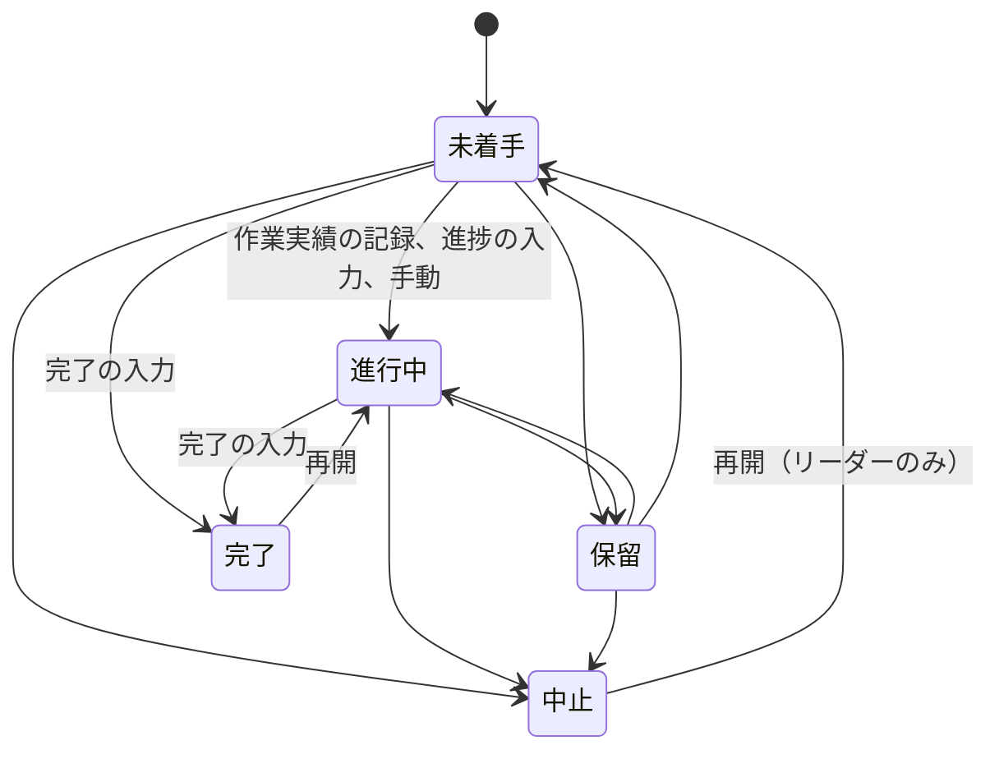

# タスク予実管理システム（仮称） 詳細設計書

| 項目 | 内容 |
| --- | --- |
| 版 | 1.2 案（2026-10-03 更新） |
| 状態 | レビュー待ち |
| 入力となる文書 | [要件定義書 1.4 案](requirements_v2.md)、[基本設計書 1.2 案](basic_design_v2.md) |
| 置き換える文書 | 旧 [detail_design.md](detail_design.md)（試作品の詳細設計書。本書の確定後は参照しない） |

改訂履歴

| 版 | 日付 | 内容 |
| --- | --- | --- |
| 1.0 案 | 2026-10-03 | 初版 |
| 1.1 案 | 2026-10-03 | 要件定義書 1.3 案（Q2〜Q6 の回答）を反映した。多要素認証を任意にし（6.1、6.3、6.7）、管理者がすべてのチームを閲覧できるようにした（4.5、5.3） |
| 1.2 案 | 2026-10-03 | 開発コンテナを作り（2.1、11章、13.1）、pnpm の設定を 12 系の書き方に改めた（12.6） |

---

## 1. はじめに

### 1.1 目的

本書は、基本設計書の方式に沿って、実装に必要な細部を定める。対象は、ソースの構成、テーブルの列、業務ルールの計算、権限の判定、API の入出力、認証とセッションの設定値、画面の部品、設定値、配備である。実装は本書に従う。本書と違う実装が必要になった場合は、先に本書を直す。

### 1.2 前提と表記

- 前提は基本設計書 1.2 と同じ（要件定義書の確認事項はすべて回答済み）。
- 型は PostgreSQL の表記（uuid、varchar(n)、date、timestamptz、integer、smallint、bigint、boolean、jsonb、bytea、inet）で書く。
- 表の「必須」欄の ○ は NOT NULL を表す。
- 「例:」と書いた値は例であり、それ以外の値は確定値とする。

---

## 2. ソースの構成

### 2.1 ディレクトリ

```text
BudgetControlSite/
├─ src/
│  ├─ TaskYojitsu.Domain/          … エンティティ、業務ルール
│  ├─ TaskYojitsu.Application/     … 利用場面ごとの処理、権限の判定、入出力の型
│  ├─ TaskYojitsu.Infrastructure/  … EF Core、マイグレーション、メール、セッション、監査ログ
│  ├─ TaskYojitsu.Web/             … 起動、認証の画面（Blazor 静的 SSR）、API、ミドルウェア、定期処理
│  └─ TaskYojitsu.Tool/            … 運用コマンド
├─ web/                            … 業務の画面（React と TypeScript、Vite）
├─ tests/
│  ├─ TaskYojitsu.Domain.Tests/
│  ├─ TaskYojitsu.Application.Tests/
│  ├─ TaskYojitsu.Web.Tests/       … API と権限の結合テスト（実際の PostgreSQL を使う）
│  └─ e2e/                         … 通しのテスト（Playwright）
├─ deploy/                         … compose.yaml、nginx・PostgreSQL・pgBackRest の設定、配備スクリプト
├─ .devcontainer/                  … 開発コンテナ（.NET 10 SDK、Node.js 24、pnpm 12、PostgreSQL 18、Mailpit）
├─ .github/workflows/              … CI
├─ Directory.Build.props           … 共通のビルド設定（12.6）
├─ Directory.Packages.props        … NuGet の版の一元管理
├─ nuget.config                    … 取得元を nuget.org だけに限る（12.6）
└─ docs/
```

現行の TaskManagementApp/ は、新システムのリリース後に削除する（git の履歴には残る）。

### 2.2 主な部品

| 層 | 部品 | 役割 |
| --- | --- | --- |
| Domain | TaskItem、Team、TeamMember、WorkLog、Comment、Tag、TaskDependency、SavedView、Notification、Holiday | エンティティ。.NET の Task 型と名前がぶつからないように、タスクは TaskItem とする |
| Domain | TaskItemStatus、Priority、TeamRole、UserStatus | 区分値。DB には 5.3（基本設計書）のコードで保存する |
| Domain | RollupCalculator | まとめタスクの集計（4.2） |
| Domain | WorkingCalendar | 稼働日の計算と期待進捗（4.3） |
| Domain | DelayEvaluator | 遅れ・超過の判定（4.4） |
| Domain | StatusTransitions、HierarchyRules | 状態の変化（4.1）、親子の検査（4.8） |
| Application | AccessPolicy | 権限の判定（4.5）。すべての API はこれを通す |
| Application | TeamService、MembershipService、TaskService、WorkLogService、CommentService、DependencyService、TagService、ViewService、NotificationService、AdminUserService、InvitationService、HolidayService | 更新を伴う処理 |
| Application | GanttQuery、MyTasksQuery、TimesheetQuery、DashboardQuery、TeamReportQuery、AuditLogQuery | 参照の処理 |
| Application | IAuditWriter、IEmailSender、TimeProvider | 外部への出口。テストでは差し替える。時刻は TimeProvider だけから得る |
| Infrastructure | AppDbContext、各テーブルの設定、マイグレーション | DB アクセス |
| Infrastructure | DbTicketStore | サーバー側のセッション（6.6） |
| Infrastructure | ProtectedUserStore | 認証アプリの鍵の暗号化、リカバリーコードの HMAC 化、最後に使った認証コードの記録 |
| Infrastructure | PasswordPolicyValidator、NormalizingPasswordHasher | パスワードの検査と保存（6.2） |
| Infrastructure | OneTimeTotpProvider | 認証コードの検証と再利用の拒否（6.3） |
| Infrastructure | AuditWriter、SmtpEmailSender | 監査ログの書き込み、メール送信 |
| Web | Program.cs | 依存の登録、ミドルウェアの順序 |
| Web | Endpoints/ | API（最小 API のグループ） |
| Web | SecurityHeadersMiddleware、ApiRequestGuard、AdminAccessFilter、ReauthFilter | ヘッダーの付与、CSRF などの確認、管理 API の制限、再認証の確認 |
| Web | Components/Account/ | 認証の画面（テンプレートを改修したもの） |
| Web | Jobs/ | 定期処理（9章） |
| Tool | create-admin、import-holidays、verify-audit-log、purge-audit-log、revoke-sessions | 運用コマンド |

### 2.3 使うライブラリ

| 区分 | ライブラリ | 用途 | ライセンス |
| --- | --- | --- | --- |
| サーバー | ASP.NET Core、ASP.NET Core Identity、EF Core（.NET 10 に含まれるもの） | Web、認証、DB アクセス | MIT |
| サーバー | Npgsql.EntityFrameworkCore.PostgreSQL（10 系） | PostgreSQL への接続 | PostgreSQL License |
| サーバー | Microsoft.AspNetCore.DataProtection.EntityFrameworkCore | データ保護の鍵を DB に保存 | MIT |
| サーバー | MailKit | メール送信 | MIT |
| サーバー | QRCoder | 認証アプリ登録用の QR コード（SVG） | MIT |
| 画面 | react、react-dom、react-router | 画面とルーティング | MIT |
| 画面 | @tanstack/react-query、@tanstack/react-virtual | サーバーのデータの取得、見えている行だけの描画 | MIT |
| 画面 | zod | 入力の検査 | MIT |
| 開発 | vite、typescript、vitest、eslint、openapi-typescript | ビルド、型、テスト、静的検査、API の型の生成 | MIT、Apache-2.0 |
| テスト | xUnit.net（v3）、Testcontainers、Playwright | 単体・結合・通しのテスト | Apache-2.0、MIT |

- 版は Directory.Packages.props と pnpm-lock.yaml で固定し、採用時点の最新の安定版を使う。
- 次のものは使わない: 画面の部品集、実行時に style 要素を作るライブラリ、日付ライブラリ（日付の計算は lib/ に自前で持つ）、外部 CDN。

---

## 3. DB の詳細

### 3.1 共通の決まり

- スキーマは tyj とする（public は使わない）。テーブル名・列名は snake_case、テーブル名は複数形とする。
- 主キーは uuid とし、アプリで UUIDv7 を作る（Guid.CreateVersion7）。ただし audit_logs と task_histories は bigint の連番とする。
- 日時は timestamptz（UTC）、日付は date で持つ。
- 多くのテーブルに共通の列を持たせる: created_at（必須、既定 now()）、created_by、updated_at、updated_by。
- 論理削除するテーブルには deleted_at と deleted_by を持たせる。
- 外部キーの列には索引を付ける。
- 文字列は、保存の前に Unicode の NFC に正規化し、前後の空白を除く。改行とタブ以外の制御文字は受け付けない（4.6）。

### 3.2 テーブル定義

#### users（利用者）

ASP.NET Core Identity のユーザー情報を含む。

| 列 | 型 | 必須 | 既定 | 説明・制約 |
| --- | --- | --- | --- | --- |
| id | uuid | ○ | | 主キー |
| user_name、normalized_user_name | varchar(256) | ○ | | メールアドレスと同じ値。normalized は一意 |
| email、normalized_email | varchar(256) | ○ | | normalized_email は一意 |
| email_confirmed | boolean | ○ | false | 招待を受諾したら true |
| password_hash | text | | | 招待中は空 |
| security_stamp、concurrency_stamp | varchar(64) | ○ | | Identity が使う |
| two_factor_enabled | boolean | ○ | false | 認証アプリを登録したら true |
| lockout_end | timestamptz | | | ロックが終わる日時 |
| lockout_enabled | boolean | ○ | true | |
| access_failed_count | integer | ○ | 0 | |
| phone_number、phone_number_confirmed | | | | Identity の標準の列。使わない |
| display_name | varchar(50) | ○ | | 表示名 |
| status | varchar(16) | ○ | 'invited' | invited、active、disabled |
| is_admin | boolean | ○ | false | |
| default_view_id | uuid | | | 最初に開くビュー。saved_views の削除時は空にする |
| last_totp_step | bigint | | | 最後に受け付けた認証コードの時間区分（6.3） |
| last_login_at、disabled_at | timestamptz | | | |
| created_at、updated_at | timestamptz | ○ | now() | |

制約: status が active ならば password_hash は空でない。

#### user_tokens、user_passkeys、user_claims、user_logins（認証基盤の標準テーブル）

| テーブル | 本システムでの使い方 |
| --- | --- |
| user_tokens | 認証アプリの鍵（データ保護で暗号化した値）、リカバリーコード（HMAC の値）を保存する |
| user_passkeys | パスキーを保存する（.NET 10 の Identity の標準の列） |
| user_claims、user_logins | 使わない（外部のログインは使わない） |

#### user_sessions（セッション）

| 列 | 型 | 必須 | 既定 | 説明・制約 |
| --- | --- | --- | --- | --- |
| id | uuid | ○ | | 主キー |
| user_id | uuid | ○ | | users |
| key_hash | bytea | ○ | | Cookie に入れた鍵の SHA-256。一意 |
| ticket | bytea | ○ | | 認証情報。データ保護で暗号化したもの |
| auth_method | varchar(24) | ○ | | password、password_totp、password_recovery、passkey |
| auth_time | timestamptz | ○ | | 最後に認証した日時（再認証を含む） |
| created_at | timestamptz | ○ | now() | |
| last_seen_at | timestamptz | ○ | now() | 最後に操作した日時。自動で送られる要求では更新しない |
| expires_at | timestamptz | ○ | | created_at の 12 時間後 |
| ip | inet | ○ | | |
| user_agent | varchar(256) | ○ | | |
| revoked_at | timestamptz | | | |
| revoked_reason | varchar(32) | | | logout、password_changed、mfa_changed、disabled、user_revoked、admin_revoked |

#### user_known_devices（ログインしたことのある端末）

| 列 | 型 | 必須 | 既定 | 説明・制約 |
| --- | --- | --- | --- | --- |
| user_id | uuid | ○ | | 主キーの一部 |
| fingerprint | bytea | ○ | | 端末の指紋（6.10）。主キーの一部 |
| first_seen_at、last_seen_at | timestamptz | ○ | now() | |

#### invitations（招待）と password_reset_tokens（パスワード再設定）

| 列 | 型 | 必須 | 既定 | 説明・制約 |
| --- | --- | --- | --- | --- |
| id | uuid | ○ | | 主キー |
| user_id | uuid | ○ | | users |
| token_hash | bytea | ○ | | トークンの SHA-256。一意 |
| expires_at | timestamptz | ○ | | 招待は 72 時間後、再設定は 30 分後 |
| used_at | timestamptz | | | |
| revoked_at | timestamptz | | | 再送・新しい申請で無効にした日時 |
| created_at | timestamptz | ○ | now() | |
| created_by | uuid | | | 招待した管理者（招待のみ） |
| request_ip | inet | | | 申請した送信元（再設定のみ） |

#### teams（チーム）

| 列 | 型 | 必須 | 既定 | 説明・制約 |
| --- | --- | --- | --- | --- |
| id | uuid | ○ | | 主キー |
| name | varchar(50) | ○ | | lower(name) に一意の索引 |
| description | varchar(500) | | | |
| archived_at、archived_by | timestamptz、uuid | | | アーカイブした日時と人 |
| version | integer | ○ | 1 | 同時編集の検出 |
| created_at、created_by、updated_at、updated_by | | | | 共通の列 |

チームは削除しない（アーカイブだけ）。

#### team_members（チームの所属）

| 列 | 型 | 必須 | 既定 | 説明・制約 |
| --- | --- | --- | --- | --- |
| team_id | uuid | ○ | | 主キーの一部。teams |
| user_id | uuid | ○ | | 主キーの一部。users |
| role | varchar(8) | ○ | | leader、member |
| joined_at | timestamptz | ○ | now() | |
| removed_at、removed_by | timestamptz、uuid | | | チームから外した日時と人。外した後も行を残す |

- 「現在のメンバー」は removed_at が空の行とする。再び追加するときは、同じ行の removed_at を空に戻す。
- 行を残すのは、完了したタスクの担当者や作業実績から参照され続けるため。

#### tags（タグ）

| 列 | 型 | 必須 | 既定 | 説明・制約 |
| --- | --- | --- | --- | --- |
| id | uuid | ○ | | 主キー |
| team_id | uuid | ○ | | teams。(team_id, id) に一意の制約（複合外部キー用） |
| name | varchar(30) | ○ | | (team_id, lower(name)) に一意の索引 |
| color | varchar(8) | ○ | 'gray' | 決めた 8 色（基本設計書 5.3） |
| created_at、created_by、updated_at、updated_by | | | | 共通の列 |

#### tasks（タスク）

| 列 | 型 | 必須 | 既定 | 説明・制約 |
| --- | --- | --- | --- | --- |
| id | uuid | ○ | | 主キー。(team_id, id) に一意の制約 |
| team_id | uuid | ○ | | teams |
| parent_id | uuid | | | (team_id, parent_id) から tasks(team_id, id) への外部キー |
| depth | smallint | ○ | 1 | 1〜4 |
| sort_order | integer | ○ | | 同じ親の中での並び順（4.8） |
| title | varchar(200) | ○ | | 1 文字以上 |
| description | varchar(4000) | | | |
| assignee_id | uuid | | | (team_id, assignee_id) から team_members(team_id, user_id) への外部キー |
| created_by | uuid | ○ | | users |
| status | varchar(16) | ○ | 'not_started' | 区分値 |
| priority | varchar(8) | ○ | 'medium' | 区分値 |
| planned_start、planned_end | date | | | 両方あるか、両方空。planned_end ≧ planned_start |
| planned_minutes | integer | | | 0〜599,940（9,999 時間）、15 の倍数 |
| actual_start、actual_end | date | | | 両方ある場合は actual_end ≧ actual_start |
| progress | smallint | ○ | 0 | 0〜100、5 の倍数 |
| is_milestone | boolean | ○ | false | true なら planned_start = planned_end で、planned_minutes は空か 0 |
| result_note | varchar(4000) | | | 結果コメント |
| version | integer | ○ | 1 | 同時編集の検出 |
| created_at、updated_at、updated_by | | | | 共通の列 |
| deleted_at、deleted_by | timestamptz、uuid | | | 論理削除 |
| delete_batch_id | uuid | | | 同時に削除した子孫に同じ値を入れる（復元の単位） |

- 制約（CHECK）: 上の各列の範囲と組み合わせに加え、status が done ならば actual_end が空でなく progress が 100。
- まとめタスク（子を持つタスク）の日程・工数・進捗・状態は、表示のたびに子から計算する（4.2）。列に保存された値は、子を持つ前の値のまま残す。

#### task_dependencies（依存関係）

| 列 | 型 | 必須 | 既定 | 説明・制約 |
| --- | --- | --- | --- | --- |
| team_id | uuid | ○ | | |
| predecessor_id | uuid | ○ | | 先行タスク。(team_id, predecessor_id) から tasks への外部キー |
| successor_id | uuid | ○ | | 後続タスク。(team_id, successor_id) から tasks への外部キー |
| created_at、created_by | | ○ | | |

主キーは (predecessor_id, successor_id)。predecessor_id と successor_id は違う値。循環はアプリで検査する（4.8）。

#### task_tags（タスクとタグ）

| 列 | 型 | 必須 | 既定 | 説明・制約 |
| --- | --- | --- | --- | --- |
| team_id | uuid | ○ | | |
| task_id | uuid | ○ | | (team_id, task_id) から tasks への外部キー |
| tag_id | uuid | ○ | | (team_id, tag_id) から tags への外部キー |

主キーは (task_id, tag_id)。1 つのタスクに付けられるタグは 20 個まで（アプリで検査）。

#### task_histories（変更履歴）

| 列 | 型 | 必須 | 既定 | 説明・制約 |
| --- | --- | --- | --- | --- |
| id | bigint（連番） | ○ | | 主キー |
| task_id、team_id | uuid | ○ | | |
| occurred_at | timestamptz | ○ | now() | |
| actor_id | uuid | ○ | | 変更した人 |
| kind | varchar(24) | ○ | | created、updated、moved、deleted、restored、worklog_added、worklog_updated、worklog_deleted、dependency_added、dependency_removed |
| field | varchar(32) | | | 変更した項目（updated のとき） |
| old_value、new_value | varchar(4000) | | | 変更前と変更後の値（表示用の文字列） |

#### comments（コメント）

| 列 | 型 | 必須 | 既定 | 説明・制約 |
| --- | --- | --- | --- | --- |
| id | uuid | ○ | | 主キー |
| team_id、task_id | uuid | ○ | | (team_id, task_id) から tasks への外部キー |
| author_id | uuid | ○ | | users |
| body | varchar(2000) | ○ | | 1 文字以上。プレーンテキスト |
| created_at | timestamptz | ○ | now() | |
| edited_at | timestamptz | | | |
| deleted_at | timestamptz | | | 論理削除。画面には「削除されました」と出す |

#### work_logs（作業実績）

| 列 | 型 | 必須 | 既定 | 説明・制約 |
| --- | --- | --- | --- | --- |
| id | uuid | ○ | | 主キー |
| team_id、task_id | uuid | ○ | | (team_id, task_id) から tasks への外部キー |
| user_id | uuid | ○ | | 記録した人。users |
| work_date | date | ○ | | 作業日 |
| minutes | integer | ○ | | 15〜1,440、15 の倍数 |
| note | varchar(500) | | | メモ |
| source | varchar(12) | ○ | 'dialog' | dialog（ダイアログで記録）、timesheet（週の入力表で記録） |
| version | integer | ○ | 1 | |
| created_at、updated_at | timestamptz | ○ | now() | |

#### saved_views（ビュー）

| 列 | 型 | 必須 | 既定 | 説明・制約 |
| --- | --- | --- | --- | --- |
| id | uuid | ○ | | 主キー |
| owner_id | uuid | ○ | | 作った人 |
| team_id | uuid | | | 共有ビューのチーム |
| is_shared | boolean | ○ | false | true ならば team_id は空でない |
| name | varchar(50) | ○ | | |
| conditions | jsonb | ○ | | 形式は 7.3.6。4KB 以内 |
| version | integer | ○ | 1 | |
| created_at、updated_at | timestamptz | ○ | now() | |

#### notifications（通知）

| 列 | 型 | 必須 | 既定 | 説明・制約 |
| --- | --- | --- | --- | --- |
| id | uuid | ○ | | 主キー |
| user_id | uuid | ○ | | 宛先 |
| kind | varchar(24) | ○ | | 基本設計書 5.3 の通知の種類 |
| team_id、task_id、actor_id | uuid | | | 対象のチーム・タスク、契機となった人 |
| created_at | timestamptz | ○ | now() | |
| read_at | timestamptz | | | |

タスクの名前などの内容は保存しない。表示するたびに権限を確かめて読み出し、見られない場合は「（閲覧できません）」と出す。

#### holidays（祝日）

| 列 | 型 | 必須 | 既定 | 説明・制約 |
| --- | --- | --- | --- | --- |
| holiday_date | date | ○ | | 主キー |
| name | varchar(50) | ○ | | |
| created_at、created_by | | ○ | | |

#### audit_logs（監査ログ）と audit_chain_head（連鎖の先頭）

| 列 | 型 | 必須 | 既定 | 説明・制約 |
| --- | --- | --- | --- | --- |
| id | bigint（連番） | ○ | | 主キー |
| occurred_at | timestamptz | ○ | now() | |
| actor_id | uuid | | | 操作した人。未ログインなら空 |
| actor_hint | varchar(64) | | | 未ログインで入力されたメールアドレスの HMAC の値（平文は残さない） |
| action | varchar(64) | ○ | | 8.4 の一覧 |
| result | varchar(8) | ○ | | success、failure、denied |
| target_type | varchar(32) | | | user、team、task、work_log、comment、tag、view、holiday、session |
| target_id | varchar(64) | | | 対象の ID（祝日は日付） |
| team_id | uuid | | | |
| ip | inet | | | |
| user_agent | varchar(256) | | | |
| request_id | varchar(64) | | | |
| detail | jsonb | | | 変更前後の値など。秘密情報は入れない |
| prev_hash、hash | bytea | ○ | | トリガーで設定する（3.5） |

audit_chain_head は 1 行だけのテーブル（id = 1）で、last_id、last_hash（最後の記録の ID とハッシュ値）と、anchor_id、anchor_hash（保存期間で削除した後の検証の起点）を持つ。

#### data_protection_keys（データ保護の鍵）

ASP.NET Core のデータ保護の標準の構成（id、friendly_name、xml）。鍵の XML は証明書で暗号化して保存する。

### 3.3 索引

| テーブル | 索引 | 用途 |
| --- | --- | --- |
| users | normalized_email（一意）、normalized_user_name（一意） | ログイン |
| user_sessions | key_hash（一意）、(user_id, revoked_at) | セッションの照合、一覧 |
| invitations、password_reset_tokens | token_hash（一意） | トークンの照合 |
| teams | lower(name)（一意） | 名前の重複を防ぐ |
| team_members | (user_id)。removed_at が空の行だけ | 所属チームの取得 |
| tags | (team_id, id)（一意）、(team_id, lower(name))（一意） | |
| tasks | (team_id, id)（一意） | 複合外部キー |
| tasks | (team_id, parent_id, sort_order)。deleted_at が空の行だけ | 階層の表示 |
| tasks | (assignee_id)。deleted_at が空で、status が done・cancelled 以外の行だけ | マイタスク |
| tasks | (team_id, planned_start, planned_end)。deleted_at が空の行だけ | ガント |
| work_logs | (task_id)、(user_id, work_date) | 実績の集計、1 日の合計 |
| comments | (task_id, created_at) | |
| task_histories | (task_id, occurred_at) | |
| notifications | (user_id, created_at DESC)、(user_id)。read_at が空の行だけ | |
| audit_logs | (occurred_at)、(actor_id, occurred_at)、(target_type, target_id)、(action, occurred_at) | 監査ログの検索 |

### 3.4 DB のアカウントと権限

| アカウント | 用途 | 権限 |
| --- | --- | --- |
| tyj_owner | スキーマの所有者。マイグレーションと監査ログの削除（purge-audit-log）でだけ使う | スキーマとすべてのオブジェクトの所有 |
| tyj_app | アプリ | スキーマ tyj の USAGE。業務テーブルの SELECT、INSERT、UPDATE、DELETE（users と teams には DELETE を与えない）。audit_logs は SELECT と INSERT だけ。audit_chain_head には権限を与えない。シーケンスの USAGE |
| tyj_backup | pgBackRest | バックアップに必要な権限だけ |

- tyj_app には、文の実行時間の上限 30 秒、トランザクション中の放置の上限 60 秒を設定する。
- PUBLIC から、public スキーマと tyj スキーマのすべての権限を外す。

### 3.5 監査ログのハッシュ連鎖

audit_logs に INSERT するとき、BEFORE INSERT のトリガー関数 tyj.audit_logs_chain() が次の処理をする。関数は所有者の権限で動き（SECURITY DEFINER）、search_path を固定する。

1. audit_chain_head の行を FOR UPDATE で読む（同時の書き込みは順番に処理される）。
2. NEW.prev_hash に last_hash を入れる。
3. NEW.hash に、SHA-256(prev_hash ∥ 本文) を入れる。本文は、id、occurred_at（UTC、マイクロ秒まで）、actor_id、actor_hint、action、result、target_type、target_id、team_id、ip、user_agent、request_id、detail（jsonb の文字列表現）を「|」でつないだ UTF-8 の文字列とする。空の値は空文字にする。
4. audit_chain_head の last_id と last_hash を更新する。

- audit_chain_head の last_hash の初期値は、32 バイトのゼロとする。
- UPDATE と DELETE は、権限を与えないことに加えて、BEFORE UPDATE OR DELETE のトリガーで拒否する。ただし所有者が監査ログの削除（設定値 tyj.audit_purge = on）を行う場合だけは通す。
- 検証（verify-audit-log と JOB-04）: anchor_id の次の記録から ID の順に読み、prev_hash と hash を計算し直して比べる。最初に食い違った ID を報告する。
- 削除（purge-audit-log）: 保存期間（3 年）を過ぎた記録を古い順に削除し、最後に削除した記録の ID とハッシュ値を anchor_id と anchor_hash に保存する。

### 3.6 マイグレーションの運用

- EF Core のマイグレーションで作る。EF Core で表せないもの（CHECK 制約、式を使った索引、トリガーと関数、権限の付与）は、マイグレーションの中で SQL を書く。
- CI でマイグレーションの実行ファイル（bundle）を作り、配備のときに tyj_owner の権限で実行する（12.7）。
- 1 つ前の版のアプリでも動く変更だけを 1 回の配備で行う。列の削除や名前の変更は、追加を先に配備し、次の版で削除する。

---

## 4. 業務ロジック

### 4.1 タスクの状態の変化



| 変化 | 操作できる人 | 条件と、自動で変わる値 |
| --- | --- | --- |
| 未着手 → 進行中 | 担当者、リーダー | 作業実績を初めて記録したとき、進捗率を 0 より大きくしたときは自動で変わる。実績開始日が空なら、作業日（進捗の入力なら今日）を入れる |
| 未着手・進行中 → 完了 | 担当者、リーダー | 実績終了日が必須（今日以前で、実績開始日以降）。進捗率は 100 にする。実績開始日が空なら実績終了日と同じ日を入れる |
| 完了 → 進行中（再開） | 担当者、リーダー | 実績終了日を空に戻す。進捗率はそのまま（必要なら利用者が直す） |
| → 保留、保留 → 戻す | リーダー。または、自分が作成して担当しているタスクの担当者 | |
| → 中止 | 同上 | 予実の集計から除く |
| 中止 → 未着手（再開） | リーダー | |

上の表にない変化（例: 完了 → 中止）は受け付けない（MSG-TSK-015）。まとめタスクの状態は子から決まるため、直接は変えられない（MSG-TSK-008）。

### 4.2 まとめタスクの集計

チームの論理削除されていないタスクを読み込み、葉から根へ順に計算する（後順の走査）。中止したタスクは計算から除く。

| 値 | 計算方法 |
| --- | --- |
| 予定開始日・予定終了日 | 子の予定開始日のうち最も早い日、予定終了日のうち最も遅い日。日程のある子がなければ空 |
| 実績開始日 | 子の実績開始日と、自分の実績開始日のうち最も早い日 |
| 実績終了日 | すべての子が完了していれば、子の実績終了日のうち最も遅い日。そうでなければ空 |
| 予定工数 | 子の予定工数の合計（空は 0 とする。すべて空なら空） |
| 実績工数 | 自分の作業実績（子を持つ前に記録したもの）と、子の実績工数の合計 |
| 進捗率 | 子の進捗率の重み付き平均。重みは子の予定工数。予定工数がない子は予定期間の稼働日数、それもなければ 1 とする。小数点以下は切り捨て |
| 状態 | 子がすべて完了なら完了。子がすべて未着手なら未着手。それ以外は進行中。中止を除いた子がない場合（すべて中止）は中止 |
| 遅れの印 | 自分の値で判定した印（4.4）に加えて、子孫のどれかに印があれば「子孫に遅れあり」の印を付ける |

- 子を持つタスクには、新しい作業実績を記録できない（MSG-WL-004）。子を持つ前の作業実績は残し、上の表のとおり実績工数に含める。
- 計算はサーバー側（RollupCalculator）だけで行い、画面は結果を表示する。

### 4.3 稼働日と期待進捗

- 稼働日は、土曜日・日曜日と、holidays テーブルの日を除いた日とする。
- 稼働日数(a, b) は、a から b まで（両端を含む）の稼働日の数とする。
- 「今日」は日本時間の日付とし、TimeProvider から得る（テストでは固定できる）。
- 期待進捗は次のとおり計算する。

| 条件 | 期待進捗 |
| --- | --- |
| 予定日がない | 計算しない |
| 今日 ≦ 予定開始日 | 0% |
| 今日 > 予定終了日 | 100% |
| それ以外 | 稼働日数(予定開始日, 今日の前日) ÷ 稼働日数(予定開始日, 予定終了日) × 100（小数点以下は切り捨て） |

- 「今日の前日まで」とするのは、「昨日までに終わっているはずの割合」を表すため。
- 予定期間がすべて休日で分母が 0 の場合は、暦日の日数で計算する。

### 4.4 遅れ・超過の判定

| 印 | 条件 | 対象 |
| --- | --- | --- |
| overdue（期限超過） | 予定終了日 < 今日。かつ状態が完了・中止のいずれでもない | 予定日のあるタスク（マイルストーンを含む） |
| late_start（開始遅れ） | 予定開始日 < 今日。かつ状態が未着手 | 予定日のあるタスク |
| effort_overrun（工数超過） | 予定工数 > 0。かつ実績工数 > 予定工数 | |
| progress_lag（進捗遅れ、S） | 状態が未着手か進行中で、期待進捗 − 進捗率 ≧ しきい値（初期値 20） | 予定日があり、子を持たないタスク |

### 4.5 権限の判定表

判定に使う情報:

| 記号 | 意味 |
| --- | --- |
| A | 利用者が管理者 |
| R | 対象チームでの現在の役割（leader、member、なし） |
| C | タスクの作成者が自分 |
| S | タスクの担当者が自分 |
| W | タスク（子孫を含む）に作業実績がある |
| X | チームがアーカイブされている |
| L | いずれかのチームで、現在リーダーを務めている |

判定の順序:

1. 利用者が有効でなければ拒否する。
2. 管理の操作（admin.*）は、A、直近 10 分以内の認証、許可したネットワークからのアクセス（設定した場合）をすべて満たせば許可する。満たさなければ 403 を返す。
3. チームのデータへの操作で R が「なし」の場合、管理者に許される操作（下表で A を含むもの）でなければ 404 を返す。
4. X の場合、閲覧とアーカイブの解除以外は 403 を返す（team.archived）。
5. 下表の条件を満たせば許可し、満たさなければ 403 を返す。判定の途中でエラーが起きたら拒否する。

| 操作 | 許可する条件 |
| --- | --- |
| team.view（基本情報、メンバー、タグ） | R が leader か member。または A |
| team.create | A または L |
| team.update、team.archive、team.unarchive | R = leader。または A |
| team.member.add、team.member.remove | R = leader。または A |
| team.leader.assign、team.leader.revoke | R = leader。または A。最後のリーダーは外せない |
| team.tag.manage、team.view.shared.manage | R = leader |
| task.view（タスク、ガント、コメント、変更履歴の閲覧） | R が leader か member。または A（閲覧のみ） |
| task.create | R = leader（担当者は現在のメンバーの誰でも、または未割り当て）。R = member（担当者は自分） |
| task.plan.edit | R = leader。または R = member かつ C かつ S |
| task.assign | R = leader |
| task.child.add | R = leader。または R = member で、親タスクについて C かつ S |
| task.move | R = leader。または R = member で、対象と移動先の親（最上位を除く）について C かつ S |
| task.dependency.edit | R = leader。または R = member で、両方のタスクについて C かつ S |
| task.delete | R = leader。または R = member で、子孫を含むすべてのタスクについて C で、かつ W でない |
| task.restore | R = leader |
| task.actual.edit（状態、進捗、実績日、結果コメント） | R = leader。または R = member かつ S。保留・中止への変更は 4.1 の表に従う |
| worklog.create | R が leader か member で、かつ S。子を持たないタスクだけ |
| worklog.edit、worklog.delete | 記録した本人で、R が leader か member |
| worklog.view.detail | R = leader、または A（全員分）。それ以外は自分の記録だけ |
| comment.create | R が leader か member |
| comment.edit、comment.delete | 投稿した本人 |
| report.team | R = leader。または A |
| admin.* | 判定の順序 2 のとおり |

- 管理者は、所属していないチームでは上の表の閲覧の操作だけが許される（変更の操作はすべて 403）。閲覧を許可したときは、監査ログに admin.team_viewed を記録する（同じセッション・同じチームでは 1 回だけ）。
- 権限の判定は Application 層の AccessPolicy だけで行い、API の処理には条件を書かない（NF-ACC-05）。
- 判定の材料は毎回 DB から読む。R は team_members の removed_at が空の行で判定する。

### 4.6 入力の検査

サーバー側で検査する。画面側でも同じ規則で検査するが、それは使いやすさのためとする。

| 対象 | 項目 | 規則 | メッセージ |
| --- | --- | --- | --- |
| タスク | title | 前後の空白を除いて 1〜200 字 | MSG-TSK-001 |
| タスク | description、resultNote | 4,000 字以内 | MSG-CMN-002 |
| タスク | plannedStart、plannedEnd | 両方あるか両方空。終了日 ≧ 開始日。2000-01-01〜2099-12-31 | MSG-TSK-002、003 |
| タスク | plannedMinutes | 0〜599,940、15 の倍数 | MSG-TSK-004 |
| タスク | parentId | 同じチーム。自分と子孫は不可。深さ 4 まで | MSG-TSK-005、006 |
| タスク | assigneeId | チームの現在のメンバー | MSG-TSK-007 |
| タスク | status、priority | 区分値。状態は 4.1 の変化に従う | MSG-CMN-003、MSG-TSK-015 |
| タスク | progress | 0〜100、5 の倍数 | MSG-TSK-012 |
| タスク | actualStart、actualEnd | 終了日 ≧ 開始日。どちらも今日以前 | MSG-TSK-009 |
| タスク | isMilestone | 開始日 = 終了日、工数なし、子を持たない | MSG-TSK-011 |
| タスク | tagIds | 同じチームのタグ、20 個まで | MSG-CMN-003 |
| 作業実績 | workDate | 今日以前、2000-01-01 以降 | MSG-WL-003 |
| 作業実績 | minutes | 15〜1,440、15 の倍数。同じ人・同じ日の合計が 1,440 以下 | MSG-WL-001、002 |
| 作業実績 | note | 500 字以内 | MSG-CMN-002 |
| チーム | name | 1〜50 字。重複は不可 | MSG-TEM-001、002 |
| チーム | description | 500 字以内 | MSG-CMN-002 |
| タグ | name、color | 1〜30 字でチーム内の重複は不可。色は決めた 8 色 | MSG-TEM-004、MSG-CMN-003 |
| コメント | body | 1〜2,000 字 | MSG-CMN-002、004 |
| ビュー | name、conditions | 1〜50 字。条件は 7.3.6 の形式で 4KB 以内 | MSG-CMN-002、003 |
| 利用者 | displayName | 1〜50 字 | MSG-CMN-002、004 |
| 利用者 | email | 254 字以内、形式が正しい、重複は不可 | MSG-ADM-002 |

- 文字列は NFC に正規化し、前後の空白を除いてから検査する。改行・タブ以外の制御文字を含む場合は受け付けない。
- 定義されていない項目が要求に含まれていても無視する（NF-ACC-04）。

### 4.7 同時編集の制御

- version を持つテーブル（tasks、teams、work_logs、saved_views）を更新する要求には、version を必ず含める。
- 更新は「id と version が一致する行」に対して行い、version を 1 増やす（EF Core の同時実行トークン）。
- 一致する行がなければ 409（concurrency.conflict）を返し、応答に最新の内容を含める。
- ガントのドラッグによる日程の変更も同じ扱いにする。

### 4.8 並び順と階層の変更

- sort_order は 1,024 刻みで振る。新しいタスクは同じ親の最後（最大値 + 1,024）に置く。
- 並び替えでは、移動先の前後の sort_order の中間の値を使う。間が 2 未満になったら、同じ親の子を 1,024 刻みで振り直す（同じトランザクションで行う）。
- 親を変えるときの検査:
  - 移動先の親が同じチームで、論理削除されていない。
  - 移動先の親が、自分自身と自分の子孫でない（再帰の問い合わせで祖先をたどって確かめる）。
  - 移動先の親の深さ + 自分の部分木の高さ ≦ 4。
  - 移動先の親がマイルストーンでない。
- 同じチームの階層の変更が同時に動いて循環が生まれないよう、トランザクションの最初にチームごとの DB のロック（pg_advisory_xact_lock）を取る。
- 移動した部分木の depth を、まとめて更新する。
- 依存関係の追加でも、循環の検査（後続から先行へたどれないこと）を同じロックの中で行う（MSG-TSK-016）。

### 4.9 削除、復元、チームから外すとき

| 操作 | 処理 |
| --- | --- |
| タスクの削除 | 子孫を含む部分木を集め、すべてに同じ deleted_at、deleted_by、delete_batch_id を入れる。変更履歴と監査ログに残す |
| タスクの復元（30 日以内） | 同じ delete_batch_id の行を元に戻す。親が別に削除されている場合は受け付けない（MSG-TSK-014） |
| 完全な削除（JOB-02） | deleted_at から 365 日を過ぎたタスクを部分木ごと削除する。作業実績、コメント、変更履歴、タグ、依存関係も一緒に消える |
| メンバーをチームから外す | team_members の removed_at を入れる。そのチームで本人が担当している未完了（完了・中止以外）のタスクの担当者を空にし、変更履歴に残す。リーダーに通知する。完了したタスクの担当者と作業実績はそのまま残す |
| リーダーを外す・メンバーにする | チームの所属の行をロックし、ほかに現在のリーダーがいることを確かめる（MSG-TEM-003） |
| 管理者の権限を外す | 管理者の行をロックし、ほかに有効な管理者がいることを確かめる（MSG-ADM-001） |
| アカウントの無効化 | 全セッションを失効させる。現在の所属チームすべてで「チームから外す」と同じ処理をする。未使用の招待を無効にする |

### 4.10 作業実績の 1 日の上限

- 作業実績を記録・修正するトランザクションの最初に、利用者と作業日の組み合わせで DB のロック（pg_advisory_xact_lock）を取る。
- その日の合計（自分の記録すべて）を求め、1,440 分を超えるなら受け付けない（MSG-WL-002）。

---

## 5. API の詳細

### 5.1 共通の仕様

| 項目 | 仕様 |
| --- | --- |
| ベースの URL | https://{ホスト名}/api/v1 |
| 認証 | セッションの Cookie。未認証は 401（auth.unauthenticated）、時間切れは 401（auth.session_expired） |
| 状態を変える要求 | ヘッダー X-XSRF-TOKEN、Origin の一致（Origin がない場合は Sec-Fetch-Site が same-origin）、Content-Type: application/json を必須とする。満たさなければ 403（security.csrf） |
| 本文の大きさ | 64KB まで（nginx とアプリの両方で制限する） |
| 日付と日時 | 日付は "YYYY-MM-DD"、日時は ISO 8601 の UTC |
| ID | UUID の文字列 |
| 件数の多い一覧 | カーソル方式（cursor、limit）。limit は 100 まで |
| 応答のヘッダー | Cache-Control: no-store、X-Request-Id |
| 回数制限 | 6.9 |

### 5.2 エラーの形式とコード

エラーは RFC 9457 の Problem Details で返す。

```json
{
  "type": "https://tasks.corp.example/problems/validation",
  "title": "入力内容を確認してください。",
  "status": 400,
  "code": "validation.failed",
  "errors": { "plannedEnd": ["MSG-TSK-002"] },
  "traceId": "00-4bf92f3577b34da6a3ce929d0e0e4736-00f067aa0ba902b7-01"
}
```

| HTTP | code | 意味 | 画面の動き |
| --- | --- | --- | --- |
| 400 | validation.failed | 入力の誤り | 項目の近くにメッセージを出す |
| 401 | auth.unauthenticated、auth.session_expired | 未ログイン、時間切れ | ログイン画面へ移る（戻り先を付ける） |
| 403 | auth.forbidden | 権限がない | お知らせを出す |
| 403 | auth.reauth_required | 再認証が必要 | 再認証の画面へ移る |
| 403 | security.csrf | CSRF の確認に失敗 | 画面を読み込み直すよう促す |
| 403 | team.archived | アーカイブ中のチーム | お知らせを出す |
| 404 | resource.not_found | 見つからない（権限がない場合も同じ） | お知らせを出す |
| 409 | concurrency.conflict | ほかの人が先に更新した | 最新を読み込み、お知らせを出す |
| 409 | rule.violation | 業務ルールに反する（最後のリーダーなど）。errors にメッセージ ID を入れる | お知らせを出す |
| 429 | rate.limited | 回数の上限を超えた（Retry-After を付ける） | お知らせを出す |
| 500 | server.error | 想定外のエラー | 問い合わせ番号（traceId）を出す |

### 5.3 エンドポイントの一覧

権限の欄は 4.5 の操作名。「本人」は自分のデータだけを扱うことを表す。

| ID | メソッド | パス | 権限 | 概要 |
| --- | --- | --- | --- | --- |
| API-01 | GET | /me | 本人 | 自分の情報（表示名、管理者か、チームを作れるか、多要素認証を設定しているか、所属チームと役割、最初に開くビュー） |
| API-02 | PATCH | /me | 本人 | 表示名の変更 |
| API-03 | PUT | /me/default-view | 本人 | 最初に開くビューの設定 |
| API-04 | GET | /session/status | 本人（延長しない） | セッションの残り時間 |
| API-05 | POST | /session/keepalive | 本人 | セッションの延長 |
| API-06 | GET | /teams | 本人 | 所属チームの一覧（includeArchived）。管理者は scope=all で全チームを取得できる（所属していないチームの役割は admin_view） |
| API-07 | POST | /teams | team.create | チームの作成（5.4.6） |
| API-08 | GET | /teams/{teamId} | team.view | チームの基本情報、メンバー、タグ |
| API-09 | PATCH | /teams/{teamId} | team.update | 名前・説明の変更 |
| API-10 | POST | /teams/{teamId}/archive | team.archive | アーカイブ |
| API-11 | POST | /teams/{teamId}/unarchive | team.unarchive | アーカイブの解除 |
| API-12 | POST | /teams/{teamId}/members | team.member.add（役割が leader なら team.leader.assign も） | メンバーの追加 |
| API-13 | PATCH | /teams/{teamId}/members/{userId} | team.leader.assign、team.leader.revoke | 役割の変更 |
| API-14 | DELETE | /teams/{teamId}/members/{userId} | team.member.remove | チームから外す（4.9） |
| API-15 | GET | /users/search | A または L | 有効な利用者の検索（2 文字以上、20 件まで。ID、表示名、メールアドレスだけを返す） |
| API-16 | POST | /teams/{teamId}/tags | team.tag.manage | タグの作成 |
| API-17 | PATCH | /tags/{tagId} | team.tag.manage | タグの変更 |
| API-18 | DELETE | /tags/{tagId} | team.tag.manage | タグの削除（付いているタスクからも外す） |
| API-19 | GET | /gantt | task.view（指定したすべてのチーム） | ガントの表示用データ（5.4.1） |
| API-20 | GET | /gantt/search | task.view | キーワードに一致するタスクの ID（タイトル、説明、タグ。1,000 件まで） |
| API-21 | GET | /tasks/{taskId} | task.view | タスクの詳細（説明、結果コメント、親の経路、操作の可否） |
| API-22 | POST | /tasks | task.create（親を指定したら task.child.add） | タスクの登録（5.4.2） |
| API-23 | PATCH | /tasks/{taskId} | 項目ごとに task.plan.edit、task.assign、task.actual.edit | タスクの変更（5.4.3） |
| API-24 | POST | /tasks/{taskId}/move | task.move | 親と並び順の変更 |
| API-25 | DELETE | /tasks/{taskId}?version= | task.delete | 削除（子孫を含む） |
| API-26 | GET | /teams/{teamId}/deleted-tasks | task.restore | 30 日以内に削除したタスク |
| API-27 | POST | /tasks/{taskId}/restore | task.restore | 復元 |
| API-28 | GET | /tasks/{taskId}/history | task.view | 変更履歴（新しい順、カーソル方式） |
| API-29 | GET | /tasks/{taskId}/comments | task.view | コメントの一覧 |
| API-30 | POST | /tasks/{taskId}/comments | comment.create | コメントの投稿 |
| API-31 | PATCH | /comments/{commentId} | comment.edit | コメントの編集 |
| API-32 | DELETE | /comments/{commentId} | comment.delete | コメントの削除 |
| API-33 | POST | /tasks/{taskId}/dependencies | task.dependency.edit | 先行タスクの追加 |
| API-34 | DELETE | /tasks/{taskId}/dependencies/{predecessorId} | task.dependency.edit | 先行タスクの削除 |
| API-35 | GET | /tasks | task.view | タスク一覧（検索・絞り込み・並べ替え、カーソル方式。S） |
| API-36 | GET | /tasks/{taskId}/work-logs | task.view | 自分の記録と人ごとの合計。リーダーには全員の明細 |
| API-37 | POST | /tasks/{taskId}/work-logs | worklog.create | 作業実績の記録（5.4.4） |
| API-38 | PATCH | /work-logs/{workLogId} | worklog.edit | 作業実績の修正 |
| API-39 | DELETE | /work-logs/{workLogId} | worklog.delete | 作業実績の削除 |
| API-40 | GET | /me/timesheet?weekStart= | 本人 | 週の入力表 |
| API-41 | PUT | /me/timesheet | 本人 | 週の入力表の保存（5.4.5） |
| API-42 | GET | /me/tasks | 本人 | マイタスク |
| API-43 | GET | /dashboard | 本人 | ホームの要約 |
| API-44 | GET | /teams/{teamId}/report?from=&to= | report.team | 担当者別の予実（S） |
| API-45 | GET | /views | 本人 | 自分のビューと、所属チームの共有ビュー |
| API-46 | POST | /views | 本人（共有するなら team.view.shared.manage） | ビューの保存 |
| API-47 | PATCH | /views/{viewId} | 作った人（共有ビューは team.view.shared.manage） | ビューの変更 |
| API-48 | DELETE | /views/{viewId} | 同上 | ビューの削除 |
| API-49 | GET | /notifications | 本人 | 通知の一覧（S） |
| API-50 | GET | /notifications/unread-count | 本人（延長しない） | 未読の数（S） |
| API-51 | POST | /notifications/{id}/read | 本人 | 既読にする（S） |
| API-52 | POST | /notifications/read-all | 本人 | すべて既読にする（S） |
| API-53 | GET | /admin/users | admin | 利用者の一覧・検索（多要素認証とパスキーの設定状況を含む） |
| API-54 | POST | /admin/invitations | admin | 招待（メールアドレス、表示名、管理者にするか） |
| API-55 | POST | /admin/invitations/{userId}/resend | admin | 招待の再送（古いトークンは無効） |
| API-56 | DELETE | /admin/invitations/{userId} | admin | 招待の取り消し（利用者は無効にする） |
| API-57 | POST | /admin/users/{userId}/disable | admin | 無効化（4.9） |
| API-58 | POST | /admin/users/{userId}/enable | admin | 再有効化 |
| API-59 | PUT | /admin/users/{userId}/admin | admin | 管理者権限の付与・解除 |
| API-60 | POST | /admin/users/{userId}/reset-mfa | admin | 多要素認証のリセット（本人確認の方法の記録を必須にする） |
| API-61 | GET | /admin/teams | admin | 全チームの一覧（メンバー数、リーダー） |
| API-62 | GET | /admin/audit-logs | admin | 監査ログの検索（期間、操作者、操作、対象、カーソル方式） |
| API-63 | GET | /admin/holidays?year= | admin | 祝日の一覧 |
| API-64 | POST | /admin/holidays | admin | 祝日の追加 |
| API-65 | DELETE | /admin/holidays/{date} | admin | 祝日の削除 |

- 監視用の GET /health/live と GET /health/ready は /api/v1 の外に置き、nginx で監視サーバーからの要求だけを通す。
- 管理者がチームを作るときは、API-07 で leaderUserId を指定する。リーダーが作るときは指定せず、作った人がリーダーになる。

### 5.4 主な API の入出力

#### 5.4.1 ガントの表示用データ（API-19）

要求: `GET /api/v1/gantt?teamIds={id1},{id2}&from=2026-10-06&to=2026-11-16`

応答の例:

```json
{
  "asOf": "2026-10-15",
  "range": { "from": "2026-10-06", "to": "2026-11-16" },
  "teams": [{ "id": "0192a8f0-...", "name": "販売管理更改", "role": "leader", "archived": false }],
  "members": [{ "id": "0192a8f1-...", "displayName": "鈴木", "teamIds": ["0192a8f0-..."], "current": true }],
  "tags": [{ "id": "0192a8f2-...", "teamId": "0192a8f0-...", "name": "設計", "color": "blue" }],
  "holidays": [{ "date": "2026-11-03", "name": "文化の日" }],
  "tasks": [{
    "id": "0192a8f3-...", "teamId": "0192a8f0-...", "parentId": null, "depth": 1, "sortOrder": 1024,
    "title": "API 設計", "assigneeId": "0192a8f1-...", "createdById": "0192a8f1-...",
    "status": "in_progress", "priority": "medium", "isMilestone": false, "isSummary": false,
    "plannedStart": "2026-10-08", "plannedEnd": "2026-10-14", "plannedMinutes": 960,
    "actualStart": "2026-10-09", "actualEnd": null, "actualMinutes": 930,
    "progress": 80, "expectedProgress": 100,
    "flags": ["overdue"], "descendantFlagged": false,
    "tagIds": ["0192a8f2-..."], "predecessorIds": [],
    "version": 7,
    "can": { "editPlan": true, "assign": false, "editActual": true, "logWork": true, "addChild": true, "delete": false }
  }],
  "truncated": false
}
```

- 返すタスク: 指定したチームの論理削除されていないタスクのうち、次のどれかに当たるものと、その祖先すべて。
  - 予定期間か実績期間（未完了なら実績開始日から今日まで）が、表示期間と重なる。
  - 予定日がなく、完了・中止のどちらでもない（日程未定）。
- まとめタスクの値（4.2）、遅れの印（4.4）、操作の可否（can）はサーバーで計算する。
- 管理者が所属していないチームの role は admin_view とし、そのチームのタスクの can はすべて false にする。
- 説明と結果コメントは含めない（詳細は API-21 で取得する）。
- 返すタスクが Gantt:MaxTasksPerResponse（5,000 件）を超えたら、先頭から 5,000 件だけを返して truncated を true にし、画面で条件を絞るよう促す。

#### 5.4.2 タスクの登録（API-22）

要求の例:

```json
{
  "teamId": "0192a8f0-...",
  "parentId": "0192a8f4-...",
  "title": "API 設計",
  "description": "API の一覧と入出力を設計書にまとめる",
  "assigneeId": "0192a8f1-...",
  "plannedStart": "2026-10-08",
  "plannedEnd": "2026-10-14",
  "plannedMinutes": 960,
  "priority": "medium",
  "tagIds": ["0192a8f2-..."],
  "isMilestone": false
}
```

- メンバーが登録する場合、assigneeId は自分でなければならない（省略したら自分）。
- 応答は 201 と、作成したタスク（5.4.1 の tasks の要素と同じ形）。Location ヘッダーに API-21 の URL を入れる。
- 担当者がいれば、その人に通知（task_assigned）を作る。

#### 5.4.3 タスクの変更（API-23）

要求の例（ガントで日程を動かした場合）:

```json
{ "version": 7, "plannedStart": "2026-10-09", "plannedEnd": "2026-10-15" }
```

- 送られた項目だけを変える。項目ごとに 4.5 の権限を確かめ、1 つでも権限のない項目があれば全体を受け付けない（403）。
- まとめタスクの日程・工数・進捗・状態は変えられない（MSG-TSK-008）。
- 状態を変える場合は 4.1 の変化に従う。完了にする場合は actualEnd を同じ要求に含める。
- 応答は 200 と、変更後のタスク。画面はガントのデータを取得し直す。
- 担当者を変えた場合は、新しい担当者に task_assigned、前の担当者に task_unassigned の通知を作る。

#### 5.4.4 作業実績の記録（API-37）

要求の例:

```json
{
  "workDate": "2026-10-15",
  "minutes": 90,
  "note": "エラー時の応答を整理",
  "progress": 85,
  "taskVersion": 7
}
```

- progress と taskVersion は任意で、指定するとタスクの進捗率も同じトランザクションで変える。
- 応答は 201 と、作成した作業実績、変更後のタスクの要点（status、progress、actualStart、actualMinutes、version）。
- 自動で変わる値は 4.1 のとおり。

#### 5.4.5 週の入力表の保存（API-41）

要求の例:

```json
{
  "weekStart": "2026-10-12",
  "cells": [
    { "taskId": "0192a8f3-...", "date": "2026-10-12", "minutes": 120 },
    { "taskId": "0192a8f3-...", "date": "2026-10-13", "minutes": 0 }
  ]
}
```

- weekStart は月曜日。cells の日付はその週の中だけ。
- マスごとに、その日の自分の作業実績を次のように扱う。
  - source = dialog の記録がある日: 変更できない（MSG-WL-006）。
  - source = timesheet の記録が 1 件ある日: minutes が 0 なら削除、それ以外なら修正する。
  - 記録がない日: minutes が 0 より大きければ、source = timesheet で作る。
- すべてのマスを 1 つのトランザクションで処理し、1 つでも誤りがあれば何も保存しない。応答の errors に、マスの位置（cells の番号）とメッセージ ID を入れる。

#### 5.4.6 チームの作成（API-07）

要求の例:

```json
{ "name": "販売管理更改", "description": "2027 年 4 月稼働の販売管理システム更改", "leaderUserId": null }
```

- リーダー（L）が作る場合、leaderUserId は空にする。作った人がリーダーになる。
- 管理者が作る場合、leaderUserId を必須とする（自分を指定してもよい）。指定された人に team_added の通知を作る。
- 名前の重複は 409（MSG-TEM-002）。

---

## 6. 認証とセッションの詳細

### 6.1 Identity の設定値

| 項目 | 値 |
| --- | --- |
| パスワードの長さ | 15〜128 文字（Unicode のコードポイントで数える） |
| 文字の種類の必須 | なし（英大文字・英小文字・数字・記号を求めない） |
| メールアドレスの一意 | 必須 |
| ロック | 5 回続けて失敗したら 15 分。新しい利用者にも適用し、認証コードの失敗も数える |
| ログインできる利用者 | 招待を受諾した（email_confirmed が true で、status が active の）利用者だけ |
| 多要素認証 | 任意。設定していない利用者には、設定を勧める表示を出す（MSG-AUT-011）。Security:Mfa:RequiredForAdmins を true にすると、管理者だけ必須にできる（初期値は false） |
| パスワードのハッシュ | PBKDF2-HMAC-SHA512、300,000 回 |

### 6.2 パスワードの検査と保存

1. 入力を Unicode の NFKC で正規化する（設定するときと照合するときの両方）。
2. 長さが 15〜128 文字であることを確かめる（MSG-AUT-003）。
3. 同梱した頻出パスワードの一覧（約 10 万件。大文字と小文字は区別しない）に含まれないことを確かめる（MSG-AUT-004）。一覧は、再配布できるライセンスの公開データから作る。
4. メールアドレスの @ より前の部分と、表示名（4 文字以上の場合）を含まないことを確かめる。大文字と小文字は区別しない（MSG-AUT-005）。
5. 同じ文字の繰り返しや、続いた文字（abcdef、123456、qwerty など）だけでできていないこと、使っている文字の種類が 5 つ以上であることを確かめる（MSG-AUT-006）。
6. 設定 Security:Password:PwnedApi:Enabled が true の場合だけ、外部の漏えい照合サービスに SHA-1 の値の先頭 5 文字だけを送って照合する（k-匿名性の方式）。社内サーバーから外へ出られない場合は false のままにする。
7. PBKDF2-HMAC-SHA512（300,000 回、ソルトは 128 ビット）で保存する。古い回数で保存されたものは、ログインに成功したときに計算し直して保存する。

### 6.3 認証アプリ（TOTP）

| 項目 | 値 |
| --- | --- |
| 方式 | RFC 6238。HMAC-SHA1、6 桁、30 秒（一般的な認証アプリと合わせる） |
| 時刻のずれ | 前後 1 区間（±30 秒）まで受け付ける |
| 再利用の防止 | 受け付けたコードの時間区分を users.last_totp_step に保存し、それ以前の区分のコードは拒否する |
| 鍵 | 160 ビットの乱数。データ保護（目的の名前 TaskYojitsu.AuthenticatorKey.v1）で暗号化して user_tokens に保存する |
| QR コード | otpauth の URI（発行者名「タスク予実管理」、アカウント名はメールアドレス）を QRCoder で SVG にし、画面に直接埋め込む。画像の data URI は使わない |
| 登録の確定 | 表示した鍵で作ったコードを入力したときだけ確定する |
| 解除 | 再認証のうえで解除できる。解除するとリカバリーコードも無効にし、本人にメールで知らせる |

### 6.4 リカバリーコード

- 認証アプリを登録したときに 10 個発行する。1 個は 12 文字で、Crockford の Base32 を 4 文字ずつハイフンで区切る（例: 7K2M-Q9XD-4HTP。約 60 ビット）。
- 秘密の値（pepper）を使った HMAC-SHA256 の値だけを保存する。
- 使ったコードは削除する。残りが 3 個以下になったら、画面で再発行を促す（MSG-AUT-010）。
- 再発行には再認証が必要で、古いコードはすべて無効になる。
- リカバリーコードでログインしたら、auth_method を password_recovery とし、本人にメールで知らせる。

### 6.5 パスキー

- .NET 10 の Identity のパスキーの機能と、Blazor Web App テンプレートの画面を使う。
- 本人確認（指紋・PIN など）を必須にする。発行元の証明（attestation）は検証しない（機種を限定しないため）。
- 1 人 10 個まで登録できる。名前を付けて管理し、追加と削除には再認証が必要。
- パスキーでのログインは、パスワードと認証アプリの組み合わせと同じ強さとして扱う（auth_method = passkey）。
- パスワードを再設定しても、パスキーは消さない。

### 6.6 セッションの保存と時間切れ

- Cookie 認証のセッションの保存先を DB（user_sessions）にする（DbTicketStore）。
- ログインしたとき: 256 ビットの乱数の鍵を作る。Cookie には鍵だけを入れ（データ保護で暗号化される）、DB には鍵の SHA-256 の値と認証情報を保存する。
- 要求のたびに鍵のハッシュで行を探し、次のどれかに当たれば無効とする（401、auth.session_expired）。
  - revoked_at が入っている。
  - expires_at（作成から 12 時間）を過ぎた。
  - last_seen_at から 30 分を過ぎた。
  - 利用者が有効でない、または security stamp が変わった。
- last_seen_at は、利用者の操作による要求で、前の更新から 60 秒以上たっている場合に更新する。API-04 と API-50（画面が自動で送る要求）では更新しない。
- 失効させるときは revoked_at と理由を記録する。
- 利用者は自分のセッションの一覧（ログインの日時、最後の操作、ブラウザ、IP アドレス）を見て、ほかの端末のセッションを失効させられる。
- 時間切れの予告: 画面は API-04 で残り時間を知り、残り 5 分で予告を出す（MSG-SES-001）。「続ける」で API-05 を呼ぶ。

### 6.7 再認証

| 項目 | 内容 |
| --- | --- |
| 対象 | 管理 API（API-53〜65）のすべてと、アカウントのセキュリティ設定の変更（パスワード、多要素認証、パスキー、リカバリーコード） |
| 条件 | セッションの auth_time が 10 分以内 |
| 満たさない場合 | API は 403（auth.reauth_required）を返す。画面は /account/reauthenticate?returnUrl=… へ移る |
| 再認証の方法 | パスワード（多要素認証を設定していれば認証コードも）、またはパスキー |
| 成功した後 | auth_time を更新して元の画面へ戻る。returnUrl は自サイト内のパスだけを受け付ける |

### 6.8 招待とパスワード再設定のトークン

| 項目 | 招待 | パスワード再設定 |
| --- | --- | --- |
| 値 | 256 ビットの乱数（Base64URL） | 同左 |
| 保存 | SHA-256 の値 | 同左 |
| 有効期限 | 72 時間 | 30 分 |
| 使える回数 | 1 回 | 1 回 |
| 作り直し | 管理者が再送すると、古いものは無効 | 新しく申請すると、古いものは無効 |
| 成功した後 | 利用者を有効にする | パスワードを変え、全セッションを失効させ、本人にメールで知らせる |
| 申請への応答 | — | 登録の有無にかかわらず同じ画面を出す（MSG-AUT-008）。登録がない人・無効な人にはメールを送らない |

- リンクを開いたら、サーバーはトークンを確かめ、暗号化した短期間の Cookie（`__Host-tyj.flow`、SameSite=Strict、10 分）に移して、トークンを含まない URL へ移す。トークンがブラウザの履歴や画面の URL に残らないようにするため。

### 6.9 回数制限

| 対象 | 数える単位 | 上限 |
| --- | --- | --- |
| ログイン | 送信元 IP | 1 分に 10 回 |
| ログイン | メールアドレス | 15 分に 10 回（ロックとは別に数える） |
| 2 段階目（認証コード、リカバリーコード） | 送信元 IP | 1 分に 10 回 |
| パスワード再設定の申請 | 送信元 IP | 1 時間に 5 回 |
| パスワード再設定の申請 | メールアドレス | 1 時間に 3 回（超えたらメールを送らず、同じ画面を出す） |
| 招待の受諾、パスワードの再設定 | 送信元 IP | 1 時間に 20 回 |
| 再認証 | 利用者 | 15 分に 5 回 |
| API 全体 | 利用者 | 1 分に 300 回 |
| API 全体 | 送信元 IP | 1 分に 600 回 |
| 管理 API | 利用者 | 1 分に 60 回 |

- ASP.NET Core の回数制限の機能で実装する。サーバーが 1 台なので、数はメモリで持つ。nginx でも送信元 IP ごとに大まかな制限をかける。
- 送信元 IP は、nginx から来た要求に限って X-Forwarded-For の値を使う（Security:KnownProxies）。

### 6.10 新しい端末からのログインの検知

- 端末の指紋は、SHA-256（ブラウザの種類とメジャーバージョン + IP アドレスの上位 24 ビット。IPv6 は上位 48 ビット）とする。
- ログインに成功したとき、過去 90 日に同じ指紋がなければ「新しい端末」とし、本人にメールで知らせる（FR-NTF-04）。指紋は user_known_devices に保存する。
- 招待を受諾した直後のログインは知らせない。

---

## 7. 画面の詳細（SPA）

### 7.1 フロントエンドの構成

```text
web/
├─ index.html
├─ vite.config.ts
├─ package.json、pnpm-lock.yaml、pnpm-workspace.yaml（12.6 の設定）
└─ src/
   ├─ main.tsx、App.tsx         … 起動とルーティング
   ├─ api/                      … API の呼び出し（client.ts）、自動で作った型（schema.d.ts）
   ├─ features/
   │  ├─ gantt/                 … model（行の組み立て、絞り込み、URL の条件）、view（一覧、時間軸、バー、ドラッグ）
   │  ├─ tasks/                 … 詳細パネル、登録・編集、作業実績、完了、コメント、履歴
   │  └─ my-tasks/、timesheet/、home/、teams/、admin/、notifications/、settings/
   ├─ components/               … 共通の部品（ボタン、ダイアログ、選択、日付・工数の入力、表、タブ、お知らせ、印、アイコン）
   ├─ lib/                      … 日付と稼働日、工数の解釈、区分値の表示名、メッセージ
   └─ styles/                   … tokens.css（デザインの変数）、base.css。部品ごとのスタイルは CSS Modules
```

- 状態の持ち方: サーバーのデータは TanStack Query、ガントの表示条件は URL、画面の中の一時的な状態は各部品で持つ。全体用の状態管理ライブラリは使わない。
- スタイル: CSS ファイル（CSS Modules）だけを使う。バーの位置など動的な値は、JavaScript から要素の style プロパティに設定する（CSP のもとでも許される方法）。
- ルーティング: React Router。/app 以下のすべての URL に同じ index.html を返す。
- ビルド: Vite。出力先は TaskYojitsu.Web の wwwroot/app で、ファイル名に内容のハッシュを付ける。

### 7.2 API の呼び出し

- fetch を包んだ共通の関数だけを使う。
  - credentials は same-origin にする。
  - 状態を変える要求には、Cookie `__Host-tyj.xsrf` の値を X-XSRF-TOKEN ヘッダーに入れ、Content-Type: application/json を付ける。
  - 応答のコードに応じて、5.2 の「画面の動き」のとおりに処理する。
- 型は、OpenAPI の定義から openapi-typescript で自動で作る。

### 7.3 ガントチャートの部品

#### 7.3.1 データの流れ

1. URL から表示条件を読む（7.3.6）。
2. API-19 で、チームと期間に合うデータを取得する。TanStack Query のキーはチームと期間にする。
3. 行を組み立てる。処理は純粋な関数とし、絞り込み → まとめ方 → 並べ替え → 折りたたみの順に行う。
4. 見えている行だけを描く。
5. 操作（ドラッグなど）で API を呼び、成功したらデータを取得し直す。

#### 7.3.2 行の種類

| 種類 | 内容 |
| --- | --- |
| まとめの見出し | 担当者別・チーム別・状態別にまとめたときの見出し。担当者別は表示期間内の予定工数の合計（7.3.7）を、チーム別はプロジェクト全体のバーを表示する |
| タスク | 予定のレーン（上）と実績のレーン（下）を持つ |

階層で表示して絞り込んだときは、条件に合うタスクの祖先も薄い色で表示する（どこに属するタスクかが分かるようにするため）。

#### 7.3.3 寸法

| 項目 | 標準 | 詰める |
| --- | --- | --- |
| 行の高さ | 40px | 28px |
| 予定バー | 高さ 12px（行の上から 8px） | 高さ 10px（上から 4px） |
| 実績バー | 高さ 6px（行の上から 24px） | 高さ 4px（上から 18px） |
| マイルストーン | 一辺 12px のひし形 | 一辺 10px |

| 目盛り | 1 日の幅 |
| --- | --- |
| 日 | 32px |
| 週 | 14px |
| 月 | 4px |
| 四半期 | 1.5px |

- x 座標は「(日付 − 表示開始日) の日数 × 1 日の幅」とする。バーの幅は「日数（両端を含む） × 1 日の幅」とし、2px より細くしない。
- 日付は「1970-01-01 からの日数」という整数で扱い、JavaScript の Date の時差の影響を受けないようにする。

#### 7.3.4 描画

- 画面を左右の 2 つの領域に分け、縦のスクロールは右（時間軸）を基準に左を合わせる。見出しは固定する。
- 見えている行と前後 10 行だけを描く（TanStack Virtual）。
- 土日・祝日の網掛けと今日の線は、背景の SVG の 1 枚の層に描く。
- バーは行ごとに SVG で描く。ツールチップは React の要素で、文字列として表示する（HTML として解釈しない）。

#### 7.3.5 操作

| 操作 | 動き |
| --- | --- |
| クリック | タスク詳細を開き、URL に task={タスク ID} を付ける |
| 予定バーの中をドラッグ | 日程を移動する。1 日単位で吸着させ、動かしている間は新しい日程を表示する |
| 予定バーの両端（6px）をドラッグ | 開始日または終了日を変える |
| ドラッグを終えたとき | API-23 を呼ぶ。失敗したら元に戻す。409 なら最新を読み込む |
| キーボード | ↑↓ で行の移動、→← で開閉、Enter で詳細、Shift + ←→ で日程を 1 日ずらす（ドラッグの代わり） |
| 取り消し（S） | Ctrl + Z で、直前の日程の変更を元に戻す |

まとめタスク（日程は子から計算する）と、can.editPlan が false のタスクはドラッグできない。

#### 7.3.6 表示条件（URL とビュー）

| URL の項目 | 例 | 内容 |
| --- | --- | --- |
| teams | id1,id2 | 表示するチーム |
| range | this_month | 期間の選び方（default、this_month、next_month、this_quarter、custom） |
| from、to | 2026-10-06 | custom のときの表示期間。default は今日の 1 週間前から 5 週間後まで |
| group | assignee | hierarchy、assignee、team、status |
| sort | planned_start | manual、planned_start、planned_end、priority、progress |
| assignees | me,unassigned,id | 担当者 |
| status | not_started,in_progress | 状態 |
| priority | high | 優先度 |
| tags | id | タグ |
| flags | overdue | overdue、late_start、effort_overrun、progress_lag |
| milestones | 1 | マイルストーンだけ |
| q | API | キーワード |
| zoom | week | day、week、month、quarter |
| cols | assignee,progress | 左に出す列 |
| color | status | 色分けの基準（status、assignee、priority、tag） |
| task | id | 開いているタスク詳細 |

ビューの conditions は、task 以外の項目を JSON にしたもの。例:

```json
{
  "v": 1,
  "teams": ["0192a8f0-..."],
  "range": "custom", "from": "2026-10-01", "to": "2026-12-31",
  "group": "assignee", "sort": "manual",
  "assignees": ["me"], "status": ["not_started", "in_progress"],
  "flags": ["overdue"], "zoom": "week",
  "cols": ["assignee", "status", "progress"], "color": "status"
}
```

サーバーは、決められた項目だけであること、値が選択肢か UUID の形式であること、配列が 50 個以内であること、全体が 4KB 以内であることを確かめてから保存する。

#### 7.3.7 担当者別の予定工数の合計

- 表示期間内の予定工数 = 各タスクの予定工数 ÷ 予定期間の稼働日数 × 表示期間と重なる稼働日数。
- 対象は、中止以外の、子を持たないタスク（まとめタスクは子と重なるため除く）。
- 表示しているチームの分だけを数え、ほかのチームの分は含めない（要件定義書 12.3 の Q6）。
- 表示は時間単位で小数 1 桁とする。

### 7.4 タスク詳細パネル

```text
+--------------------------------------------------+
| API 設計                                  [x]    |
| 販売管理更改 > 設計 > API 設計                   |
| [概要] [作業実績] [コメント] [履歴]              |
+--------------------------------------------------+
| 状態 [進行中 v]   進捗 [80% v]   優先度 中       |
| 担当 鈴木                      ! 期限超過        |
|                                                  |
|         開始日       終了日       工数           |
| 予定    10/8（木）   10/14（水）  16.0h          |
| 実績    10/9（金）   -            15.5h          |
| 期待進捗 100%    工数の差 -0.5h                  |
|                                                  |
| 説明                                             |
|   API の一覧と入出力を設計書にまとめる           |
|                                                  |
| [実績を記録] [完了にする] [編集] [削除]          |
+--------------------------------------------------+
```

| タブ | 内容 | 変更できる人 |
| --- | --- | --- |
| 概要 | 状態、進捗、優先度、担当、予定と実績の日程・工数、期待進捗、工数の差、遅れの印、タグ、説明、結果コメント、親の経路 | 計画の項目は task.plan.edit、担当は task.assign、実績の項目は task.actual.edit。権限のない項目は表示だけにする |
| 作業実績 | 自分の記録の一覧（追加、修正、削除）と人ごとの合計。リーダーには全員の明細 | worklog.* |
| コメント | 投稿の一覧と入力欄 | comment.* |
| 履歴 | 変更履歴（新しい順） | 変更なし |

ボタンは、操作できない場合は表示しない（API-21 の操作の可否で判断する）。

### 7.5 入力項目

タスクの登録・編集（SC-07）:

| 項目 | 部品 | 必須 | 規則 | 備考 |
| --- | --- | --- | --- | --- |
| チーム | 選択 | ○ | 自分がタスクを登録できるチーム | 登録のときだけ |
| タイトル | 1 行の入力 | ○ | 1〜200 字 | |
| 説明 | 複数行の入力 | | 4,000 字以内 | |
| 親タスク | 検索できる選択 | | 4.6 | |
| 担当者 | 選択 | | チームの現在のメンバー | メンバーが登録するときは自分に固定 |
| 予定開始日、予定終了日 | 日付の入力 2 つ | | 両方入れるか両方空 | |
| 予定工数 | 工数の入力 | | 0〜9,999 時間、15 分単位 | |
| 優先度 | 選択 | ○ | 高・中・低 | 初期値は中 |
| タグ | 複数の選択 | | 20 個まで | |
| マイルストーン | チェック | | | オンにすると、終了日は開始日と同じになり、工数は入力できなくなる |

作業実績の記録（ダイアログ）:

| 項目 | 部品 | 必須 | 規則 |
| --- | --- | --- | --- |
| 作業日 | 日付の入力 | ○ | 初期値は今日。今日以前 |
| 作業時間 | 工数の入力 | ○ | 15 分〜24 時間、15 分単位 |
| メモ | 1 行の入力 | | 500 字以内 |
| 進捗率 | 選択（0〜100%、5% 刻み） | | 変えた場合だけ送る |

完了（ダイアログ）:

| 項目 | 部品 | 必須 | 規則 |
| --- | --- | --- | --- |
| 実績終了日 | 日付の入力 | ○ | 初期値は今日。実績開始日以降で今日以前 |
| 結果コメント | 複数行の入力 | | 4,000 字以内 |

工数の入力は「1.5」（時間の小数）と「1:30」（時:分）の両方を受け付け、分に直して送る。15 分の倍数にならない場合は丸めずに誤りとする（MSG-WL-007、MSG-TSK-004）。

### 7.6 マイタスク、週の入力表、ホーム

マイタスク（SC-08）の分類（対象は自分が担当の、子を持たない、完了・中止以外のタスク。アーカイブしたチームのものは除く）:

| 分類 | 条件 |
| --- | --- |
| 遅れ | 期限超過か開始遅れの印がある |
| 今日まで | 予定終了日が今日 |
| 今週まで | 予定終了日が今週（月曜始まり）の日曜日まで |
| それ以降 | 予定終了日が来週以降 |
| 日程未定 | 予定日がない |

週の入力表（SC-09）:

- 行は、自分が担当の子を持たないタスクのうち、完了・中止以外のものと、その週に自分の作業実績があるもの。ほかの担当タスクを行に加えることもできる。
- マスは「時:分」で表示し、入力は 7.5 の工数と同じ形式を受け付ける。
- その日に source = dialog の記録があるマスは変更できない（合計とアイコンを表示する）。
- 日ごと・行ごとの合計を表示する。1 日の合計が 24 時間を超えたら、保存の前に警告する。

ホーム（SC-04）:

- 自分の要約: 遅れ、今日まで、今週までの件数と、それぞれ最大 10 件の一覧。
- 所属チームごとの状況: 完了率（中止を除く子を持たないタスクの件数で計算）、遅れの件数、予定工数と実績工数の合計（プロジェクトの開始から今日まで）。

多要素認証を勧める表示:

- 多要素認証を設定していない利用者（API-01 で分かる）には、すべての業務画面の上部に MSG-AUT-011 と「設定する」ボタンを出す。ボタンは /account/manage の多要素認証の設定へ移る。
- 「閉じる」を押すと、そのセッションの間は出さない。次にログインしたときは、再び出す。

### 7.7 メッセージの一覧

| ID | 文言 |
| --- | --- |
| MSG-CMN-001 | 保存しました。 |
| MSG-CMN-002 | {項目}は{n}字以内で入力してください。 |
| MSG-CMN-003 | 選択肢から選んでください。 |
| MSG-CMN-004 | {項目}を入力してください。 |
| MSG-CMN-401 | ログインの有効期限が切れました。もう一度ログインしてください。 |
| MSG-CMN-403 | この操作を行う権限がありません。 |
| MSG-CMN-404 | 対象が見つかりません。削除されたか、表示する権限がありません。 |
| MSG-CMN-409 | ほかの人が先に更新しました。最新の内容を表示したので、もう一度操作してください。 |
| MSG-CMN-429 | 操作の回数が多すぎます。しばらく待ってからやり直してください。 |
| MSG-CMN-500 | エラーが発生しました。時間をおいてやり直してください。続く場合は、問い合わせ番号 {traceId} を管理者に伝えてください。 |
| MSG-CMN-ARC | このチームはアーカイブされているため、変更できません。 |
| MSG-SES-001 | 操作がないため、あと 5 分でログアウトします。続ける場合は「続ける」を押してください。 |
| MSG-TSK-001 | タイトルを入力してください（200 字以内）。 |
| MSG-TSK-002 | 予定終了日は予定開始日以降にしてください。 |
| MSG-TSK-003 | 予定開始日と予定終了日は、両方入力するか、両方空にしてください。 |
| MSG-TSK-004 | 予定工数は 0〜9,999 時間の範囲で、15 分単位で入力してください。 |
| MSG-TSK-005 | 親タスクに、このタスク自身やその下のタスクは選べません。 |
| MSG-TSK-006 | 階層は 4 段までです。 |
| MSG-TSK-007 | 担当者は、このチームのメンバーから選んでください。 |
| MSG-TSK-008 | まとめタスクの日程・工数・進捗・状態は子タスクから自動で計算されるため、変更できません。 |
| MSG-TSK-009 | 実績終了日は実績開始日以降で、今日以前の日付にしてください。 |
| MSG-TSK-010 | 完了にするには、実績終了日を入力してください。 |
| MSG-TSK-011 | マイルストーンは、開始日と終了日を同じ日にしてください（工数は入力できません）。 |
| MSG-TSK-012 | 進捗率は 0〜100% の範囲で、5% 単位で選んでください。 |
| MSG-TSK-013 | 作業実績があるタスクは削除できません。リーダーに依頼してください。 |
| MSG-TSK-014 | 親タスクが削除されているため、復元できません。先に親タスクを復元してください。 |
| MSG-TSK-015 | この状態には変更できません。 |
| MSG-TSK-016 | 依存関係が循環するため、設定できません。 |
| MSG-TSK-017 | 先行タスクの予定終了日が、このタスクの予定開始日より後になっています。 |
| MSG-WL-001 | 作業時間は 15 分単位で、15 分〜24 時間の範囲で入力してください。 |
| MSG-WL-002 | {日付}の作業時間の合計が 24 時間を超えます。 |
| MSG-WL-003 | 未来の日付には記録できません。 |
| MSG-WL-004 | まとめタスクとマイルストーンには、作業実績を記録できません。 |
| MSG-WL-005 | 担当していないタスクには、作業実績を記録できません。 |
| MSG-WL-006 | この日は複数の記録があるため、ここでは変更できません。タスク詳細から変更してください。 |
| MSG-WL-007 | 工数は「1.5」または「1:30」の形式で入力してください。 |
| MSG-TEM-001 | チーム名を入力してください（50 字以内）。 |
| MSG-TEM-002 | 同じ名前のチームがすでにあります。 |
| MSG-TEM-003 | 最後のリーダーは外せません。ほかのメンバーをリーダーにしてから外してください。 |
| MSG-TEM-004 | 同じ名前のタグがすでにあります。 |
| MSG-AUT-001 | メールアドレス、パスワード、認証コードのいずれかが正しくありません。 |
| MSG-AUT-002 | ログインに続けて失敗したため、アカウントを一時的にロックしました。15 分ほどたってからやり直してください。 |
| MSG-AUT-003 | パスワードは 15 文字以上、128 文字以下にしてください。 |
| MSG-AUT-004 | このパスワードは、よく使われているか、過去に漏えいしたことがあるため使えません。 |
| MSG-AUT-005 | メールアドレスや名前を含むパスワードは使えません。 |
| MSG-AUT-006 | 同じ文字や続いた文字だけのパスワードは使えません。 |
| MSG-AUT-007 | リンクの有効期限が切れているか、すでに使われています。 |
| MSG-AUT-008 | 入力したメールアドレスが登録されていれば、再設定のメールを送りました。 |
| MSG-AUT-009 | 続けるには、もう一度本人確認をしてください。 |
| MSG-AUT-010 | リカバリーコードの残りが {n} 個です。新しいコードを発行してください。 |
| MSG-AUT-011 | 多要素認証が設定されていません。アカウントを守るため、認証アプリかパスキーの設定をおすすめします。 |
| MSG-ADM-001 | 最後の管理者の権限は外せません。 |
| MSG-ADM-002 | このメールアドレスはすでに登録されています。 |

---

## 8. セキュリティの実装の詳細

### 8.1 HTTP のヘッダー

| ヘッダー | 値 | 付ける応答 |
| --- | --- | --- |
| Strict-Transport-Security | max-age=31536000; includeSubDomains | すべて |
| Content-Security-Policy | default-src 'self'; script-src 'self'; style-src 'self'; img-src 'self'; font-src 'self'; connect-src 'self'; object-src 'none'; base-uri 'none'; frame-ancestors 'none'; form-action 'self'; upgrade-insecure-requests | HTML |
| X-Content-Type-Options | nosniff | すべて |
| X-Frame-Options | DENY | HTML |
| Referrer-Policy | strict-origin-when-cross-origin | すべて |
| Permissions-Policy | camera=(), microphone=(), geolocation=(), payment=(), usb=(), publickey-credentials-get=(self) | すべて |
| Cross-Origin-Opener-Policy | same-origin | HTML |
| Cross-Origin-Resource-Policy | same-origin | すべて |
| Cache-Control | no-store | ログイン後の HTML と API。名前にハッシュの付いた静的ファイルは public, max-age=31536000, immutable |

- SPA の HTML には、検証で問題がなければ require-trusted-types-for 'script' を追加する（S）。
- Server と X-Powered-By のヘッダーは出さない。

### 8.2 Cookie

| 名前 | 用途 | 属性 | 有効期間 |
| --- | --- | --- | --- |
| `__Host-tyj.session` | セッション（サーバー側のセッションの鍵） | Secure、HttpOnly、SameSite=Lax、Path=/ | ブラウザを閉じるまで（サーバー側で 30 分・12 時間） |
| `__Host-tyj.2fa` | 2 段階目の認証を待っている状態 | Secure、HttpOnly、SameSite=Strict | 5 分 |
| `__Host-tyj.af` | CSRF 対策の Cookie 側のトークン | Secure、HttpOnly、SameSite=Strict | ブラウザを閉じるまで |
| `__Host-tyj.xsrf` | SPA が読んでヘッダーで返すトークン | Secure、SameSite=Strict（HttpOnly は付けない） | ブラウザを閉じるまで |
| `__Host-tyj.flow` | 招待・再設定のトークンの一時的な受け渡し（6.8） | Secure、HttpOnly、SameSite=Strict | 10 分 |

### 8.3 CSRF の確認

- 認証の画面（Blazor）: 標準の偽造防止トークン（フォームの隠し項目と `__Host-tyj.af`）を使う。
- API:
  1. ログインしたら、アプリは要求用のトークンを `__Host-tyj.xsrf` で渡す。
  2. SPA は、状態を変える要求でトークンを X-XSRF-TOKEN ヘッダーに入れて返す。
  3. サーバーは、ヘッダーのトークンと `__Host-tyj.af` を ASP.NET Core の偽造防止の機能で照合する。
  4. あわせて、Origin が自サイトと一致すること（Origin がない場合は Sec-Fetch-Site が same-origin であること）と、Content-Type が application/json であることを確かめる。
- トークンはログインのたびに作り直す。確認に失敗したら 403（security.csrf）を返し、監査ログに残す。

### 8.4 監査ログの出来事

| action | 内容 | target_type |
| --- | --- | --- |
| auth.login | ログイン（成功・失敗。detail に方式） | user |
| auth.login.locked | ロックした | user |
| auth.logout | ログアウト | session |
| auth.reauth | 再認証（成功・失敗） | session |
| auth.recovery_code.used | リカバリーコードでログインした | user |
| auth.password.changed、auth.password.reset_requested、auth.password.reset_completed | パスワードの変更、再設定の申請と完了 | user |
| auth.mfa.enrolled、auth.mfa.disabled、auth.mfa.reset、auth.recovery_codes.regenerated | 多要素認証の登録、本人による解除、管理者によるリセット、リカバリーコードの再発行 | user |
| auth.passkey.added、auth.passkey.removed | パスキーの追加と削除 | user |
| auth.session.revoked | セッションの失効（detail に理由） | session |
| user.invited、user.invitation.resent、user.invitation.revoked、user.activated | 招待、再送、取り消し、受諾 | user |
| user.disabled、user.enabled、user.admin.granted、user.admin.revoked、user.display_name.changed | 無効化、再有効化、管理者権限、表示名 | user |
| team.created、team.updated、team.archived、team.unarchived | チームの作成・変更・アーカイブ | team |
| team.member.added、team.member.removed、team.member.role_changed | メンバーと役割 | team |
| tag.created、tag.updated、tag.deleted | タグ | tag |
| task.created、task.updated、task.moved、task.deleted、task.restored、task.purged | タスク（task.updated の detail に項目ごとの変更前後の値） | task |
| task.dependency.added、task.dependency.removed | 依存関係 | task |
| worklog.created、worklog.updated、worklog.deleted | 作業実績 | work_log |
| comment.created、comment.updated、comment.deleted | コメント | comment |
| view.shared.created、view.shared.updated、view.shared.deleted | 共有ビュー（個人のビューは記録しない） | view |
| holiday.created、holiday.deleted、holiday.imported | 祝日 | holiday |
| audit.viewed、audit.verified、audit.purged | 監査ログの閲覧（detail に検索条件）、検証、削除 | — |
| admin.team_viewed | 管理者が、所属していないチームのデータを閲覧した（同じセッション・同じチームでは 1 回） | team |
| access.denied | 権限による拒否（403 と、チーム外のための 404） | 対象による |
| security.csrf_rejected、security.rate_limited、security.alert | CSRF の拒否、回数制限（同じ対象は 1 分に 1 件まで）、検知した警告 | — |

### 8.5 ログに残さない情報

- パスワード、認証コード、リカバリーコード、トークン（招待、再設定、CSRF）、Cookie の値、認証アプリの鍵、接続文字列。
- ログインに失敗したときに入力されたメールアドレス（平文では残さず、HMAC の値を actor_hint に入れる）。
- 要求の URL のクエリ文字列（トークンが含まれることがあるため）。nginx のアクセスログもクエリを除いた形式にする。
- 説明、コメント、作業のメモなどの本文。

---

## 9. 定期処理

| ID | 処理 | 実行時刻（日本時間） | 内容 | 失敗したとき |
| --- | --- | --- | --- | --- |
| JOB-01 | 期限の通知（S） | 毎日 7:00 | 予定終了日が明日のタスクと、期限を超えたタスクの担当者に通知する（同じタスクは 1 日 1 回） | 次の回でまとめて処理する |
| JOB-02 | 削除したタスクの整理 | 毎日 2:00 | 論理削除から 365 日を過ぎたタスクを完全に削除する（4.9） | ログに残し、管理者に知らせる |
| JOB-03 | 期限切れのデータの削除 | 1 時間ごと | 期限切れの招待と再設定のトークン、終了してから 7 日たったセッション | ログに残す |
| JOB-04 | 監査ログの検証 | 毎日 3:00 | 直近 1 日分の連鎖を検証する。日曜日は全体を検証する | 管理者にメールで知らせる |
| JOB-05 | セキュリティの検知 | 5 分ごと | 直近 5 分のログイン失敗が 30 回以上、直近 15 分のロックが 3 件以上、管理者権限の変更 | 管理者にメールで知らせる |
| JOB-06 | 古い通知の削除 | 毎日 4:00 | 作成から 180 日を過ぎた通知 | ログに残す |

- 定期処理はアプリの中で動かす。同じ処理が同時に 2 つ動かないよう、DB のロック（pg_advisory_lock）を取る。
- 監査ログの保存期間による削除は、アプリの DB アカウントでは行えない。運用コマンド purge-audit-log を、サーバーの定期実行（cron など）で月に 1 回動かす。

---

## 10. メールの文面

すべてテキストのメールとし、差出人は no-reply のアドレスにする。本文の末尾に「このメールには返信できません」と書く。

招待:

```text
件名: 【タスク予実管理】アカウントへの招待

{表示名} さん

タスク予実管理システムの管理者から、アカウントへの招待が届いています。
次のリンクを開き、72 時間以内に初期設定（パスワードと認証アプリの登録）を行ってください。
リンクは 1 回だけ使えます。

{リンク}

心当たりがない場合は、このメールを破棄してください。
```

パスワード再設定:

```text
件名: 【タスク予実管理】パスワード再設定のご案内

パスワードの再設定の申請を受け付けました。
次のリンクを開き、30 分以内に新しいパスワードを設定してください。

{リンク}

申請した覚えがない場合は、このメールを破棄してください。パスワードは変わりません。
```

新しい端末からのログイン:

```text
件名: 【タスク予実管理】新しい端末からのログイン

{日時（日本時間）}に、次の端末からあなたのアカウントにログインがありました。

ブラウザ: {ブラウザの種類と版}
IP アドレス: {IP アドレス}

心当たりがない場合は、すぐにパスワードを変更し、管理者に連絡してください。
アカウント設定の「ログイン中の端末」から、ほかの端末のログインを取り消せます。
```

そのほかのメールの件名:

| 種類 | 件名 |
| --- | --- |
| パスワードの変更・再設定の完了 | 【タスク予実管理】パスワードが変更されました |
| 多要素認証・パスキーの変更 | 【タスク予実管理】ログインの設定が変更されました |
| アカウントのロック | 【タスク予実管理】アカウントを一時的にロックしました |
| リカバリーコードでのログイン | 【タスク予実管理】リカバリーコードでログインしました |
| 管理者への警告 | 【タスク予実管理】セキュリティの警告: {内容} |

---

## 11. 設定値

アプリの設定（appsettings.json。秘密情報は含めない）:

| キー | 値 | 説明 |
| --- | --- | --- |
| App:BaseUrl | 例: `https://tasks.corp.example` | 自サイトの URL。Origin の確認とメールのリンクに使う |
| App:TimeZone | Asia/Tokyo | 業務上の「今日」 |
| Security:Session:IdleMinutes | 30 | |
| Security:Session:AbsoluteHours | 12 | |
| Security:Session:WarningMinutes | 5 | |
| Security:Session:TouchIntervalSeconds | 60 | last_seen_at を更新する間隔 |
| Security:Reauth:Minutes | 10 | |
| Security:Lockout:MaxFailedAttempts | 5 | |
| Security:Lockout:Minutes | 15 | |
| Security:Password:MinLength、MaxLength | 15、128 | |
| Security:Password:Pbkdf2Iterations | 300000 | |
| Security:Password:PwnedApi:Enabled | false | 外部の照合サービスを使うか（6.2） |
| Security:Password:PwnedApi:ProxyUrl | （空） | 外部へ出るためのプロキシ |
| Security:Totp:AllowedSkewSteps | 1 | |
| Security:Mfa:RequiredForAdmins | false | true にすると、管理者だけ多要素認証を必須にする |
| Security:Invitation:ValidHours | 72 | |
| Security:PasswordReset:ValidMinutes | 30 | |
| Security:AdminAllowedNetworks | 空（例: ["10.10.20.0/24"]） | 管理 API を許可するネットワーク。空なら制限しない |
| Security:KnownProxies | 例: ["172.30.1.2"] | X-Forwarded-For を信用する送信元（nginx） |
| Security:NewDeviceLookbackDays | 90 | |
| RateLimits | 6.9 の値 | |
| Smtp:Host、Port、UseStartTls、From | 例: `mail.corp.example`、587、true、`no-reply@corp.example` | |
| Gantt:MaxTasksPerResponse | 5000 | |
| Tasks:SoftDeleteRetentionDays、RestoreWindowDays | 365、30 | |
| Notifications:RetentionDays | 180 | |
| Delay:ProgressLagThreshold | 20 | 進捗遅れのしきい値（ポイント） |
| Audit:RetentionYears | 3 | |

秘密情報（Docker の secrets でファイルとして渡す）:

| 名前 | 内容 |
| --- | --- |
| db_app_connection | アプリの接続文字列（tyj_app。SSL Mode=VerifyFull で、DB の証明書を検証する） |
| db_owner_connection | マイグレーション用（tyj_owner）。配備のときだけ渡す |
| db_ca | DB の証明書を発行した認証局の証明書 |
| dataprotection_cert、dataprotection_cert_password | データ保護の鍵を暗号化する証明書 |
| recovery_code_pepper | リカバリーコードの HMAC に使う秘密の値（32 バイト以上） |
| login_hint_pepper | ログイン失敗時のメールアドレスの HMAC に使う秘密の値（32 バイト以上） |
| smtp_password | メールサーバーで認証が必要な場合のパスワード |

開発コンテナでは、DB の接続先を環境変数 ConnectionStrings__App（アプリ用）、ConnectionStrings__Owner（マイグレーション用）、ConnectionStrings__Test（結合テスト用）で渡す。値は開発用の固定値で、.devcontainer/compose.yaml に書いてある。

---

## 12. 配備と運用の詳細

### 12.1 コンテナの構成

```yaml
# deploy/compose.yaml の要点（<...> は環境ごとの値）
services:
  proxy:
    image: nginx:<版>@sha256:<digest>
    ports: ["443:443", "80:80"]
    read_only: true
    tmpfs: ["/var/cache/nginx", "/var/run"]
    volumes:
      - ./nginx/nginx.conf:/etc/nginx/nginx.conf:ro
      - /etc/tyj/tls:/etc/nginx/tls:ro
    networks: [edge, app]
  app:
    image: ghcr.io/<組織>/taskyojitsu@sha256:<digest>
    read_only: true
    tmpfs: ["/tmp"]
    cap_drop: [ALL]
    security_opt: ["no-new-privileges:true"]
    environment:
      ASPNETCORE_URLS: http://+:8080
      ASPNETCORE_ENVIRONMENT: Production
    secrets: [db_app_connection, db_ca, dataprotection_cert, dataprotection_cert_password,
              recovery_code_pepper, login_hint_pepper, smtp_password]
    networks: [app, db, egress]
  db:
    image: <pgBackRest を加えた PostgreSQL 18 のイメージ>@sha256:<digest>
    volumes:
      - /srv/tyj/pgdata:/var/lib/postgresql
      - ./postgres:/etc/postgresql:ro
    command: ["postgres", "-c", "config_file=/etc/postgresql/postgresql.conf"]
    networks: [db]
networks:
  edge: {}
  app: { internal: true }
  db: { internal: true }
  egress: {}
```

- app はシェルのないイメージのため、コンテナの中での状態確認は行わず、監視サーバーから nginx 経由で /health/ready を確認する。
- egress は、アプリが社内メールサーバー、社内 DNS、時刻サーバーへ出るためのネットワーク。行き先は、サーバーのファイアウォール（Docker 用のチェーン）で制限する。
- /srv/tyj は暗号化したディスクに置く。

### 12.2 nginx の設定の要点

```nginx
# 抜粋（http ブロックの中）
server_tokens off;
log_format tyj '$remote_addr [$time_local] "$request_method $uri" $status $body_bytes_sent $request_time';
limit_req_zone $binary_remote_addr zone=auth:10m rate=10r/m;

server {
    listen 80;
    return 301 https://$host$request_uri;
}

server {
    listen 443 ssl;
    http2 on;
    server_name tasks.corp.example;
    ssl_certificate     /etc/nginx/tls/fullchain.pem;
    ssl_certificate_key /etc/nginx/tls/privkey.pem;
    ssl_protocols TLSv1.2 TLSv1.3;
    ssl_session_tickets off;
    client_max_body_size 64k;
    access_log /dev/stdout tyj;

    proxy_set_header Host $host;
    proxy_set_header X-Forwarded-For $remote_addr;
    proxy_set_header X-Forwarded-Proto https;

    location /health/ {
        allow <監視サーバーの IP>;
        deny all;
        proxy_pass http://app:8080;
    }
    location /account/ {
        limit_req zone=auth burst=20 nodelay;
        proxy_pass http://app:8080;
    }
    location / {
        proxy_pass http://app:8080;
    }
}
```

- 暗号方式は、Mozilla の推奨設定（intermediate）に合わせる。
- X-Forwarded-For は、利用者から送られた値を引き継がず、nginx が見た送信元で上書きする（なりすましを防ぐ）。
- アクセスログには、クエリ文字列を含まない $uri を出す。
- セキュリティのヘッダーはアプリが付ける。nginx が自分で返すエラーの画面にも、HSTS と X-Content-Type-Options を付ける。

### 12.3 PostgreSQL の設定の要点

```text
# postgresql.conf（抜粋）
ssl = on
ssl_cert_file = '/etc/postgresql/tls/server.crt'
ssl_key_file = '/etc/postgresql/tls/server.key'
ssl_min_protocol_version = 'TLSv1.2'
password_encryption = 'scram-sha-256'
timezone = 'UTC'
archive_mode = on
archive_command = 'pgbackrest --stanza=tyj archive-push %p'
archive_timeout = 300

# pg_hba.conf
# TYPE     DATABASE      USER        ADDRESS                   METHOD
local      all           postgres                              peer
hostssl    taskyojitsu   tyj_app     <app のネットワーク>        scram-sha-256
hostssl    taskyojitsu   tyj_owner   <app のネットワーク>        scram-sha-256
host       all           all         0.0.0.0/0                 reject
```

- 接続と切断をログに残す。
- DB のサーバー証明書は、社内の認証局（または本システム専用の非公開の認証局）で発行する。アプリは証明書を検証して接続する（SSL Mode=VerifyFull）。

### 12.4 バックアップの設定の要点

| 項目 | 設定 |
| --- | --- |
| 構成 | pgBackRest。バックアップサーバーを保管場所（repo1）とし、バックアップはバックアップサーバーから実行する。本番のサーバーにはバックアップを消す権限を持たせない |
| 種類と頻度 | 完全バックアップは毎週日曜 1:00、差分バックアップは毎日 1:00。WAL は継続して保管する（5 分ごとに区切る） |
| 暗号化 | 保管場所を AES-256 で暗号化する。鍵はバックアップサーバーだけに置く |
| 保存期間 | 30 日 |
| 消されない保管（repo2） | 週に 1 回、書き込んだ後は変更・削除できない保管先（例: WORM の機能がある NAS）に複製する |
| 確認 | 毎日、バックアップの結果を監視する。四半期に 1 回、検証サーバーに復元して動作を確かめる |

### 12.5 CI の流れ

| 段階 | 内容 | 失敗したとき |
| --- | --- | --- |
| 1. 静的検査 | dotnet format の確認、ESLint、TypeScript の型検査 | マージできない |
| 2. ビルド | dotnet build（警告をエラーにする）、pnpm build | マージできない |
| 3. テスト | 単体テスト、API と権限の結合テスト（PostgreSQL 18 をコンテナで起動）、画面の単体テスト（Vitest） | マージできない |
| 4. セキュリティ | CodeQL（C#、JavaScript/TypeScript）、依存パッケージの脆弱性（NuGetAudit、pnpm audit）、依存の追加の確認、秘密情報の検査 | マージできない |
| 5. イメージ | 多段のビルドで aspnet:10.0-noble-chiseled に載せる。イメージの脆弱性の検査と、部品表（SBOM）の作成 | 深刻度が「緊急」「高」の脆弱性があればリリースできない |
| 6. 通しのテスト | compose で起動し、Playwright で 13.2 の場面を動かす | リリースできない |
| 7. リリース（タグを付けたとき） | イメージに署名してレジストリに登録する。マイグレーションの実行ファイルとリリースノートを作る | — |

署名は、社内サーバーがインターネットの公開の記録に問い合わせなくても検証できる方式（鍵の組による署名）にする。

### 12.6 依存パッケージの設定

```xml
<!-- Directory.Build.props（抜粋） -->
<Project>
  <PropertyGroup>
    <TargetFramework>net10.0</TargetFramework>
    <Nullable>enable</Nullable>
    <ImplicitUsings>enable</ImplicitUsings>
    <TreatWarningsAsErrors>true</TreatWarningsAsErrors>
    <RestorePackagesWithLockFile>true</RestorePackagesWithLockFile>
    <NuGetAudit>true</NuGetAudit>
    <NuGetAuditMode>all</NuGetAuditMode>
    <NuGetAuditLevel>low</NuGetAuditLevel>
  </PropertyGroup>
</Project>
```

```xml
<!-- nuget.config -->
<configuration>
  <packageSources>
    <clear />
    <add key="nuget.org" value="https://api.nuget.org/v3/index.json" />
  </packageSources>
  <packageSourceMapping>
    <packageSource key="nuget.org">
      <package pattern="*" />
    </packageSource>
  </packageSourceMapping>
</configuration>
```

```yaml
# web/pnpm-workspace.yaml（pnpm 12 の設定）
minimumReleaseAge: 10080   # 公開から 7 日（分で指定）たっていない版は入れない（pnpm の既定は 1 日）
allowBuilds: {}            # インストール時スクリプトを許すパッケージ（パッケージ名: true）。必要と確認したものだけ加える
```

- pnpm 11 で、インストール時スクリプトの許可の設定は onlyBuiltDependencies から allowBuilds に変わった。pnpm 12 は、知らない設定名があるとエラーにするため、古い設定名は書かない。
- 使う pnpm の版は、web/package.json の devEngines.packageManager で固定する（開発コンテナは 12.7.0 を入れる）。

- CI では、ロックファイルと食い違う場合に失敗させる（dotnet restore --locked-mode、pnpm install --frozen-lockfile）。
- 依存の更新は Dependabot で提案を受け、レビューしてから取り込む。GitHub Actions の外部のアクションは、コミットのハッシュで固定する。

### 12.7 配備の手順

配備スクリプト（deploy/deploy.sh）は、運用担当が版（digest）を指定して実行する。

1. イメージを digest で取得し、公開鍵で署名を検証する。失敗したら中止する。
2. 直近 24 時間以内のバックアップが成功していることを確かめる。なければ中止する。
3. マイグレーションの実行ファイルを、tyj_owner の接続情報を一時的に渡して実行する。
4. app のコンテナを新しいイメージで作り直す。
5. /health/ready を 2 分間確かめる。応答しなければ、前の digest に戻す。DB の変更は前の版でも動く形にしてあるため（3.6）、DB は戻さない。
6. 結果（版、日時、実行者、結果）を記録する。

---

## 13. テストの詳細

### 13.1 権限のテスト

- 利用者の種類:
  - 未ログイン
  - 管理者（チーム外）
  - A チームのリーダー
  - A チームのメンバー（タスクの作成者かつ担当者）
  - A チームのメンバー（作成者でも担当者でもない）
  - B チームのリーダー（A チームの外）
  - A チームから外された元メンバー
- 対象のデータ:
  - A チームのタスク（リーダーが作成し、メンバーが担当）
  - メンバーが自分で作ったタスク（作業実績あり、なし）
  - まとめタスク
  - アーカイブしたチーム
- 期待する結果を表（CSV）にし、全 API × 利用者の種類 × 対象の組み合わせで、HTTP のステータスを確かめる。表は 4.5 から作り、4.5 を変えたら表も直す。
- 実際の PostgreSQL と、本番と同じミドルウェアの構成で動かす。PostgreSQL は、CI では Testcontainers で起動し、開発コンテナでは ConnectionStrings__Test の DB を使う（開発コンテナに Docker を操作する権限を与えないため）。

### 13.2 通しのテストの場面

| ID | 場面 |
| --- | --- |
| E2E-01 | 招待から最初のログインまで（パスワードを設定し、続けて認証アプリを登録してリカバリーコードが表示される場合と、登録を後回しにする場合） |
| E2E-02 | リーダーがチームを作り、メンバーを追加し、タスクを計画して割り振る |
| E2E-03 | メンバーが自分のタスクを追加し、作業実績・進捗・完了を入力する |
| E2E-04 | ガントの絞り込み、まとめ方の切り替え、URL での共有、ビューの保存 |
| E2E-05 | ドラッグで日程を変え、2 人が同時に変えたときに競合を知らせる |
| E2E-06 | 週の入力表でまとめて入力する |
| E2E-07 | 5 回続けて失敗するとロックされ、メールが届く |
| E2E-08 | 30 分操作しないとセッションが切れる（時刻を進めて確かめる） |
| E2E-09 | 管理の操作の前に再認証を求められる |
| E2E-10 | CSRF のトークンがない要求や、ほかのオリジンからの要求が拒否される |
| E2E-11 | 管理者が、所属していないチームのガントとタスクを閲覧でき、変更はできない（監査ログに記録される） |

### 13.3 セキュリティの確認項目

| 項目 | 方法 |
| --- | --- |
| HTTP のヘッダーと Cookie の属性 | 自動テストで、すべての種類の応答を確かめる |
| ログに秘密情報が出ていないこと | テスト中のログを検索する自動テスト |
| TLS の設定 | 検証環境に対して TLS の診断ツールを使う |
| 動作中のシステムへの検査 | OWASP ZAP（ログインした状態で）を検証環境に対して動かす |
| ASVS レベル 2 | チェックリストで全項目を確かめ、結果を記録する |
| 第三者による診断 | 初版のリリース前に受け、指摘に対応する |
