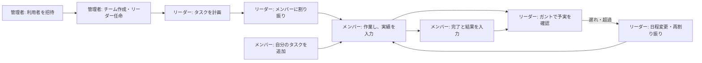
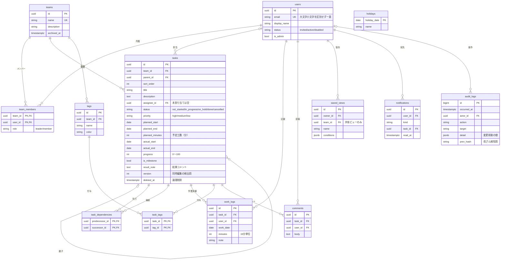

# タスク予実管理システム（仮称） 要件定義書

| 項目 | 内容 |
| --- | --- |
| 版 | 1.4 案（2026-10-03 更新） |
| 状態 | 確認事項（12章）はすべて回答済み。内容の最終確認を経て確定する |
| 置き換える文書 | 旧要件定義書 [requirements.md](requirements.md)（本書の確定後は参照しない） |
| 参考資料 | [現行システム調査書](current_system_analysis.md) |

改訂履歴

| 版 | 日付 | 内容 |
| --- | --- | --- |
| 1.0 案 | 2026-10-03 | 初版 |
| 1.1 案 | 2026-10-03 | 稼働環境を社内サーバーに決定し、インターネットに公開しない前提で 8.1.7、8.3、9章などを見直した。プロジェクトをチームとして扱うことに決め、1.3、5.2、5.6 などに反映した |
| 1.2 案 | 2026-10-03 | リーダーもチーム（プロジェクト）を作成できることに決め、3章、5.3、6.1 に反映した |
| 1.3 案 | 2026-10-03 | Q2〜Q6 の回答を反映した。技術の構成を決め（9章）、多要素認証を任意にし（5.1、8.1）、管理者がすべてのチームのタスクを閲覧できるようにした（3章、5.2） |
| 1.4 案 | 2026-10-03 | 開発コンテナを作り直したことを 9.1 に反映した |

ID の付け方: 機能要件は FR-、非機能要件は NF-、画面は SC- で始まる。SEC-01・DATA-01・UI-01・DEV-01 のような ID は「現行課題」で、現行システム調査書の 11章を指す。

---

## 1. はじめに

### 1.1 目的

チームのタスクをガントチャートで計画して割り振り、メンバーが入力した実績（日程・工数）を予定と比べて、遅れを早く見つけられる Web システムを作る。現行の試作品（TaskManagementApp）は作り直し、本書の要件で置き換える。

### 1.2 合意済みの方針

| No | 方針 | 決定日 |
| --- | --- | --- |
| 1 | タスクはガントチャートを中心に管理する | 2026-10-03 |
| 2 | チームのリーダーは、メンバーにタスクを割り振れる | 2026-10-03 |
| 3 | メンバーは、自分のタスクを追加し、結果（実績）を入力できる | 2026-10-03 |
| 4 | ガントチャートは、検索や絞り込みなどで見やすくまとめられる | 2026-10-03 |
| 5 | 金額（予算・原価など）は管理しない。予実は日程と工数で比べる | 2026-10-03 |
| 6 | セキュリティは、一般的な水準を上回る対策をとる | 2026-10-03 |
| 7 | 稼働環境は社内サーバーとする | 2026-10-03 |
| 8 | プロジェクトはチームとして扱う（プロジェクトごとにチームを作る） | 2026-10-03 |
| 9 | リーダーも、チーム（プロジェクト）を作成できる | 2026-10-03 |
| 10 | 技術の構成は開発側が決める（セキュリティを重視する）。サーバー側は C#（.NET 10）、画面側は TypeScript とする | 2026-10-03 |
| 11 | 多要素認証は必須にしない（利用者が任意で設定する） | 2026-10-03 |
| 12 | 管理者は、すべてのチームのタスクを閲覧できる | 2026-10-03 |
| 13 | メンバーは、リーダーが作成したタスクの予定を変更できない | 2026-10-03 |
| 14 | 他のチームの情報（予定工数の合計を含む）は見られない | 2026-10-03 |

### 1.3 用語

| 用語 | 意味 |
| --- | --- |
| タスク | 管理する作業の単位。担当者・予定・実績を持つ |
| まとめタスク | 子タスクを持つタスク。日程・工数・進捗は子から自動で計算する |
| マイルストーン | 期間を持たない節目（リリース日など）。ガントではひし形で表示する |
| 予定 | タスクの計画値。予定開始日・予定終了日・予定工数 |
| 実績 | 実際の値。実績開始日・実績終了日・実績工数・進捗率 |
| 作業実績 | 「いつ・何時間・何をしたか」の記録。1 つのタスクに何件でも登録できる。合計が実績工数になる |
| 工数 | 作業にかかる時間。単位は時間で、15 分刻み |
| 予実 | 予定と実績の比較（日程の差、工数の差） |
| チーム | プロジェクトの単位。プロジェクトごとに 1 つのチームを作り、関わる利用者が所属する。タスクは必ず 1 つのチームに属する。プロジェクトの中の工程などのまとまりは、まとめタスクで表す |
| リーダー／メンバー | チーム内の役割。1 人が複数のチームに、チームごとに違う役割で所属できる |
| 管理者 | アカウントとチームを管理する、システム全体の役割。すべてのチームのタスクを閲覧できる |
| ビュー | ガントチャートの検索・絞り込み・表示方法の条件を、名前を付けて保存したもの |

本書の前提と未確定の事項は 12章にまとめた。

---

## 2. 背景と目標

### 2.1 背景

現行の試作品は、ジョブ単位の予定と作業時間を記録できるが、次の問題がある（詳細は現行システム調査書）。

- 権限チェックの漏れや CSRF 対策の欠如など、セキュリティ上の欠陥がある（SEC-01〜03）
- ジョブがチームに紐付かず、チームの予定と実績をまとめて見られない（DATA-02）
- ガントチャートは予定しか表示できず、検索や絞り込みもできない（UI-02、UI-04）
- 基盤の .NET 8 が 2026-11-10 にサポートを終了する（DEV-01）

### 2.2 目標

| No | 目標 | 達成の目安 |
| --- | --- | --- |
| G1 | チームの「誰が・いつ・何を」を、ガントチャートで一目で把握できる | リーダーが、担当者別にまとめたガントを 3 回以内の操作で表示できる |
| G2 | リーダーがメンバーにタスクを割り振り、負荷と進み具合を確認できる | 割り振ったタスクが、担当者のマイタスクにすぐ表示される |
| G3 | メンバーが、自分のタスクの追加と実績の入力を手早くできる | 1 件の実績入力が 30 秒程度で終わる |
| G4 | 予定と実績の差（遅れ・超過）を早く見つけられる | 遅れや超過のあるタスクがガントで強調され、それだけに絞り込める |
| G5 | 一般的な水準を上回るセキュリティを確保する | OWASP ASVS 5.0 のレベル 2 に準拠する（多要素認証の必須化だけは例外とし、別の対策で補う）。セッション管理・アクセス制御などはレベル 3 相当とする（8.1） |

---

## 3. 利用者と権限

### 3.1 役割

| 役割 | 範囲 | 概要 |
| --- | --- | --- |
| 管理者 | システム全体 | アカウントの招待・無効化、チーム（プロジェクト）の作成・アーカイブ、リーダーの任命、監査ログの閲覧、祝日の設定。すべてのチームのタスクを閲覧できる（変更はできない。チームに所属した場合は、そのチームでの役割の権限で変更できる） |
| リーダー | 所属チーム | チームのタスクの計画・割り振り・変更、メンバーの追加・削除とリーダーの任命、チームの名前・説明の変更とアーカイブ、チームの作業実績の閲覧、タグ・共有ビューの管理。新しいチーム（プロジェクト）も作成できる |
| メンバー | 所属チーム | チームのタスクとガントの閲覧、自分のタスクの追加、担当タスクの実績入力 |

- 1 人の利用者が複数のチームに所属でき、役割はチームごとに決まる（例: A プロジェクトではリーダー、B プロジェクトではメンバー）。
- 1 つのチームに、リーダーを 1 人以上置く（複数可）。最後の 1 人のリーダーは外せない。
- 新しいチーム（プロジェクト）を作れるのは、管理者と、いずれかのチームでリーダーを務めている利用者とする。リーダーが作った場合は、作った人がそのチームの最初のリーダーになる。管理者が作る場合は、作成と同時にリーダーを指定する。
- 管理者は 2 人以上置くことを推奨する。最後の 1 人の管理者権限は解除できない。

### 3.2 チーム内の権限

| 操作 | リーダー | メンバー | チーム外の利用者 |
| --- | --- | --- | --- |
| チームのガント・タスクの閲覧 | ○ | ○ | × |
| タスクの登録 | ○（担当者はチームの誰でも） | ○（担当者は自分） | × |
| 計画項目の変更（※1） | ○ | 自分が作成し、担当しているタスクのみ | × |
| 担当者の割り当て・変更 | ○ | × | × |
| 子タスクの追加 | ○ | 自分が作成し、担当しているタスクの下のみ | × |
| 依存関係の設定 | ○ | 自分が作成し、担当しているタスク同士のみ | × |
| タスクの削除（論理削除） | ○ | 自分が作成し、作業実績がないタスクのみ | × |
| 削除したタスクの復元 | ○ | × | × |
| 実績項目の入力（※2） | ○ | 自分が担当のタスクのみ | × |
| 作業実績の記録・修正・削除 | 自分の記録のみ | 自分の記録のみ | × |
| 作業実績の閲覧 | チーム全員の明細 | 自分の明細と、タスクごとの合計 | × |
| コメントの投稿 | ○ | ○ | × |
| タグ・共有ビューの管理 | ○ | × | × |
| メンバーの追加・削除 | ○ | × | × |
| リーダーの任命・解除 | ○（最後の 1 人は外せない） | × | × |
| チームの名前・説明の変更、アーカイブとその解除 | ○ | × | × |

※1 計画項目: タイトル、説明、親タスク、予定開始日、予定終了日、予定工数、優先度、タグ、マイルストーンの指定。
※2 実績項目: 状態、進捗率、実績開始日、実績終了日、結果コメント。

- メンバーは、リーダーが作成したタスクの予定を変更できない。変更が必要な場合はコメントで依頼する。予定（計画）を勝手に動かさないことで、予定と実績を正しく比べられるようにするため。
- 管理者は、所属していないチームについても、閲覧（ガント、タスク、作業実績、コメント、変更履歴）だけができる。変更はできない。閲覧したことは監査ログに残す（FR-ADM-09）。
- 権限はサーバー側で毎回判定し、画面の表示・非表示には頼らない（NF-ACC-02）。

### 3.3 管理操作の権限

| 操作 | 管理者 | リーダー | メンバー |
| --- | --- | --- | --- |
| 利用者の招待・無効化・再有効化 | ○ | × | × |
| 管理者権限の付与・解除 | ○ | × | × |
| チーム（プロジェクト）の作成 | ○ | ○（※） | × |
| チーム（プロジェクト）の変更・アーカイブ | ○ | ○（自分のチームのみ） | × |
| リーダーの任命・解除 | ○ | ○（自分のチームのみ） | × |
| メンバーの追加・削除 | ○ | ○（自分のチームのみ） | × |
| 多要素認証のリセット（本人確認の後） | ○ | × | × |
| 監査ログの閲覧 | ○ | × | × |
| すべてのチームのタスクの閲覧 | ○（変更はできない） | × | × |
| 祝日の管理 | ○ | × | × |

※ いずれかのチームでリーダーを務めている利用者。

自分のアカウント設定（パスワード、多要素認証など）と個人のビューは、全員が自分の分だけ操作できる。

### 3.4 チームから外れた・無効化されたときの扱い

- メンバーをチームから外すと、そのメンバーが担当していた未完了のタスクは「未割り当て」に戻り、リーダーに通知する。作業実績は残る。
- アカウントを無効化すると、すべてのセッションをすぐに失効させ、所属チームから外す（扱いは上と同じ）。データは削除せず、名前の横に「無効」と表示して残す。

---

## 4. 業務の流れ

### 4.1 全体の流れ



### 4.2 主な利用場面

| No | 場面 | 流れ |
| --- | --- | --- |
| S1 | 利用開始 | 管理者が招待する → 本人がメールのリンクからパスワードを設定する（多要素認証は任意で設定する） → ログインする |
| S2 | 計画と割り振り | リーダーがガント上でタスクと子タスクを作り、日程をドラッグで調整して担当者を選ぶ → 担当者に通知が届く |
| S3 | 自分のタスクの追加 | メンバーがマイタスクまたはガントから、自分が担当するタスクを追加する |
| S4 | 実績の入力 | メンバーがマイタスクで、その日の作業時間と進捗を入力する（週の入力表でまとめて入力してもよい）。完了したら実績終了日と結果を入力する |
| S5 | 予実の確認 | リーダーがガントを担当者別にまとめ、「遅れ」で絞り込み、予定と実績のバーを比べる → 日程を変えるか、割り振りを見直す |
| S6 | 見たい形の保存 | 利用者が絞り込み・まとめ方・表示期間を設定し、ビューとして保存する。次からは 1 回の操作で開ける |

---

## 5. 機能要件

優先度: M＝必須（初版に含める）、S＝推奨（初版で可能なら入れ、遅くとも次の版で入れる）、C＝任意（将来検討）

### 5.1 認証・アカウント（FR-AUT）

| ID | 要件 | 優先度 |
| --- | --- | --- |
| FR-AUT-01 | メールアドレスとパスワードでログインする。多要素認証（認証アプリのワンタイムコード）を設定した利用者は、続けてコードを入力する。多要素認証の設定は任意とし、設定していない利用者には設定を勧める | M |
| FR-AUT-02 | パスキー（指紋・顔・PIN などで本人を確かめる WebAuthn 方式）でログインできる。パスキーは単独で多要素認証と同等に扱う | S |
| FR-AUT-03 | アカウントは管理者の招待でのみ作る（自分で登録する機能は設けない）。本人は招待メールのリンクからパスワードを設定して、利用を始める。多要素認証はその場で設定してもよい | M |
| FR-AUT-04 | パスワードを忘れた場合、メールで再設定できる。多要素認証を設定している利用者は、再設定した後もログインのときにコードが必要 | M |
| FR-AUT-05 | 利用者は、パスワードの変更、多要素認証の設定・解除・再設定、リカバリーコード（認証アプリを失くしたときの予備のコード）の再発行ができる。いずれも直前に再認証を求める | M |
| FR-AUT-06 | ログアウトできる。ほかの端末も含めた、すべてのセッションからのログアウトもできる | M |
| FR-AUT-07 | 利用者は、自分のログイン履歴とログイン中の端末の一覧を確認し、端末ごとに失効させられる | S |
| FR-AUT-08 | 認証アプリとリカバリーコードを両方失った利用者について、管理者が本人確認をしたうえで多要素認証をリセットできる（監査ログに残す） | M |
| FR-AUT-09 | 利用者は、自分の表示名を変更できる | S |

パスワードの長さ、ロック、リンクの有効期限などの詳細は 8.1.1 に定める。

### 5.2 管理機能（FR-ADM）

| ID | 要件 | 優先度 |
| --- | --- | --- |
| FR-ADM-01 | 利用者を一覧・検索し、招待（メールアドレスと表示名）、招待の再送・取消ができる | M |
| FR-ADM-02 | 利用者を無効化・再有効化できる。無効化すると、その利用者の全セッションをすぐに失効させる | M |
| FR-ADM-03 | 管理者権限を付与・解除できる（最後の 1 人は解除できない） | M |
| FR-ADM-04 | チーム（プロジェクト）を作成し、名前・説明を変更し、アーカイブ（読み取り専用にする）とその解除ができる。終わったプロジェクトのチームはアーカイブする | M |
| FR-ADM-05 | チームにリーダーを任命・解除し、メンバーを追加・削除できる | M |
| FR-ADM-06 | 監査ログを、期間・操作者・操作の種類・対象で検索して閲覧できる | M |
| FR-ADM-07 | 祝日を登録・削除できる。内閣府が公表する祝日一覧の取り込みにも対応する | S |
| FR-ADM-08 | FR-ADM-01〜05 の操作の前に、再認証を求める | M |
| FR-ADM-09 | 所属していないチームを含む、すべてのチームのガントとタスク（作業実績、コメント、変更履歴を含む）を閲覧できる。変更はできない。所属していないチームを閲覧したことは監査ログに残す | M |

### 5.3 チーム運営（FR-TEM）

| ID | 要件 | 優先度 |
| --- | --- | --- |
| FR-TEM-01 | リーダーは、有効な利用者をチームのメンバーに追加・削除できる。追加された本人に通知する | M |
| FR-TEM-02 | メンバーをチームから外すと、担当していた未完了のタスクは未割り当てに戻り、リーダーに通知する | M |
| FR-TEM-03 | リーダーは、チームで使うタグ（名前・色）を作成・変更・削除できる | S |
| FR-TEM-04 | 利用者は、所属するチームの一覧と、各チームのメンバーと役割を確認できる | M |
| FR-TEM-05 | いずれかのチームでリーダーを務めている利用者は、新しいチーム（プロジェクト）を作成できる。作成した人が、そのチームのリーダーになる | M |
| FR-TEM-06 | リーダーは、自分のチームの名前・説明を変更し、アーカイブとその解除ができる | M |
| FR-TEM-07 | リーダーは、自分のチームのメンバーをリーダーに任命したり、リーダーから外したりできる（最後の 1 人のリーダーは外せない） | M |

### 5.4 タスク管理（FR-TSK）

| ID | 要件 | 優先度 |
| --- | --- | --- |
| FR-TSK-01 | タスクを登録できる。項目: チーム（必須）、タイトル（必須）、説明、親タスク、担当者、予定開始日、予定終了日、予定工数、優先度、タグ、マイルストーンの指定 | M |
| FR-TSK-02 | 権限（3.2）に応じて、タスクの計画項目と実績項目を変更できる | M |
| FR-TSK-03 | 担当者は 1 タスクに 1 人で、チームのメンバーから選ぶ。未割り当てでもよい。複数人で行う作業は、子タスクに分けて表す | M |
| FR-TSK-04 | タスクは親子の階層にでき、深さは最大 4 階層とする。子を持つタスクは「まとめタスク」になり、日程・工数・進捗は子から自動で計算する（7.3） | M |
| FR-TSK-05 | 同じ親の中でタスクの並び順を変えられる。同じチームの別の親へ移動できる | M |
| FR-TSK-06 | 状態は「未着手・進行中・保留・完了・中止」、優先度は「高・中・低」の決まった選択肢とする | M |
| FR-TSK-07 | タスクを削除すると論理削除になり、通常の画面には表示しない。子タスクがある場合は、子も削除してよいかを確認する | M |
| FR-TSK-08 | リーダーは、削除から 30 日以内のタスクを復元できる | S |
| FR-TSK-09 | タスクごとに変更履歴（誰が、いつ、どの項目を、何から何に変えたか）を表示する | M |
| FR-TSK-10 | 2 人が同じタスクを同時に編集した場合、後から保存した人に競合を知らせ、上書きを防ぐ | M |
| FR-TSK-11 | タスクごとにコメントを投稿できる。自分の投稿は編集・削除できる | S |
| FR-TSK-12 | マイルストーン（期間ゼロの節目）を登録できる | S |
| FR-TSK-13 | タスク間の依存関係（先行タスクが終わってから後続タスクを始める）を設定できる。循環する設定は受け付けない。先行タスクの予定終了日が後続タスクの予定開始日より後なら警告する | S |
| FR-TSK-14 | 複数のタスクを選び、担当者・状態・優先度・タグをまとめて変更できる | C |
| FR-TSK-15 | タスクを子タスクごと複製できる | C |
| FR-TSK-16 | 当初の予定（ベースライン）を保存し、最新の予定と比べられる | C |

### 5.5 実績（結果）の入力（FR-ACT）

| ID | 要件 | 優先度 |
| --- | --- | --- |
| FR-ACT-01 | 担当者は、担当タスクに作業実績（作業日、作業時間、メモ）を何件でも記録できる。作業時間は 15 分単位で、「1.5」と「1:30」のどちらの形式でも入力できる | M |
| FR-ACT-02 | 担当者は、進捗率（0〜100%、5% 刻み）と状態を更新できる | M |
| FR-ACT-03 | 最初の作業実績を記録すると、実績開始日が空ならその作業日を入れ、状態が未着手なら進行中にする。どちらも手で直せる | M |
| FR-ACT-04 | 状態を完了にするときは、実績終了日（初期値は当日）と結果コメント（任意）を入力する。進捗率は 100% になる | M |
| FR-ACT-05 | 担当者は、自分の作業実績を修正・削除できる。変更は変更履歴に残る | M |
| FR-ACT-06 | マイタスクと、ガントのタスク詳細から、画面を移らずに実績を入力できる | M |
| FR-ACT-07 | 週単位の入力表（自分の担当タスク × 曜日のマス）で、作業時間をまとめて入力できる | S |

### 5.6 ガントチャート（FR-GNT）

本システムの中心となる機能。画面の構成は 6.3 に示す。

表示

| ID | 要件 | 優先度 |
| --- | --- | --- |
| FR-GNT-01 | 左に階層付きのタスク一覧（折りたたみ可）、右に時間軸を並べる。左右の縦スクロールは連動し、見出し（日付と列名）は常に表示する。予定日が未定のタスクは、バーなしで一覧に表示する | M |
| FR-GNT-02 | 時間軸の目盛りを日・週・月・四半期で切り替えられる。「今日へ」ボタンで今日の位置に移動する | M |
| FR-GNT-03 | 各タスクに予定バーと実績バーを上下に並べて表示する。予定バーには進捗率を塗りで示す。実績バーは実績開始日から実績終了日まで（未完了なら今日まで） | M |
| FR-GNT-04 | まとめタスクは、子の期間をまとめたバーで表示する | M |
| FR-GNT-05 | 今日の位置を縦線で示し、土日の列に網を掛ける | M |
| FR-GNT-06 | 祝日（FR-ADM-07）の列にも網を掛ける | S |
| FR-GNT-07 | 遅れや超過のあるタスク（7.4）を、色に加えてアイコンでも強調する | M |
| FR-GNT-08 | バーにマウスを乗せると、要点（担当者、日程、工数、進捗、状態）を表示する | M |
| FR-GNT-09 | バーの色分けの基準を、状態・担当者・優先度・タグから選べる。凡例を表示する | S |
| FR-GNT-10 | 左の一覧に表示する列（担当者、状態、進捗率、予定日程、実績日程、予定工数、実績工数、工数差異など）を選べる | S |
| FR-GNT-11 | マイルストーンをひし形で表示する | S |
| FR-GNT-12 | 依存関係を矢印で表示する | S |

操作

| ID | 要件 | 優先度 |
| --- | --- | --- |
| FR-GNT-13 | タスク名かバーをクリックすると、画面の右側にタスク詳細（計画、実績、作業実績、コメント、変更履歴）を開き、その場で編集できる | M |
| FR-GNT-14 | 権限のある利用者は、予定バーをドラッグして日程を移動・伸縮できる。変更はすぐに保存する | M |
| FR-GNT-15 | 直前の変更を取り消せる | S |
| FR-GNT-16 | ガント上からタスクや子タスクを追加できる | M |
| FR-GNT-17 | ドラッグでタスクの並び順や親を変えられる | S |

検索・絞り込み・まとめ方

| ID | 要件 | 優先度 |
| --- | --- | --- |
| FR-GNT-18 | キーワードでタスクを検索できる（タイトル、説明、タグ）。一致したタスクと、その親の階層を表示する | M |
| FR-GNT-19 | 次の条件で絞り込める（組み合わせ可）: チーム（複数可。複数のプロジェクトを並べて見られる）、担当者（複数可。「自分」「未割り当て」を含む）、状態、優先度、表示期間と重なるタスク、遅れ・超過のあるタスクだけ、マイルストーンだけ | M |
| FR-GNT-20 | タグで絞り込める | S |
| FR-GNT-21 | よく使う条件を 1 回の操作で適用できる: 自分のタスク、今週が期限、遅れている、未割り当て | M |
| FR-GNT-22 | 行のまとめ方を切り替えられる: 階層（初期値）、担当者別、チーム別、状態別。担当者別のときは、担当者ごとに表示期間内の予定工数の合計を表示する。チーム別のときは、チームの行にプロジェクト全体の期間と進捗をまとめたバーを表示する | M |
| FR-GNT-23 | 表示期間を「今月」「来月」「今四半期」「任意の期間」から選べる。初期表示は、今日の 1 週間前から 5 週間後まで | M |
| FR-GNT-24 | 並べ替えを選べる: 階層と手動の並び順（初期値）、予定開始日、予定終了日、優先度、進捗率 | S |
| FR-GNT-25 | 現在の検索・絞り込み・まとめ方・表示期間を URL に反映する。URL を共有すると同じ表示を再現できる（閲覧できる範囲は、開いた人の権限による） | M |
| FR-GNT-26 | 条件を「ビュー」として名前を付けて保存し、次から選ぶだけで開ける。最初に開くビューを設定できる | S |
| FR-GNT-27 | リーダーは、チームの全員が使える共有ビューを作れる | S |
| FR-GNT-28 | 表示中のタスクの件数、予定工数と実績工数の合計、その差を表示する | S |
| FR-GNT-29 | 表示中のガントを印刷・PDF 出力できる | C |

### 5.7 マイタスクと一覧（FR-LST）

| ID | 要件 | 優先度 |
| --- | --- | --- |
| FR-LST-01 | マイタスク: 自分が担当の未完了タスクを「遅れ」「今日まで」「今週まで」「それ以降」「日程未定」に分けて表示し、その場で実績を入力できる | M |
| FR-LST-02 | タスク一覧: ガントと同じ条件で検索・絞り込みした結果を表で表示し、列ごとに並べ替えられる | S |
| FR-LST-03 | 一覧を CSV で出力できる（リーダーのみ。出力したことを監査ログに残す） | C |

### 5.8 ホームと予実の確認（FR-DSH）

| ID | 要件 | 優先度 |
| --- | --- | --- |
| FR-DSH-01 | ホーム（ログイン後に最初に開く画面）に、自分の担当タスクの要約（遅れ・今週が期限の件数と一覧）と、所属チーム（プロジェクト）ごとの状況（完了率、遅れの件数、予定工数と実績工数）を表示する | M |
| FR-DSH-02 | リーダーは、期間を指定して、担当者別の予定工数・実績工数・差・遅れの件数を表で見られる | S |
| FR-DSH-03 | 担当者 × 週の予定工数を色の濃さで示す負荷表を見られる（割り振りの偏りを見るため） | C |

### 5.9 通知（FR-NTF）

| ID | 要件 | 優先度 |
| --- | --- | --- |
| FR-NTF-01 | 画面内で通知する: タスクの割り当てと担当の変更、自分のタスクへのコメント、予定終了日の前日、期限の超過、チームへの追加 | S |
| FR-NTF-02 | 通知の一覧で、未読・既読を管理できる | S |
| FR-NTF-03 | 業務の通知をメールでも受け取れる（利用者ごとに選べる）。メールには内容を書かず、システムへのリンクだけを載せる | C |
| FR-NTF-04 | セキュリティに関わる出来事（新しい端末からのログイン、パスワード・多要素認証の変更、アカウントのロック）を本人にメールで知らせる | M |

---

## 6. 画面要件

### 6.1 画面一覧

| ID | 画面 | 使う人 | 主な内容 | 優先度 |
| --- | --- | --- | --- | --- |
| SC-01 | ログイン | 全員 | メールアドレスとパスワード（多要素認証を設定した人は、続けてコードを入力）。パスキーでのログイン | M |
| SC-02 | 招待の受諾 | 招待された人 | パスワードの設定。続けて任意で、認証アプリの登録とリカバリーコードの表示 | M |
| SC-03 | パスワード再設定 | 全員 | 申請（メールアドレスの入力）と再設定 | M |
| SC-04 | ホーム | ログインした人 | 自分のタスクの要約、所属チームの状況 | M |
| SC-05 | ガントチャート | チームの利用者、管理者（閲覧のみ） | 本システムの中心画面（6.3） | M |
| SC-06 | タスク詳細（画面右のパネル） | チームの利用者、管理者（閲覧のみ） | 計画、実績、作業実績、コメント、変更履歴 | M |
| SC-07 | タスクの登録・編集 | 権限のある人 | タスクの項目の入力 | M |
| SC-08 | マイタスク | ログインした人 | 期限別の担当タスク、実績の入力 | M |
| SC-09 | 週の実績入力表 | ログインした人 | 担当タスク × 曜日の作業時間 | S |
| SC-10 | タスク一覧 | チームの利用者 | 検索・絞り込みの結果の表 | S |
| SC-11 | チームの予実 | リーダー | 担当者別の予定・実績・差 | S |
| SC-12 | チーム | 所属している人 | チームの一覧、メンバーと役割、タグ。リーダーは、チームの作成、名前・説明の変更、アーカイブ、メンバーの追加・削除、リーダーの任命も行う | M |
| SC-13 | 通知 | ログインした人 | 通知の一覧 | S |
| SC-14 | アカウント設定 | ログインした人 | 表示名、パスワード、多要素認証、パスキー、ログイン中の端末 | M |
| SC-15 | 利用者管理 | 管理者 | 招待、無効化、管理者権限 | M |
| SC-16 | チーム管理 | 管理者 | チーム（プロジェクト）の作成・アーカイブ、リーダーの任命 | M |
| SC-17 | 監査ログ | 管理者 | 検索と閲覧 | M |
| SC-18 | エラー | 全員 | 権限がない、見つからない、システムエラーの共通画面（内部の情報は出さない） | M |

### 6.2 画面設計の方針

- 業務用の画面として、情報の見やすさを優先する。大きな見出し帯や装飾的なグラデーションは使わず、表とガントの表示領域を広くとる（UI-06）。
- 色・余白・文字サイズ・部品（ボタン、入力欄、表、ダイアログ）を共通のデザインルールとして 1 か所で定義し、全画面で使う。画面ごとの独自のスタイルや、HTML に直接書くスタイルは使わない（NF-BRW-02 とも合わせる）。
- 画面の構成: 左にメニュー（ホーム、ガント、マイタスク、チーム、管理）を、上部にチームの切り替え、検索、通知、利用者メニューを置く。
- 状態や遅れは色だけで示さず、アイコンや文字を添える。
- 日付は「2026/10/03（土）」の形式、週は月曜始まりとする。工数は「1.5h」の形式で表示する。
- 保存などの結果は画面上部に短く表示する。確認のダイアログは、削除などの取り消せない操作に限る。
- 用語は「タスク」に統一し、ページの言語は日本語（lang="ja"）と指定する（UI-09）。

### 6.3 ガントチャート画面の構成

担当者別にまとめた表示の例（今日を 10/15 とする）:

```text
+-----------------------------------------------------------------+
| [チーム: 販売管理更改 v] [検索: キーワード] [通知] [山田 v]     |
+-----------------------------------------------------------------+
| すぐ絞る: [自分のタスク] [今週が期限] [遅れ] [未割り当て]       |
| 絞り込み: [担当者 v] [状態 v] [優先度 v] [タグ v]               |
| 表示期間: [今月 v]  目盛り: [日|週|月]  [今日へ]                |
| まとめ方: [担当者別 v]  ビュー: [自分のビュー v] [保存]         |
+------------------------------+----------------------------------+
| タスク名        担当   進捗  | 10/6   10/13  10/20  10/27       |
+------------------------------+----------------------------------+
| v 鈴木（2件）                |          :                       |
|   画面設計      鈴木   100%  | [===]    :                       |
|                              | [######] :                       |
|   API 設計      鈴木    80%  |   [====-]:!                      |
|                              |    [#####>                       |
| v 佐藤（2件）                |          :                       |
|   ガント実装    佐藤    30%  |        [===-------]              |
|                              |        [#>                       |
|   <> リリース   佐藤         |          :           <>          |
+------------------------------+----------------------------------+
| 表示 4件  予定工数 60h  実績工数 38h  差 -22h                   |
+-----------------------------------------------------------------+
```

凡例: `[==--]` 予定バー（`=` が進捗）、`[##>` 実績バー（`>` は進行中）、`<>` マイルストーン、`!` 遅れ・超過、`:` 今日

| 領域 | 内容 | 関連要件 |
| --- | --- | --- |
| 上部 | チーム（プロジェクト）の切り替え、キーワード検索、通知、利用者メニュー | FR-GNT-18〜19 |
| 条件の帯 | すぐ絞る、絞り込み、表示期間、目盛り、まとめ方、ビュー | FR-GNT-19〜27 |
| 左（タスク一覧） | 階層またはまとめ方に応じた行、選んだ列 | FR-GNT-01、10、22 |
| 右（時間軸） | 予定バーと実績バー、今日の線、土日・祝日の網掛け、遅れの印 | FR-GNT-02〜08 |
| 下部 | 表示中の件数と工数の合計 | FR-GNT-28 |
| 右側のパネル（クリック時） | タスク詳細と実績の入力 | FR-GNT-13、FR-ACT-06 |

### 6.4 対応環境

- ブラウザ: Chrome、Edge、Firefox、Safari の最新版
- PC（画面幅 1366px 以上）では、すべての機能を使える。スマートフォンでは、ホーム、マイタスク、実績の入力、ガントの閲覧ができる（ガントの編集は PC のみ）

---

## 7. データ要件

### 7.1 データモデル



図では、全テーブルに共通の作成日時・作成者・更新日時・更新者と、認証関連のテーブル（パスワード、多要素認証、パスキー、セッション）を省いている。認証関連は、採用する認証基盤の標準の構成に従う。

### 7.2 主なデータ項目とルール

| データ | 主な項目 | 主なルール |
| --- | --- | --- |
| 利用者 | メールアドレス、表示名、状態（招待中・有効・無効）、管理者かどうか、最終ログイン日時 | メールアドレスは一意（大文字と小文字を区別しない）。表示名は表示にだけ使い、利用者の識別には内部の ID を使う。利用者は削除せず無効化する |
| 認証情報 | パスワードのハッシュ値、多要素認証の秘密鍵、リカバリーコード、パスキー、セッション、招待・再設定のトークン | 秘密鍵は暗号化し、トークンとリカバリーコードはハッシュ値で保存する |
| チーム | 名前（プロジェクト名）、説明、アーカイブ日時 | 名前は一意で 50 字以内。アーカイブしたチームは読み取り専用 |
| チーム所属 | チーム、利用者、役割（リーダー・メンバー） | チームと利用者の組み合わせは一意 |
| タスク | チーム、親タスク、並び順、タイトル、説明、担当者、作成者、状態、優先度、予定開始日・終了日、予定工数、実績開始日・終了日、進捗率、マイルストーンかどうか、結果コメント、版番号、削除日時 | 7.5 の入力ルールに従う。実績工数は列として持たず、作業実績から計算する |
| 依存関係 | 先行タスク、後続タスク | 同じチームのタスク同士に限る。循環は禁止 |
| 作業実績 | タスク、利用者、作業日、作業時間（分）、メモ | 1 件 15〜1,440 分で 15 分単位。1 人 1 日の合計は 24 時間以内。作業日は今日以前。メモは 500 字以内 |
| タグ | チーム、名前、色 | 名前はチーム内で一意、30 字以内 |
| コメント | タスク、投稿者、本文、投稿日時、編集日時 | 本文はプレーンテキストで 2,000 字以内 |
| ビュー | 所有者、チーム（共有ビューの場合）、名前、条件、最初に開くかどうか | 条件は決まった形式のものだけを受け付ける |
| 通知 | 宛先、種類、対象のタスク、作成日時、既読日時 | — |
| 祝日 | 日付、名前 | — |
| 監査ログ | 日時、操作者、操作の種類、対象、結果、変更前後の値、送信元 IP、ブラウザ情報、リクエスト ID、直前の記録のハッシュ値 | 追記だけを許可する（NF-LOG-04） |

### 7.3 予実の計算

| 指標 | 計算方法 |
| --- | --- |
| 実績工数 | 作業実績の作業時間の合計。作業実績だけを元データとし、ほかの場所に実績工数を持たない（DATA-01） |
| 工数差 | 実績工数 − 予定工数（プラスは予定を超えている） |
| 工数消化率 | 実績工数 ÷ 予定工数 |
| 日程差 | 完了したタスク: 実績終了日 − 予定終了日（日数。プラスは遅れ）。未完了で予定終了日を過ぎたタスク: 今日 − 予定終了日 |
| 期待進捗 | 予定開始日から今日までの稼働日数 ÷ 予定期間の稼働日数（0〜100%） |

- 稼働日は、土日と祝日（FR-ADM-07）を除いた日とする。
- 中止したタスクは、予実の集計に含めない。

まとめタスクの自動計算:

| 項目 | 計算方法 |
| --- | --- |
| 予定開始日・予定終了日 | 子の予定開始日の最も早い日・予定終了日の最も遅い日 |
| 実績開始日・実績終了日 | 子の実績開始日の最も早い日。実績終了日は、すべての子が完了または中止したときの最も遅い日 |
| 予定工数・実績工数 | 子の合計 |
| 進捗率 | 子の進捗率を予定工数で重み付けした平均（予定工数がない子は予定日数で代用する） |
| 状態 | 子がすべて完了か中止なら完了（すべて中止なら中止）、すべて未着手なら未着手、それ以外は進行中 |

まとめタスクには、日程・工数・進捗を直接入力できず、作業実績も記録できない。

### 7.4 遅れ・超過の判定

ガントでの強調（FR-GNT-07）と絞り込み（FR-GNT-19）に使う。

| 種類 | 条件 |
| --- | --- |
| 期限超過 | 今日が予定終了日より後で、状態が完了・中止のいずれでもない |
| 開始遅れ | 今日が予定開始日より後で、状態が未着手 |
| 工数超過 | 実績工数が予定工数を超えている |
| 進捗遅れ（S） | 進捗率が、期待進捗よりしきい値以上低い（しきい値の初期値は 20 ポイント。設定で変更できる） |

### 7.5 状態の変わり方と入力のルール

状態の変わり方:

- 未着手 → 進行中: 最初の作業実績を記録したとき、または進捗率を 0% より大きくしたときに自動で変わる。手動でも変えられる。
- 完了にする: 担当者かリーダーが行う。実績終了日を必ず入れ、進捗率は 100% になる。
- 完了 → 進行中（再開）: 担当者かリーダーが行う。実績終了日は空に戻す。
- 保留・中止にする: リーダー、または自分が作成して担当しているタスクの担当者が行う。

入力のルール（すべてサーバー側で検査する）:

| 項目 | ルール |
| --- | --- |
| タイトル | 1〜200 字 |
| 説明・結果コメント | それぞれ 4,000 字以内。プレーンテキスト |
| 予定日 | 開始日と終了日は両方入れるか、両方空（日程未定）にする。終了日は開始日以降 |
| 予定工数 | 0〜9,999 時間、15 分単位 |
| 実績日 | 終了日は開始日以降。どちらも今日以前 |
| マイルストーン | 予定開始日と予定終了日が同じ日。工数は持たない |
| 親タスク | 同じチームのタスク。自分自身や自分の子孫は選べない。深さは 4 階層まで |
| 担当者 | そのチームのメンバー（リーダーを含む） |

### 7.6 データ設計の方針

- 主キーには、推測されにくい UUID を使う。
- 状態・優先度・役割などの区分値は英字のコードで保存し、DB の制約で値を限定する。画面に出す名前との対応は 1 か所で管理する（DATA-04、DEV-04）。
- 予定日・実績日は時刻を持たない日付型で保存する。作成・更新日時は UTC で保存し、日本時間で表示する（DATA-07）。
- 工数は分単位の整数で保存する（DATA-10）。
- 一意制約（メールアドレス、チーム名、チーム所属、チーム内のタグ名）、外部キー、値の範囲の制約（予定終了日 ≧ 予定開始日、進捗率 0〜100 など）を DB でも定義する（DATA-06）。
- 削除は論理削除とする。論理削除したタスクは 1 年後に完全に削除する。
- テーブル名・列名は小文字の英単語をアンダースコアでつなぐ形式（snake_case）、テーブル名は複数形とする。

### 7.7 データ量と保存期間

| 対象 | 想定・期間 |
| --- | --- |
| 利用者・チーム | 利用者 100 人以下。同時に進むチーム（プロジェクト）は 20 以下、アーカイブしたものを含めて累計 100 程度（12.1 の前提） |
| タスク | 1 チームあたり、未完了のもので 2,000 件程度 |
| 作業実績 | 5 年で 50 万件程度 |
| タスク・作業実績の保存 | 期限なし（チームをアーカイブした後も残す） |
| 論理削除したタスク | 1 年後に完全削除 |
| 監査ログ | 3 年 |
| アプリケーションのログ | 90 日 |
| バックアップ | 30 日 |

---

## 8. 非機能要件

### 8.1 セキュリティ

基準:

- OWASP ASVS 5.0（Web アプリのセキュリティ検証の国際的な基準）のレベル 2 に準拠する。ただし、アプリへのアクセスに多要素認証（または複数の単一要素の認証の組み合わせ）を求める要件（6.3.3）は、多要素認証を任意とする方針（1.2）により例外とし、NF-AUT-11 の対策で補う。
- セッション管理、アクセス制御、セキュリティログは、レベル 3 相当を目標とする。
- OWASP Top 10:2025 の各項目に対策をとり、リリース前に確認する。
- 以下の要件は、この基準の中でも本システムで特に重視するものを具体化したもの。

#### 8.1.1 認証（NF-AUT）

| ID | 要件 |
| --- | --- |
| NF-AUT-01 | 多要素認証は、利用者が任意で設定できるものとする。方式は認証アプリのワンタイムコード（TOTP）とパスキー。SMS やメールで送るコードは使わない。設定によって管理者だけを必須にもできるようにする（初期値は必須にしない） |
| NF-AUT-02 | パスワードは 15 文字以上（パスワードだけでログインする場合の NIST の基準）とし、64 文字以上まで入力できるようにする。空白や日本語を含むすべての文字を受け付ける。文字の種類の組み合わせは強制せず、漏えいしたことがあるパスワード、よく使われるパスワード、メールアドレスや表示名を含むパスワードは拒否する（NIST SP 800-63B-4 の考え方に従う） |
| NF-AUT-03 | 同じアカウントでログインに 5 回続けて失敗したら 15 分間ロックし、本人にメールで知らせる。送信元ごとのログイン試行の回数も制限する |
| NF-AUT-04 | ログインに失敗したときのメッセージは、どちらが誤っていたか、アカウントが存在するかを区別しない。パスワード再設定の申請も、登録されているかどうかにかかわらず同じ応答にする |
| NF-AUT-05 | 招待とパスワード再設定のリンクには、推測できない乱数（128 ビット以上）を使い、1 回限り有効とする。有効期限は招待が 72 時間、再設定が 30 分。DB にはハッシュ値で保存する |
| NF-AUT-06 | パスワードの変更・再設定、多要素認証の変更、管理者の操作の前に再認証を求める（直近 10 分以内に認証していれば省略できる） |
| NF-AUT-07 | パスワードの変更・再設定、多要素認証の変更、アカウントの無効化をしたときは、その利用者のほかのセッションをすべて失効させる |
| NF-AUT-08 | パスワードは、OWASP Password Storage Cheat Sheet の推奨値以上の方式で保存する（例: Argon2id でメモリ 19 MiB・反復 2 回・並列度 1 以上）。フレームワークの初期設定が推奨値に届かない場合は引き上げる |
| NF-AUT-09 | リカバリーコードは 10 個発行し、それぞれ 1 回限り有効とする。ハッシュ値で保存する |
| NF-AUT-10 | 最初の管理者は、配備のときにコマンドで 1 回だけ作り、招待のリンクから本人がパスワードを設定する（SQL での直接登録や、決まったパスワードは使わない）。多要素認証の設定を強く勧める |
| NF-AUT-11 | 多要素認証を設定していない利用者がいることを、次の対策で補う: ログイン後の画面で設定を勧める表示を続ける、新しい端末からのログインを本人に知らせる（FR-NTF-04）、ログイン失敗の急増を管理者に知らせる（NF-LOG-06）、管理者の画面で利用者ごとの設定状況を確認できるようにする |

#### 8.1.2 セッション（NF-SES）

| ID | 要件 |
| --- | --- |
| NF-SES-01 | セッションはサーバー側で管理し、Cookie で受け渡す。Cookie には Secure、HttpOnly、SameSite=Lax の属性と `__Host-` の接頭辞を付ける。認証用のトークンをブラウザの保存領域（localStorage など）に置かない |
| NF-SES-02 | ログインしたときと権限が変わったときに、セッション ID を作り直す |
| NF-SES-03 | 操作がない状態が 30 分続いたらセッションを切る（5 分前に予告する）。ログインから 12 時間たったら必ず切る |
| NF-SES-04 | ログアウトしたら、サーバー側のセッションを破棄する |
| NF-SES-05 | 権限の変更（チームから外す、無効化するなど）は、その利用者の次の操作からすぐに反映する |

#### 8.1.3 アクセス制御（NF-ACC）

| ID | 要件 |
| --- | --- |
| NF-ACC-01 | ログイン、パスワード再設定、招待の受諾以外のすべての画面と API に、認証を必須とする（初期状態ですべて拒否し、必要なものだけ許可する） |
| NF-ACC-02 | 権限は、すべてのリクエストでサーバー側が判定する。判定は、タスクが属するチームと利用者の役割（3章）に基づく。判定できない場合やエラーが起きた場合は拒否する |
| NF-ACC-03 | 所属していないチームのデータは、ID を指定しても取得・変更できない（管理者による閲覧を除く）。その場合は、存在しないデータと同じ応答（404）を返す |
| NF-ACC-04 | 更新の処理では、変更してよい項目だけを受け付ける（画面にない項目を送られても反映しない） |
| NF-ACC-05 | 権限の判定は 1 か所の共通処理にまとめ、画面や API ごとに個別に書かない |
| NF-ACC-06 | 利用者ごと・送信元ごとにリクエストの回数の上限を設け、超えたら一時的に拒否する |
| NF-ACC-07 | 管理者の画面へのアクセスを、社内の特定のネットワーク（情報システム部門の端末など）からに限れる設定を用意する |

#### 8.1.4 入力と出力の安全性（NF-INP）

| ID | 要件 |
| --- | --- |
| NF-INP-01 | すべての入力を、サーバー側で検査する（型、長さ、範囲、形式、選択肢）。画面側の検査は補助と位置付ける |
| NF-INP-02 | 状態を変えるすべての操作（フォームと API）で、CSRF 対策のトークンを検証する。あわせて Origin ヘッダーも確認する |
| NF-INP-03 | 画面に出す値は、すべてフレームワークで自動的にエスケープする。利用者が入力した内容を HTML として描画しない（説明やコメントはプレーンテキストとし、URL だけを自動でリンクにする）。ガントのツールチップなども文字列として描画する |
| NF-INP-04 | DB へのアクセスには ORM かパラメーター化したクエリだけを使い、SQL を文字列の連結で組み立てない |
| NF-INP-05 | 初版では、ファイルを添付・アップロードする機能を設けない（攻撃を受ける窓口を減らすため） |
| NF-INP-06 | API は同じオリジンからの利用に限り、CORS は許可しない |
| NF-INP-07 | 自動でリンクにする URL は http と https に限り、外部へのリンクには rel="noopener noreferrer" を付ける |
| NF-INP-08 | ログイン後の移動先など、URL を受け取る箇所では自サイト内の URL だけを許可する（オープンリダイレクト対策） |

#### 8.1.5 ブラウザ側の防御（NF-BRW）

| ID | 要件 |
| --- | --- |
| NF-BRW-01 | 通信はすべて HTTPS とし、HSTS（有効期間 1 年以上、サブドメインを含む）を設定する |
| NF-BRW-02 | Content Security Policy を設定し、自サイト以外からのスクリプト・スタイル・フォントの読み込み、HTML 内に直接書いたスクリプトとスタイル、eval、他サイトへの埋め込みを禁止する（例: `default-src 'self'; script-src 'self'; object-src 'none'; base-uri 'none'; frame-ancestors 'none'; form-action 'self'`） |
| NF-BRW-03 | 外部の CDN、外部のフォント、アクセス解析などは一切使わない。必要なファイルは、すべて自サイトから配信する（DEV-07） |
| NF-BRW-04 | X-Content-Type-Options（nosniff）、Referrer-Policy（strict-origin-when-cross-origin）、Permissions-Policy（カメラ・マイク・位置情報などを無効）、Cross-Origin-Opener-Policy（same-origin）を設定する |
| NF-BRW-05 | ログイン後の画面と API の応答は、ブラウザや途中のサーバーにキャッシュさせない（Cache-Control: no-store） |

#### 8.1.6 暗号化と秘密情報（NF-CRY）

| ID | 要件 |
| --- | --- |
| NF-CRY-01 | TLS 1.2 以上（1.3 を優先）を使い、安全でない暗号方式は無効にする。アプリと DB の間の通信も暗号化する |
| NF-CRY-02 | DB とバックアップを、保存するときに暗号化する |
| NF-CRY-03 | パスワード、DB の接続情報、鍵などの秘密情報は、ソースコードや設定ファイルに書かない。環境ごとの秘密情報の保管場所（環境変数やシークレット管理サービス）から読み込む。リポジトリに秘密情報が混ざっていないかを自動で検査する（SEC-08） |
| NF-CRY-04 | 署名・暗号化に使う鍵（Cookie を保護する鍵など）は安全な場所に保管し、定期的に更新する |

#### 8.1.7 インフラと DB（NF-INF）

| ID | 要件 |
| --- | --- |
| NF-INF-01 | 社内ネットワークからだけ接続できるようにし、インターネットには公開しない。社外から使う場合は社内の VPN を経由する。サーバーが受け付けるのは HTTPS（443 番）だけとし、DB にはアプリからしか接続できないようにする |
| NF-INF-02 | アプリが使う DB のアカウントには、必要なテーブルの読み書きだけを許可し、テーブル定義を変える権限を持たせない（定義の変更は、配備のときに別のアカウントで行う）。監査ログのテーブルは追記だけを許可する |
| NF-INF-03 | コンテナは管理者権限（root）で動かさず、必要最小限のベースイメージを使う |
| NF-INF-04 | 開発・検証・本番の環境を分け、本番のデータを開発に使わない。検証環境は、本番とは別のサーバーか仮想マシンに置く |
| NF-INF-05 | 本番では、詳しいエラー表示、デバッグ機能、開発用の画面や API の説明ページを無効にする |
| NF-INF-06 | メールは社内のメールサーバーを経由して送る。送信元のドメインに SPF・DKIM・DMARC（なりすましメールを防ぐ設定）が行われていることを確認する |
| NF-INF-07 | サーバーの時刻を、社内の時刻サーバー（NTP）に合わせる（多要素認証のワンタイムコードは、時刻がずれると使えないため） |
| NF-INF-08 | サーバーの OS はサポート期間内の版を使い、セキュリティ更新を定期的に適用する（緊急のものは NF-SDL-04 の期限に従う）。ディスク全体を暗号化し、OS のファイアウォールで必要な通信以外を遮断する |
| NF-INF-09 | サーバーへの保守用のログインは鍵による認証に限り、許可した管理用の端末からだけ受け付ける。ログインできる担当者を限定し、操作を記録する |
| NF-INF-10 | 利用者には社内 DNS に登録した名前でアクセスさせ、IP アドレスで直接アクセスさせない。証明書は社内の認証局か公的な認証局が発行したものを使い（自己署名の証明書は使わない）、期限が切れる前に更新する（パスキーと HTTPS を正しく動かすため） |

#### 8.1.8 ログと監査（NF-LOG）

| ID | 要件 |
| --- | --- |
| NF-LOG-01 | 次の出来事を監査ログに記録する: ログインの成功と失敗、ログアウト、ロック、パスワード・多要素認証・パスキーの変更と再設定、招待・無効化・管理者権限の変更、チームの作成・アーカイブ・メンバーと役割の変更、タスク・作業実績・コメントの作成・変更・削除（変更前後の値）、権限エラー、CSV の出力 |
| NF-LOG-02 | 記録する項目: 日時（UTC）、操作者、操作の種類、対象、結果、送信元 IP、ブラウザの情報、リクエスト ID |
| NF-LOG-03 | パスワード、トークン、セッション ID、多要素認証の秘密鍵などは、ログに残さない |
| NF-LOG-04 | 監査ログは追記だけとし、各記録に直前の記録のハッシュ値を含めて、改ざんを検知できるようにする |
| NF-LOG-05 | 監査ログは 3 年間保存する（期間は運用の中で見直す） |
| NF-LOG-06 | ログイン失敗の急増、ロックの多発、管理者権限の変更などを検知したら、管理者に知らせる |
| NF-LOG-07 | エラーが起きても、利用者に内部の情報（例外の内容、SQL、スタックトレースなど）を見せない |

#### 8.1.9 開発と運用の安全管理（NF-SDL）

| ID | 要件 |
| --- | --- |
| NF-SDL-01 | 依存するパッケージは必要最小限にし、バージョンを固定する（ロックファイルを使う）。既知の脆弱性を CI で自動検査する。画面側のビルドに使う npm パッケージは、インストール時のスクリプトを原則として無効にする |
| NF-SDL-02 | 静的解析（CodeQL など）と秘密情報の検査を CI で実行し、問題があればマージできないようにする |
| NF-SDL-03 | main ブランチへの直接の変更を禁止し、レビューと CI の成功をマージの条件にする |
| NF-SDL-04 | 脆弱性は、深刻度に応じて期限内に対応する: 緊急は 72 時間以内、高は 7 日以内、中は 30 日以内 |
| NF-SDL-05 | 実行環境とライブラリは、サポート期間内の版だけを使う。サポート終了の 6 か月前までに更新の計画を立てる |
| NF-SDL-06 | 3章の権限表のすべての組み合わせを、自動テストで確かめる |
| NF-SDL-07 | リリース前に、ASVS レベル 2 のチェックリストでの確認と、動作中のシステムへの検査（OWASP ZAP など）を行い、リスクの高い指摘がない状態にする |
| NF-SDL-08 | リリースごとに、使っている部品の一覧（SBOM）を作る |
| NF-SDL-09 | 配備するのは CI で作ったコンテナイメージだけとし、改ざんされていないことを確かめてから配備する |
| NF-SDL-10 | 初版のリリース前に、第三者による脆弱性診断を受ける |

### 8.2 性能（NF-PRF）

| ID | 要件 |
| --- | --- |
| NF-PRF-01 | 画面の表示と保存は、95% の操作で 2 秒以内に終わる |
| NF-PRF-02 | ガントは 1,000 件のタスクを 2 秒以内に表示し、スクロールが滑らかに動く |
| NF-PRF-03 | 検索・絞り込み・まとめ方の切り替えは、1 秒以内に反映する |
| NF-PRF-04 | 同時に 50 人が使っても、上の目標を満たす |

### 8.3 可用性とバックアップ（NF-AVL）

| ID | 要件 |
| --- | --- |
| NF-AVL-01 | 稼働率の目標は月 99.5%（計画停止を除く）。計画停止は 3 日前までに画面で予告する |
| NF-AVL-02 | DB を毎日バックアップし、変更の記録も続けて保管して、障害の 1 時間前までの状態に戻せるようにする |
| NF-AVL-03 | 障害が起きてから 4 時間以内に復旧する。サーバー機器の故障に備え、予備のサーバー（社内の仮想基盤でもよい）に復元できる手順と環境を用意する |
| NF-AVL-04 | バックアップは暗号化し、本番サーバーとは別の機器（できれば別の建物）に保管して、30 日間残す。そのうち 1 つは、本番サーバーからは書き換えも削除もできない形で保管する（ランサムウェア対策）。四半期に 1 回、実際に復元する訓練を行う |

### 8.4 運用と保守（NF-OPS）

| ID | 要件 |
| --- | --- |
| NF-OPS-01 | システムが動いているか、エラーの割合、ディスクの空き容量、証明書の期限を監視し、異常があれば管理者に知らせる。社内に監視の仕組みがあれば、それに組み込む |
| NF-OPS-02 | アプリケーションのログは、決まった形式で 1 か所に集めて保管する。社内にログを集める仕組みがあれば、そこにも送る |
| NF-OPS-03 | 配備を自動化し、DB の変更はバージョン管理したマイグレーションで行う。失敗したときに前の版へ戻す手順を用意する |
| NF-OPS-04 | 利用者向けと管理者向けの操作マニュアル、運用手順書（バックアップ、復元、障害対応、鍵の更新）を用意する |

### 8.5 使いやすさとアクセシビリティ（NF-USE）

| ID | 要件 |
| --- | --- |
| NF-USE-01 | WCAG 2.2 の AA 相当を目標とする（文字と背景のコントラスト比 4.5:1 以上、キーボードだけで主な操作ができる、操作中の位置が見える） |
| NF-USE-02 | 入力の誤りは、その項目の近くに日本語で具体的に示し、入力済みの内容を消さない（UI-08） |
| NF-USE-03 | 対応する環境は 6.4 のとおり |

### 8.6 品質と保守性（NF-QUA）

| ID | 要件 |
| --- | --- |
| NF-QUA-01 | 業務ルール（計算、権限、状態の変わり方）の自動テストを作り、その部分のコードの 80% 以上を通す |
| NF-QUA-02 | 主な利用場面（4.2）を通しで確かめる自動テストを作る |
| NF-QUA-03 | 業務ロジック、データアクセス、画面を層に分ける。権限の判定と区分値は、それぞれ 1 か所にまとめる |
| NF-QUA-04 | コンパイラーの警告と静的解析の指摘がない状態を保つ |

### 8.7 移行と導入（NF-MIG）

| ID | 要件 |
| --- | --- |
| NF-MIG-01 | 現行システムのデータは移行しない（試作の開発データしかないため） |
| NF-MIG-02 | 最初の管理者は、NF-AUT-10 の手順で作る |
| NF-MIG-03 | 導入時に祝日のデータを登録する |

---

## 9. 技術方針

技術の選定は、セキュリティを重視して開発側で決めることになった（12.3 の Q2）。次の構成に決定する。

### 9.1 採用する構成

| 区分 | 採用 | 理由 |
| --- | --- | --- |
| サーバー側の言語 | C#（.NET 10 LTS。2028-11-10 までサポート） | 多要素認証、アカウントのロック、パスキー、CSRF 対策、鍵の保護といったセキュリティ機能を、フレームワークが標準で持っている。外部ライブラリを増やさずに 8.1 を満たしやすい。現行の知見も活かせる |
| Web フレームワーク | ASP.NET Core と ASP.NET Core Identity | ブラウザにトークンを持たせない Cookie 認証で作れ、攻撃を受ける窓口が小さい |
| 画面側の言語 | TypeScript（自サイトから配信。外部 CDN は使わない） | ガントのような操作の多い画面を、型の検査付きで安全に作れる。現行の JavaScript から移行する |
| 画面の作り方 | 認証まわりの画面はサーバー側で生成する。そのほかの画面（全体を SPA にするか、ガント画面だけを部品化するか）は基本設計で決める | パスキーの画面は、.NET 10 の Blazor Web App テンプレートに含まれているため、その利用も候補にする |
| ガントチャートの部品 | 基本設計で選ぶ。条件: 外部 CDN が要らない、NF-BRW-02 の CSP の下で動く、ライセンスがはっきりしている、ツリー表示・予定と実績の 2 本表示・ドラッグ操作・1,000 件の表示（NF-PRF-02）に対応する | 既製の部品で条件を満たせない場合は、自作も検討する |
| DB | PostgreSQL 18（2030-11 までサポート） | |
| ORM | Entity Framework Core 10 | |
| 稼働基盤 | 社内の Linux サーバーで、アプリ・DB・リバースプロキシ（HTTPS の受け口）をコンテナ（Docker Compose）として動かす | 開発環境と同じ構成で動かせ、配備と復元の手順をそろえやすい。社内の標準が Windows Server の場合は、IIS での運用もできる |
| 配備 | CI で作ったコンテナイメージを、社内サーバーの側から取得して配備する | 外部から社内サーバーへの接続を開けずに済む。社内の規程で外部への接続が難しい場合は、CI の実行環境を社内に置く |
| 開発環境 | Dev Container（.NET 10 SDK、Node.js 24、pnpm 12、PostgreSQL 18、Mailpit） | 別プロジェクトの設定だった開発コンテナを作り直した（.devcontainer/。DEV-02） |
| CI | GitHub Actions（ビルド、テスト、CodeQL、依存パッケージと秘密情報の検査） | NF-SDL-01〜03 |
| リポジトリ | .gitignore を整え、ビルドの成果物は管理しない | DEV-06 |

### 9.2 比べた選択肢

| 構成 | 評価 |
| --- | --- |
| 採用: C#（.NET 10）＋ TypeScript | セキュリティ機能が標準でそろい、追加の依存が少ない。現行の知見を活かせる。一方で、サーバー側と画面側で言語が 2 つになる |
| TypeScript で統一（Node.js 系のフレームワーク） | 言語が 1 つで済む。ただし認証・権限・CSRF 対策などを外部ライブラリの組み合わせで作る必要があり、依存するパッケージが増える。セキュリティ重視の方針では不利 |
| Python（Django） | 標準のセキュリティ機能は強い。ただし現行の C# の知見を活かせず、採用した構成に比べた利点が少ない |

稼働環境は社内サーバーに決まった（1.2）。9.1 の構成は、社内サーバーでの運用を前提にしている。

---

## 10. 対象外とするもの

| 対象外 | 理由・扱い |
| --- | --- |
| 金額の管理（予算・原価・売上） | 合意済みの方針（1.2） |
| インターネットからの直接の利用 | 社内ネットワークと VPN からの利用に限る（NF-INF-01） |
| 利用者が自分でアカウントを作る機能 | セキュリティのため。招待制とする |
| ファイルの添付 | 初版では攻撃を受ける窓口を減らすため（NF-INP-05）。必要になったら、ウイルス検査などとあわせて検討する |
| 外部サービスとの連携（チャット、カレンダー、シングルサインオンなど） | 将来検討 |
| 承認の流れ、実績の締め（確定）処理 | 将来検討 |
| 依存関係からの日程の自動計算、クリティカルパス | 将来検討 |
| 休暇や稼働率などの人員管理 | 将来検討 |
| スマートフォン用アプリ | Web 画面のスマートフォン対応（6.4）で代える |
| 日本語以外の言語 | 対象外 |
| 現行データの移行 | 対象外（NF-MIG-01） |

---

## 11. 現行課題との対応

| 現行課題 | 本書での対応 | 要件 |
| --- | --- | --- |
| SEC-01 権限チェックの漏れ | 初期状態で拒否し、すべてのリクエストで権限を判定する | NF-ACC-01〜05、NF-SDL-06 |
| SEC-02 CSRF 対策が無効 | CSRF トークンと Origin を検証する | NF-INP-02 |
| SEC-03 氏名で利用者を識別 | 内部の ID で識別し、表示名は表示にだけ使う | 7.2、NF-SES-01 |
| SEC-04 パスワードポリシーが機能しない | 15 文字以上、漏えいパスワードの拒否、多要素認証（任意）、ロック | NF-AUT-01〜03、NF-AUT-11 |
| SEC-05 XSS の余地 | 自動エスケープ、プレーンテキスト、CSP | NF-INP-03、NF-BRW-02 |
| SEC-06 管理者・ロールの運用手段がない | 招待制と管理画面、最初の管理者の作成手順 | FR-ADM-01〜03、NF-AUT-10 |
| SEC-07 パスワード再設定の情報漏えい | 同じ応答、トークンのハッシュ保存 | NF-AUT-04〜05 |
| SEC-08 秘密情報のコミット | 秘密情報を外部に置き、自動で検査する | NF-CRY-03 |
| DATA-01 実績工数の二重管理 | 作業実績だけを元データにする | 7.3 |
| DATA-02 予実を集計する軸がない | タスクを必ずチーム（プロジェクト）に属させ、担当者別・期間別に集計する | FR-TSK-01、FR-GNT-22、FR-DSH-01〜02 |
| DATA-03 日程の実績がない | 実績開始日・終了日を入力できるようにする | FR-ACT-03〜04 |
| DATA-04 区分値を文字列で保存 | 英字のコードと DB の制約 | 7.6 |
| DATA-05 リーダーを氏名の文字列で保持 | チーム所属の役割として持つ | 7.2 |
| DATA-06 一意制約がない | 一意制約を定義する | 7.6 |
| DATA-07 日時・タイムゾーンの扱いが不統一 | 日付型と UTC で保存し、日本時間で表示する | 7.6 |
| DATA-08 サーバー側の入力チェック不足 | サーバー側で検査し、循環を禁止する | 7.5、NF-INP-01 |
| DATA-09 削除時の扱い | 論理削除、無効化、子タスクの扱いの確認 | FR-TSK-07、3.4 |
| DATA-10 時間を小数で保存 | 分単位の整数にする | 7.6 |
| DATA-11 作業記録の編集でジョブを変えられない | 作業実績の修正・削除 | FR-ACT-05 |
| DATA-12 監査情報がない | 監査ログと変更履歴 | NF-LOG-01〜05、FR-TSK-09 |
| UI-01 予実の全体像を見る画面がない | ホームとチームの予実 | FR-DSH-01〜02 |
| UI-02 一覧が探しにくい | 検索・絞り込み・まとめ方・ビュー | FR-GNT-18〜28 |
| UI-03 「進捗」の意味が画面で違う | 進捗率、期待進捗、工数消化率を分けて定義する | 7.3 |
| UI-04 ガントチャートの制約 | 予定と実績の 2 本表示、期間・担当者での絞り込み、今日への移動 | FR-GNT-02〜03、19、21〜23 |
| UI-05 リーダー向け機能が不完全 | 権限の整理、作業実績の閲覧、担当者別のまとめ | 3.2、FR-GNT-22、FR-DSH-02 |
| UI-06 デザインの作り方がばらばら | 共通のデザインルール | 6.2 |
| UI-07 入力しにくい | 15 分単位で 2 形式の入力、週の入力表、日付型 | FR-ACT-01、07 |
| UI-08 メッセージが出ない・分かりにくい | 項目ごとの日本語のメッセージ、入力内容を残す | NF-USE-02 |
| UI-09 表記と見た目の不統一 | 「タスク」に統一、lang="ja"、色以外でも示す | 6.2 |
| DEV-01 .NET 8 のサポート終了 | .NET 10 LTS | 9.1 |
| DEV-02 開発環境が使えない | Dev Container を作り直す | 9.1 |
| DEV-03 保守しにくい構造 | 層の分離、権限判定の一元化 | NF-QUA-03、NF-ACC-05 |
| DEV-04 値のハードコード | 区分値と表示名を 1 か所で管理する | 7.6、NF-QUA-03 |
| DEV-05 テストと CI がない | 自動テストと CI | NF-QUA-01〜02、NF-SDL-01〜03 |
| DEV-06 構成管理 | .gitignore を整え、成果物を管理しない | 9.1 |
| DEV-07 外部依存と旧版ライブラリ | CDN を使わず、依存を最小限にする | NF-BRW-03、NF-SDL-01、NF-SDL-05 |
| DEV-08 文書と実装の乖離 | 本書を正とし、旧要件定義書は廃止する | 冒頭 |

---

## 12. 前提と確認事項

### 12.1 前提

本書を書くために置いた仮定。実際と違う場合は修正する。

| 項目 | 前提 |
| --- | --- |
| 利用の規模 | 利用者 100 人以下、同時に進むチーム（プロジェクト）20 以下、同時に使うのは 50 人程度 |
| 利用する時間 | 平日の日中が中心。夜間や休日の停止は許容する |
| 端末 | PC が中心。スマートフォンは閲覧と実績の入力に使う |
| 社外からの利用 | 社内の VPN を経由する（スマートフォンも同じ） |
| 稼働日 | 土日祝が休み。日本時間で運用する |
| 現行のデータ | 移行しない |
| サーバー | 本番用のサーバー 1 台と、故障したときに復元できる予備（社内の仮想基盤でもよい）。検証用の環境は別に用意する |
| メール | 社内のメールサーバーから送信でき、利用者は全員が社内のメールアドレスを持っている |

### 12.2 確認事項

確認事項には、すべて回答をいただいた（12.3）。

### 12.3 回答済みの事項

| No | 確認したこと | 回答（2026-10-03） | 反映先 |
| --- | --- | --- | --- |
| Q1 | 稼働環境は社内サーバーか、クラウドか | 社内サーバー | 1.2、8.1.7、8.3、9.1、12.1 |
| Q2 | 技術の構成（言語）をどうするか | セキュリティを重視して開発側で決める。C#（.NET 10）と TypeScript に決めた | 1.2、9章 |
| Q3 | 多要素認証を全員必須にするか | 必須にしない（利用者が任意で設定する） | 1.2、5.1、8.1 |
| Q4 | 管理者がタスクの内容を見られるようにするか | すべてのチームのタスクを閲覧できる（変更はできない） | 1.2、3章、5.2 |
| Q5 | メンバーは、リーダーが作ったタスクの予定を変更できない設計でよいか | その仕様でよい | 1.2、3.2 |
| Q6 | リーダーは、メンバーがほかのプロジェクトで抱えている予定工数を見られる必要があるか | 自分のチームの分だけ見えればよい | 1.2、5.6 |
| Q7 | 「プロジェクト」という管理単位は必要か | プロジェクトはチームとして扱う | 1.2、1.3、5.2、5.6、7.2 |
| Q8 | チーム（プロジェクト）を作れるのは管理者だけでよいか | リーダーも作成できる | 1.2、3章、5.3、6.1 |

---

## 13. リリースの進め方

| 段階 | 含める範囲 |
| --- | --- |
| 初版 | 優先度 M の要件すべて |
| 第 2 版 | 優先度 S の要件 |
| 将来 | 優先度 C の要件と、10章で「将来検討」とした事項 |

初版を受け入れる条件:

1. 優先度 M の要件の受け入れテストにすべて合格している
2. 権限表（3章）のすべての組み合わせの自動テストに合格している
3. ASVS レベル 2 のチェックリストでの確認と、動作中のシステムへの検査（NF-SDL-07）で、リスクの高い指摘がない
4. 第三者による脆弱性診断（NF-SDL-10）の指摘に対応している
5. 性能の目標（8.2）を満たしている
